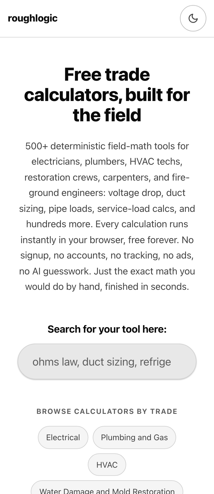
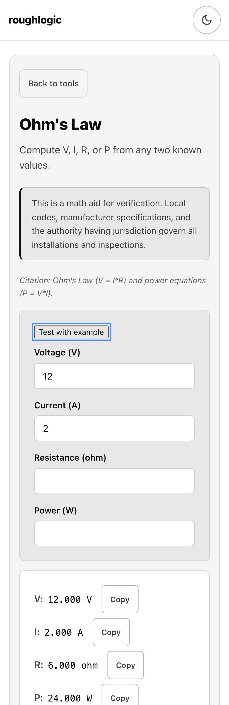
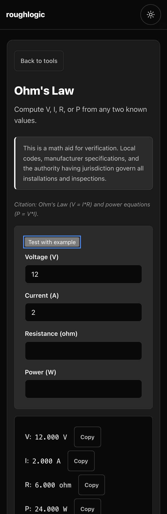
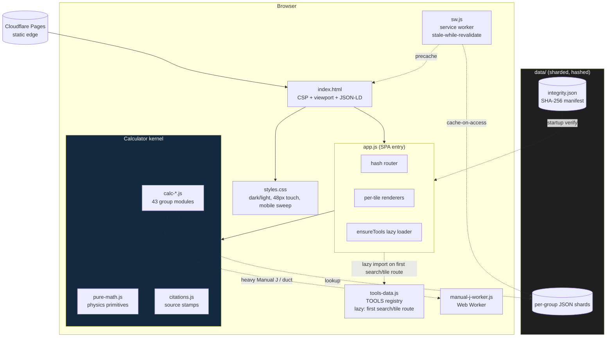
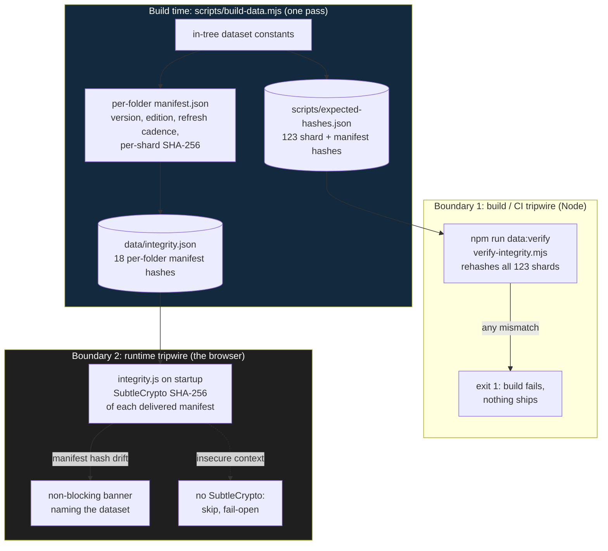
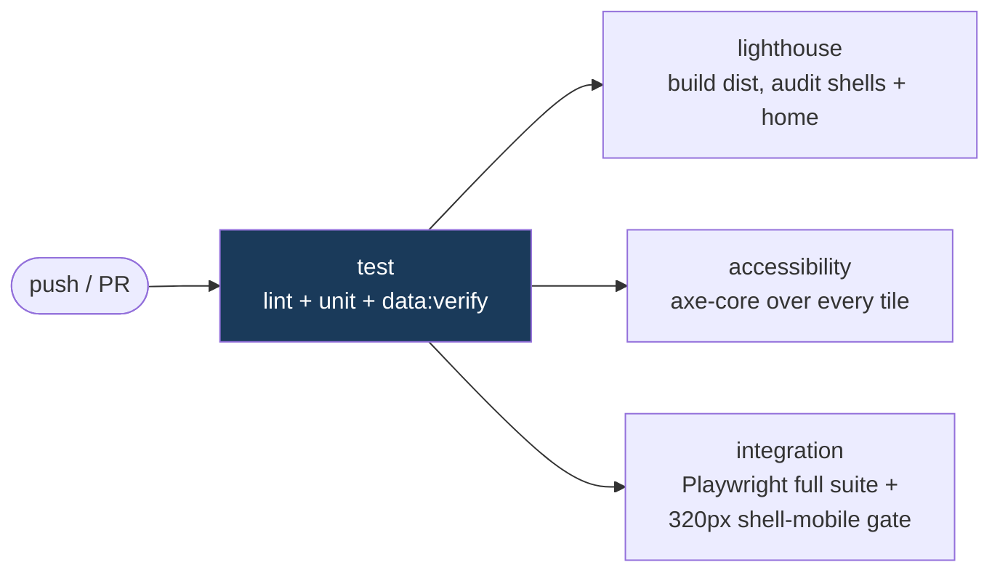
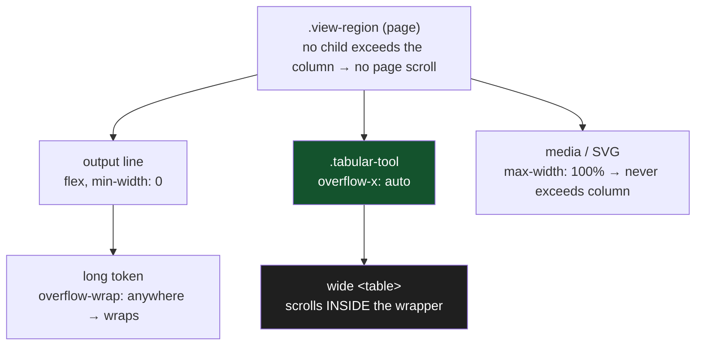

# roughlogic

Field math for the trades. A calm, fast, ad-free, account-free, ever-free reference site.

[roughlogic.com](https://roughlogic.com) is a single-page static web application that helps electricians, plumbers, HVAC technicians, water-damage and mold-restoration techs, carpenters and general contractors, fire-ground engineers, and a widening set of allied professions do the math they actually do during a workday. Everything runs in the browser. No server, no account, no analytics, no telemetry, no AI inference, no API key, no ongoing operating cost beyond domain renewal.

> **624 deterministic tools across 25 trade groups. 0 dependencies. 0 trackers. 0 LLM calls. 5,534 unit tests. Works offline.**

<p align="center">
  
  &nbsp;
  
  &nbsp;
  
</p>

<p align="center"><sub>The home view and a calculator (light and dark), on a 390&nbsp;px phone. One column, live output, cited, with a per-value copy button. No accounts, no ads, no network calls, no horizontal scroll at any width down to 320&nbsp;px.</sub></p>

---

## The problem

Tradespeople do quick math constantly: voltage drop, friction loss, conduit fill, duct sizing, refrigerant superheat, psychrometric drying goals, stair geometry, fire-ground pump pressure. The reference material lives behind paywalled code books, in licensed apps that nag the user constantly, or in cluttered websites that lard the page with advertisements and trackers. The trades deserve better.

## The solution

One static page with 624 small calculators and reference tools, organized into 25 categories. Each tool does one thing. The home page is scannable in five seconds. Every formula is computed from public physics or public-domain data. Every reference value is sourced and dated. The user can save the page and use it offline forever.

The design constraints are the product:

| Constraint | What it means |
|---|---|
| No accounts | Nothing to sign up for. No email is ever requested. |
| No telemetry | No analytics SDK, no pixel, no beacon. CSP `connect-src 'self'` makes outbound calls impossible at runtime. |
| No AI | Every output is a deterministic function of input and bundled data. No model, no inference, no probabilistic step. |
| No runtime dependencies | The app ships zero third-party JavaScript. `package.json` has empty `dependencies` and `devDependencies`. |
| Offline-first | A service worker pre-caches the shell; the page works with the network off. |
| Cited | Every answer carries a source stamp with the publication and edition it derives from. |

---

## Quick start

Open [https://roughlogic.com](https://roughlogic.com) in any browser. Type a tool's name in the center search bar; it filters the catalog as you type and shows a results dropdown. Click a result, or press Enter, to open that calculator. Focus the empty search bar to browse the whole catalog. Type in your numbers. Read the answer (it renders live, there is no submit button). Copy to clipboard. Go back to work. The header toggle (top right) switches between dark and light; the choice persists across reloads.

Calculator state is encoded in the URL hash, so you can bookmark or share a calculator with its inputs preloaded (for example, `https://roughlogic.com/#voltage-drop`).

---

## How it works

The home view is a single centered hero: an elevator-pitch headline, a one-paragraph description, one search bar, and a static "browse by trade" index of the 25 group hubs. The search bar is a combobox: free text filters the catalog by tool name, description, or industry-term alias, and a results dropdown shows matches with their category; focusing the empty field lists every tool. Selecting a result routes to that calculator.


Each calculator has labeled numeric inputs (with `inputmode` set so phones surface the right keypad), a "Test with example" button that fills a known reference case, an inline citation, a live-rendered output that updates as you type, a per-output Copy button, and a limitation notice stating what the tool is not. There is no submit button anywhere on the site.

---

## System design and architecture

The runtime is a single `index.html`, a single `styles.css`, a single entry `app.js`, a lazy-loaded catalog registry (`tools-data.js`), a set of per-group calculator modules (`calc-*.js`), a shared math kernel (`pure-math.js`), a citations module, a service worker, and a `data/` folder of sharded JSON. The architecture follows the same principles as encryptalotta.com and sophiewell.com: same-origin static assets, a strict Content Security Policy, no runtime dependencies, no telemetry.



Design decisions worth calling out:

- **Computation on the main thread, with two exceptions.** Most tools compute in well under a millisecond, so a worker would only add latency. The simplified Manual J load estimators and the duct-sizing calculator (nested bisection + Colebrook iteration) run in `manual-j-worker.js` to keep the main thread responsive.
- **Sharded data, hashed at build.** Reference datasets are split per group so a tool loads only what it needs. A startup integrity check (`integrity.js`) verifies the SHA-256 of each per-folder manifest against `data/integrity.json`; a mismatch surfaces a non-blocking banner naming the affected dataset.
- **Hash-based state.** Per-tile inputs live in the URL hash (`hash-state.js`), which makes every calculation bookmarkable and shareable with zero server state. The grammar and its back-compat policy are documented in [docs/hash-state.md](docs/hash-state.md).
- **Catalog metadata is lazy (spec-v10 §H.2).** The 624-entry `TOOLS` registry -- every tile's id, name, group, trades, and description -- lives in `tools-data.js` and is dynamic-imported only on the first search keystroke or tile-route navigation (via `ensureTools()`, mirroring the alias loader). The bare home view is static HTML that the router only unhides, so first paint loads neither the catalog nor the search aliases. This keeps the home-view JS sub-budget well under its ceiling (~23.6 KB gz; total home payload 36.5% of the 100 KB budget) instead of ~99% with the array inlined; the bytes are deferred, not eliminated, so the gate measures honestly.
- **One brand accent in an otherwise monochrome palette.** Links, the focus ring, the "Run the calculator" CTA, and the copy-success pulse share a single accent that clears WCAG AA on every surface in both themes.

The component diagram above shows *what* loads; the sequence below shows *when*. Opening a tile is a chain of cached dynamic imports behind a crash-safe boundary, so the bytes a given calculator needs arrive only on first use and the home view ships none of them:

```mermaid
sequenceDiagram
    participant U as User / browser
    participant RT as route() in app.js
    participant TD as tools-data.js
    participant RV as renderToolView
    participant MOD as calc-*.js + citations + support libs
    participant SW as service worker

    U->>RT: navigate to #tile-id (click result or deep link)
    Note over RT: home / empty / b= routes are synchronous (no TOOLS needed)
    RT->>TD: ensureTools() dynamic import (once; cached in _toolsPromise)
    TD-->>RT: TOOLS registry
    RT->>RV: applyRoute -> renderToolView(id, params)
    RV->>RV: build static view shell synchronously, move focus to h1
    par citation block
        RV->>MOD: import citations.js
    and calculator module
        RV->>MOD: loadRenderer(id) -> import calc-group.js (moduleCache)
    and support libs
        RV->>MOD: loadSupportLibs() (Promise.all, supportLibsPromise)
    end
    MOD-->>RV: renderer fn + hash-state / clipboard / validity helpers
    Note over RV: crash-safe boundary: try { render, applyHashState, example, stamp, copy-all, validity } catch -> recovery panel
    RV-->>U: live calculator, recomputes on each input (no submit button)
    SW-->>MOD: warm revisit: every module served from cache (0 network)
```

Each dynamic import is memoized (`_toolsPromise`, `moduleCache`, `supportLibsPromise`), so the registry and a given group module load at most once per session; the service worker then serves them with zero network on every later visit. The `try/catch` around the renderer is Crash-Safe Resume (v3 utility 187): a calculator that throws paints a recovery panel without clearing the URL hash, so the input state survives a reload.

For the full runtime walkthrough and the ASCII diagram, see [docs/architecture.md](docs/architecture.md).

### Data integrity: two hash chains, two trust boundaries

The component diagram above draws the integrity check as a single edge for clarity, but "hashed at build" is really two independent SHA-256 chains generated by the same pass of `scripts/build-data.mjs` and checked at two different boundaries. They exist because a bundled dataset can drift in two unrelated ways -- an edit in the repo that never went through the data pipeline (a build problem) and a corrupted or tampered file delivered to a browser (a runtime problem) -- and each chain catches exactly one of them.



The split is deliberate. `expected-hashes.json` covers **every** shard (123 files, the full data surface) and is the strict gate -- a single byte changed in any `data/**.json` without re-running the pipeline turns `data:verify` red in CI, so unreviewed data never reaches `main`. `data/integrity.json` covers only the **18 per-folder manifests** (each of which already pins its own shards' hashes), keeping the runtime fetch tiny; the browser recomputes those 18 over SubtleCrypto and shows a banner on any mismatch, but **fails open** -- an insecure context with no SubtleCrypto skips the check rather than blocking the calculators -- because a missing crypto API is the user's environment, not a data-trust failure. The build boundary fails closed; the runtime boundary fails open.

### Repository map

```
roughlogic.com/
  index.html            SPA shell: CSP, viewport, JSON-LD, theme pre-paint
  styles.css            single stylesheet (dark + light, mobile sweep, print)
  app.js                SPA entry: hash router, renderers, lazy loaders (~55 KB raw / ~18 KB gz)
  tools-data.js         catalog registry (TOOLS, 624 tiles); lazy-loaded (~130 KB raw / ~43 KB gz)
  pure-math.js          physics/math primitives shared across groups
  calc-<group>.js       43 per-group calculator modules (electrical, hvac, ...,
                        calc-fab.js is the pipe & conduit fabrication bench split
                        out of calc-cross.js, holding the v39-relocated conduit
                        tiles (group A); calc-layout.js the v56 layout & shop-
                        geometry bench split out of calc-fab.js (bolt-circle,
                        sine-bar, arc, polygon-miter, ...); calc-shop.js the v40
                        machine-shop & fab bench (mixed groups K/G/E);
                        calc-earthwork.js the v70 earthwork/excavation bench
                        split out of calc-construction.js (group E);
                        calc-survey.js the v71 coordinate/traverse surveying
                        bench split out of calc-field.js (group P);
                        calc-feeder.js the v72 feeder & transformer-conductor
                        overcurrent bench split out of calc-electrical.js
                        (group A); calc-drainage.js the v73 storm-drainage
                        bench (roof-drain, sump-basin) split out of
                        calc-plumbing.js (group B); calc-velocity.js the v74
                        velocity bench (duct-velocity-pressure, refrigerant-
                        velocity) split out of calc-hvac.js (group C);
                        calc-treatment.js the v75 water-treatment bench
                        (weir-flow, langelier-index, chemical-feed-pump) split
                        out of calc-water.js (group M); calc-machining.js the
                        v76 machining bench (cutting-speed-rpm, drill-point-
                        depth) split out of calc-mechanic.js (group K);
                        calc-demo.js the v77 demolition/abatement take-off bench
                        (moisture-dry-goal, flood-cut-quantity, abatement-
                        containment) split out of calc-restoration.js (group D);
                        calc-service.js the v78 post-rough-in service bench
                        (gas-appliance-demand, tpr-discharge, pipe-support-
                        spacing, softener-sizing) split out of calc-plumbing.js
                        (group B); calc-powerquality.js the v79 advanced AC
                        analysis bench (parallel-conductor-derate, neutral-
                        current-3ph, motor-vd-starting) split out of
                        calc-electrical.js (group A); calc-civil.js the v80
                        site-civil / roadway-geometry bench (horizontal-curve,
                        vertical-curve, earthwork-end-area, slope-stake-cut-
                        fill) split out of calc-construction.js (group E);
                        calc-lowvoltage.js the v28 cabling tiles)
  citations.js          per-tile source-stamp strings
  theme.js              dark/light toggle (pre-paint, no flash)
  hash-state.js         URL-hash state grammar + router
  integrity.js          startup SHA-256 manifest verification
  sw.js                 service worker (offline + stale-while-revalidate)
  manual-j-worker.js    Web Worker for Manual J + duct sizing
  data/                 sharded, hashed reference JSON (per group)
  specs/                spec.md .. spec-v80.md (inheriting build specs)
  docs/                 architecture, correctness, data-sources, a11y, ...
  scripts/              build + 26 lint/audit gates + data pipeline
  test/                 unit (Node test runner) + integration (Playwright)
  dist/                 build output: prerendered shells + sitemap (generated)
```

---

## The catalog (cheat sheet)

624 tiles across 25 active group letters. The letters are stable identifiers; new groups append, retired tiles keep their IDs.

| Letter | Group | Tiles | Representative tools |
|---|---|--:|---|
| A | Electrical | 56 | voltage drop (with reactance), power triangle, EV charger load, service load (220.82), PV interconnection busbar, conduit offset / saddle / 90-stub bending, **motor-feeder sizing (430.24/430.62)**, **transformer conductor/protection (450.3(B))**, **fiber loss budget**, **cable-tray fill (392.22)**, **CCTV/NVR storage**, **70 V speaker line**, **fire-alarm standby battery (NFPA 72)**, **coax attenuation** |
| B | Plumbing and Gas | 50 | friction loss, pipe sizing, water hammer, water-heater recovery, sanitary DFU, Spitzglass gas pressure drop, **mixing-valve blend temp (ASSE)**, **well pressure-tank drawdown**, **pipe velocity / copper erosion**, **WSFU probable demand (Hunter)**, **supply pressure budget**, **roof drain / leader sizing (IPC 1106)**, **sump / ejector basin cycle (IPC 712)**, **gas appliance demand / CFH (IFGC 402)**, **T&P relief discharge (IPC 504)**, **pipe hanger spacing (IPC 308.5)**, **water softener sizing (NSF 44)** |
| C | HVAC | 48 | duct sizing, Manual J (simplified), refrigerant P-T, chiller tonnage, LMTD/NTU, superheat/subcool charge verdict, economizer free-cooling hours, round-to-rectangular duct equivalent (ASHRAE), **total external static pressure (Manual D)**, **refrigeration compression ratio (ASHRAE)** |
| D | Water Damage and Mold Restoration | 26 | air movers, dehumidifier sizing, drying log, circuit-capacity check, drying-chamber CO2, **grain-depression water removal**, **evaporation load / dehu demand**, **mold remediation scope (EPA / NYC DOHMH)**, **IICRC S520 Condition reference**, **antimicrobial mix / coverage**, **spore-trap air sample volume**, **dry-standard verdict**, **flood-cut take-off**, **asbestos / lead abatement containment (EPA NESHAP / OSHA)** |
| E | Carpentry and Construction | 68 | joist/beam spans, header sizing (R602.7), deck beam/post (R507), wind/snow load, wall bracing, column buckling (Cp), welding heat input, metal weight, 3-4-5 layout squaring, horizontal / vertical curve layout, earthwork end-area volume, slope-stake cut/fill, fillet-weld strength (AWS D1.1 / AISC J2), groove-weld strength (CJP/PJP), press-brake air-bend tonnage, welder duty cycle (NEMA EW-1), carbon equivalent / preheat screen (AWS D1.1), **compound miter for crown molding**, **soil swell / shrinkage (bank-loose-compacted)**, **haul-cycle production / fleet match (CAT)**, **excavation dewatering pump rate**, **trench spoil setback (OSHA 1926.651)**, **pipe bedding / embedment / backfill (ASTM D2321)**, **industrial coating coverage / DFT (SSPC PA 2)**, **abrasive blast air / abrasive (SSPC SP)** |
| F | Fire-Ground Engineering | 26 | pump discharge pressure, standpipe PDP (NFPA 14), needed fire flow, nozzle reaction, sprinkler K-factor, **elevation pressure loss/gain**, **water-supply duration** |
| G | Cross-Trade Utilities | 51 | unit conversion, mileage cost, NIOSH lifting, heat stress, haversine, rolling offset (pipefitting), **fitting take-out cut length**, **multi-piece miter elbow**, **pipe wraparound template**, **flange bolt-up torque (ASME PCC-1)**, **center of gravity from two scales**, **bolt-circle hole layout**, **decimal to fraction / feet-inches**, **sine bar angle setup**, **thread pitch and lead**, **three-wire thread measurement**, **punch / shear force**, **rolled plate blank length**, **tank volume from dipstick**, **circular arc layout (chord & rise)**, **circle through three points**, **linear interpolation**, **regular polygon miter / layout**, **equal spacing (baluster / picket)** |
| H | Knowledge References | 15 | color codes, knot reference, wire gauge tables |
| J | Trucking and Logistics | 13 | bridge formula, HOS math, cargo securement WLL, IFTA fuel tax, **operating cost per mile**, **deadhead percentage**, **axle-load tandem slide** |
| K | Mechanic (Auto, Marine, Aviation) | 21 | fuel range, valve Cv, screw conveyor, **HP from torque/RPM (5252)**, **volumetric efficiency**, **gear-ratio MPH from RPM**, **machining speed and feed (SFM to RPM, feed IPM)**, **drill point depth (tip allowance)**, **cut time per pass**, **material removal rate (MRR)**, **theoretical surface finish (Ra/Rt)**, **taper per foot and angle**, **dividing-head simple indexing**, **tap drill size** |
| L | Agriculture and Forestry | 24 | sprayer calibration, irrigation requirement, NPK blend, pesticide REI/PHI, **growing degree days**, **Pearson-square feed ration**, **livestock water requirement**, **two-stroke fuel mix (chainsaw / trimmer)**, **green log / limb weight (FPL)**, **tree rigging shock load (ANSI Z133)**, **felling notch / hinge geometry**, **porta-wrap friction by wraps (capstan)**, **brush chip volume / haul loads** |
| M | Water and Wastewater Operations | 17 | pounds formula, detention time, disinfection CT, well drawdown, backflow test, **weir/flume open-channel flow**, **Langelier index**, **chemical metering-pump setting** |
| N | Stage and Live Production | 12 | DMX addressing, SPL distance, rigging pulley MA, power distro per-leg loading, **speaker impedance network**, **decibel converter**, **amp power / SPL**, **stage lighting beam and throw** |
| O | Kitchen and Food Service | 8 | recipe scaling, food cost, tip-out split, **brine / cure concentration**, **baker's percentage / dough hydration** |
| P | Field, Backcountry, and SAR | 12 | backcountry needs, ramp slope, rainwater capture, search probability of detection, **area by coordinates (shoelace)**, **traverse closure (Bowditch)**, **hiking time (Naismith's rule)** |
| Q | Historical Reference Data | 1 | historical reference lookup |
| R | Accounting, Tax, and Small-Business | 16 | loan amortization, MACRS, breakeven, payroll withholding, **declining-balance depreciation**, **markup vs. margin**, **employer payroll tax** |
| S | Legal Plain-English and Statutory Math | 12 | filing deadlines, judgment interest, wage garnishment, **federal post-judgment interest**, **lease/rent proration** |
| T | Bench Science and Laboratory Math | 14 | Beer-Lambert, dilution, Henderson-Hasselbalch, OD600, gel %, **primer melting temperature (Tm)**, **CFU/mL plate count** |
| U | Veterinary | 25 | dose, maintenance fluids, CRI drip rate, transfusion volume, **body surface area (Meeh)**, **corrected reticulocyte**, **dehydration fluid deficit**, **anion gap** |
| V | EMS and Pre-hospital | 27 | GCS, Parkland, Wells, ideal body weight, **Cockcroft-Gault CrCl**, **Winters' expected pCO2**, **A-a oxygen gradient**, **FENa** |
| W | Pilots and General Aviation | 23 | density altitude, wind triangle, fuel planning, weight-shift fuel burn, **cold-temperature altitude correction**, **weight-and-balance CG shift**, **takeoff/landing DA correction** |
| X | Real Estate | 24 | LTV, DTI, PITI, cap rate/DSCR, depreciation recapture, **gross rent multiplier**, **PMI cancellation/termination**, **seller net proceeds sheet** |
| Y | Educators and K-12 | 22 | readability scores, bell-curve CDF, Pearson correlation, chi-square GOF, linear regression, **final-exam grade needed**, **weighted category grade**, **two-sample t-test** |
| Z | Rigging and Heavy Lift | 13 | **center of gravity / pick-point load share**, **crane net capacity after deductions (OSHA 1926.1417)**, **outrigger ground bearing / mat size**, **wire-rope sling D/d bend efficiency (WRTB)**, **wind force / swing on a suspended load**, **tag-line pull and handler count**, **tandem two-crane lift share**, **shackle / eye-bolt angular derate (ASME B30.26)**, **spreader bar vs lifting beam (ASME BTH-1)**, **forklift load-center derate (ASME B56.1)**, **roller / skate / jacking push force**, **chain / lever hoist effort (ASME B30.16/21)**, **rigging block redirect resultant** |

The full inventory is in the specs. Each spec inherits all prior specs by reference: `spec.md` is the v1 source of truth; v2 through v4 expanded the catalog; v5 added Accounting / Legal / Lab; v6 set citation discipline; v7 through v9 added tiles; v10 was a platform-only maintenance pass; v11 retired Recents and Big Buttons; v12 added five allied-profession groups (U/V/W/X/Y) plus a mobile-responsive sweep, a wiring-correctness lint, and a tiered data-refresh; v13 added the prerendered discoverable surface; v14 is the correctness pass (below). Specs v15 through v17 draft a 385 to 485 tile expansion; landing is incremental against the live catalog (much of v15 was already in place). **Spec-v15 is now fully closed** (all 35 tiles, catalog at 400; package version stamped 0.15.0). Group A (Electrical) added voltage drop with reactance (NEC Chapter 9 Table 9), the power-triangle solver (IEEE 1459), EV charger continuous load (NEC Article 625), conductor ambient + fill ampacity adjustment (NEC 310.15), the service-load optional method (NEC 220.82), PV interconnection 120% busbar (NEC 705.12), and off-grid battery sizing (IEEE 1013). Group E (Carpentry) added window/door header sizing (IRC R602.7 + AWC NDS, with C_D / C_F factors and a jack-stud count) and deck beam/post sizing (IRC R507 + an NDS column check, footing, and ledger schedule). Group F (Fire-Ground) added standpipe pump discharge pressure (NFPA 14) and smoke-ejector / negative-pressure ventilation CFM (NFPA 1500 / IFSTA). Group G (Cross-Trade) added pump total dynamic head (Hazen-Williams / Crane TP-410), hydraulic cylinder force and speed (NFPA T2.13.7), V-belt sheave and drive sizing (ANSI/RMA IP-20 / IP-22), and the gear ratio / RPM cascade (AGMA 2000). All landed with full v14 discipline. The §H.6 per-group reviewer signoffs remain open and gate the "audited" announcement, not the landing.

**Spec-v24 (Trade-Floor Deepening) and spec-v25 (Surveying and Civil Layout) are closed; package version stamps 0.26.0.** These two landed together on 2026-06-09: **16 new tiles** plus **3 additive enhancements**, taking the catalog **515 -> 531** with no new group letters (every tile deepens an existing group). The headline is **conduit bending**, the single most-performed piece of field math an electrician does in a day and a gap the catalog had exactly where its first user reaches first. Group A gained the three-tile bending suite (`conduit-offset`, `conduit-saddle`, `conduit-90-stub`): the cosecant offset multiplier, the three- and four-point saddle marks, and the 90-degree stub deduct plus segmented bends, all first-principles trigonometry with the bender deduct/shoe figures user-supplied and flagged confirm-against-your-tool. Group E gained welding heat input (`weld-heat-input`, the AWS D1.1 / ASME BPVC Section IX `HI = (60 x V x I) / TS` definition with the arc-efficiency factor by process), metal weight by shape and alloy (`metal-weight`), and 3-4-5 layout squaring (`layout-squaring`), then the v25 civil set: horizontal (circular) and vertical (parabolic) curve layout (`horizontal-curve`, `vertical-curve`, AASHTO Green Book + FM 5-233), average-end-area and prismoidal earthwork volume (`earthwork-end-area`, FHWA / FM 5-233), and slope-stake cut/fill with the catch-point offset (`slope-stake-cut-fill`, FM 5-233). Group G gained the rolling offset (`rolling-offset`, the Pythagorean true offset and cosecant travel of NCCER pipefitting). Group N gained the day-of-show speaker electronics (`speaker-impedance`, `decibel-converter`, `amp-power-spl`, Ohm's-law networks + the ANSI S1.1 decibel basis). Group P gained the surveyor's tailgate math: area by coordinates (`area-by-coordinates`, the shoelace method) and traverse closure with the Compass/Bowditch adjustment (`traverse-closure`). The three enhancements are additive with backward-compatible defaults: `tire-gearing` now reports the speedometer/odometer error from a tire swap (EN.1), `spl-distance` adds incoherent N-source summation at +3 dB per doubling with N=1 reproducing the prior output exactly (EN.2), and `bend-allowance` exposes the bend deduction `BD = 2 x OSSB - BA` beside the existing flat-pattern length (EN.3). Every new tile carries the full v14 discipline and is born into the v18/v21 output contract (the tile-contract sweep reports 0 Tier-1 and 0 Tier-2 across 536 swept tiles; the angle-to-zero cosecant, zero travel speed, zero radius/length, and zero perimeter/misclosure divisor seams are all guarded per RC-1/RC-2) and the v19/v22 citation discipline. A count reconciliation is recorded honestly: the spec-v24 draft summary stated a 12-tile delta with a "K +2" line, but the spec body specifies only the 10 tiles above and no Group K new-tile section exists; rather than fabricate two uncited tiles to hit a number, the build landed exactly what the body specifies. See [specs/spec-v24.md](specs/spec-v24.md), [specs/spec-v25.md](specs/spec-v25.md), and the 2026-06-09 stanza in [docs/audit-trail.md](docs/audit-trail.md).

**Spec-v26 through v30 are closed; package version stamps 0.31.0.** Five deepening specs landed on 2026-06-09, taking the catalog **531 -> 555** (24 net-new tiles, no new group letters): the founding trades, the adjacent metal/air/rigging benches, the low-voltage cabling trade, and the pipe/raceway and metal/air/refrigerant roadmap benches. **v26** (`531 -> 540`) finished the *founding* trades: Group A gained the feeder for a bank of motors (`motor-feeder-multiple`, NEC 430.24/430.62) and the transformer's two-sided conductor/protection sizing (`transformer-conductor-protection`, NEC 450.3(B)/240.21(C)); Group B gained the tempering-valve blend temperature (`mixed-water-temp`, ASSE scald limits), the well pressure-tank drawdown by Boyle's law (`pressure-tank-drawdown`), and the copper erosion-corrosion velocity check (`pipe-velocity`); and Group G gained the pipefitter's everyday bench: the fitting take-out cut length (`pipe-fitting-takeout`), the lobster-back miter (`pipe-miter-cut`), the wraparound template ordinates (`pipe-template-wrap`), and the flange bolt-up torque with the ASME PCC-1 cross sequence (`flange-bolt-torque`). **v27** (`540 -> 543`) added the fillet-weld strength/size tile (`fillet-weld-strength`, AWS D1.1 / AISC 360 §J2), the ASHRAE round-to-rectangular duct equivalent (`round-to-rect-duct`), and the rigger's two-scale center of gravity (`center-of-gravity-2point`, ASME B30.9). A **concept-overlap reconciliation** is recorded honestly here, in the v24 tradition: the v27 draft proposed six tiles, but three of them (`duct-sizing-friction`, `superheat-subcooling`, `sling-load-tension`) duplicated existing tiles (`duct-sizing`, `superheat-subcool`, `sling-angle`) by concept; rather than ship near-duplicates to hit the number, those three were dropped-not-renamed and their genuinely net-new deltas (the trunk/branch velocity ceiling, the TXV/EEV target-subcool verdict, and the D/d bend efficiency + minimum rated-capacity + sub-30-degree hazard flag) landed as additive, backward-compatible enhancements to the existing tiles. **v28** (`543 -> 549`) opens the structured-cabling trade in a new `calc-lowvoltage.js` module: the fiber loss budget (`fiber-loss-budget`, TIA-568/526 + IEEE 802.3), cable-tray fill (`cable-tray-fill`, NEC 392.22), CCTV/NVR storage (`cctv-storage`), the 70 V distributed-audio line (`speaker-70v-line`, NEC 640/725), the fire-alarm standby battery (`standby-battery-sizing`, NFPA 72 §10.6), and coax attenuation (`coax-rg-loss`), plus an additive NAC end-of-line voltage check on `lv-dc-drop`. The spec-v28 §1.1 decision to open a dedicated **Group Z** is gated on maintainer signoff; pending it, the six tiles land in **Group A** as a low-voltage sub-cluster via the spec's documented fallback (the group letter is the only thing that changes if Z is later approved). **v29** (`549 -> 552`) lands the first batch off the spec-v28 §7 long-term trades roadmap -- three first-principles, hand-verifiable thermal-movement / field-layout tiles deepening existing groups: pipe cold spring (`pipe-cold-spring`, the cut-short gap and residual movement, ASME B31.1 §119), the PVC raceway expansion fitting (`raceway-expansion-fitting`, the NEC Table 352.44 coefficient and the 0.25 in threshold), and insulated pipe-rack spacing (`pipe-spacing-rack`, center-to-center and bundle width, ASTM C585). The batch is deliberately scoped to math that is hand-verifiable to the last digit -- the gates check finiteness and dimensions, not absolute formula correctness, so the table-method tiles (arc-flash PPE, GEC Table 250.66) stay on the roadmap for a reviewed change. The three live in a new `calc-pipefit.js` module since `calc-electrical.js` and `calc-plumbing.js` are at their size caps. **v30** (`552 -> 555`) lands the §7.4-7.6 metal/air/refrigerant block, same discipline: the groove-weld shear capacity (`groove-weld-strength`, the AISC Table J2.5 `0.60*FEXX` throat case, AWS D1.1 / AISC 360 §J2, complementing the v27 fillet tile), the total external static pressure roll-up (`duct-static-pressure-total`, ACCA Manual D, a component-drop sum against the blower rating), and the refrigeration compression ratio (`compression-ratio-refrig`, absolute discharge over absolute suction with an altitude correction and a high-ratio flag, ASHRAE) -- in a new `calc-metalair.js` module since `calc-construction.js` and `calc-hvac.js` are at their caps. Every new tile carries the full v14 discipline and the v18/v21 contract (tile-contract sweep: 0 Tier-1 / 0 Tier-2 across 560 swept tiles); the new divisor seams are all RC-1/RC-2 guarded. See [specs/spec-v26.md](specs/spec-v26.md), [specs/spec-v27.md](specs/spec-v27.md), [specs/spec-v28.md](specs/spec-v28.md), [specs/spec-v29.md](specs/spec-v29.md), [specs/spec-v30.md](specs/spec-v30.md), and the 2026-06-09 stanzas in [docs/audit-trail.md](docs/audit-trail.md).

**Spec-v31 (Machinist Bench) is closed; package version stamps 0.32.0.** A single first-principles tile deepening Group K (Mechanic), taking the catalog **555 -> 556**: `cutting-speed-rpm` (Machining Speed and Feed). It answers the question every machinist and metal fabricator asks before every cut -- the spindle speed `RPM = 12 x SFM / (pi x diameter)` from a surface speed and the cutter or work diameter, plus the feed rate `IPM = RPM x flutes x chip load per tooth` -- and is hand-verifiable to the last digit (100 SFM on a 0.5 in 2-flute cutter at 0.002 in/tooth -> 763.94 RPM, 3.056 IPM). Like the conduit-bender and POH figures elsewhere in the catalog, the recommended surface speed and chip load are user-supplied from the tool/material chart (no paywalled table is transcribed); the formula is pure cutting geometry (Machinery's Handbook speeds-and-feeds method, by name). It lands in `calc-mechanic.js` (cap bumped 18.5 -> 19.5 KB) with the full v14 discipline and the v18/v21 output contract. See [specs/spec-v31.md](specs/spec-v31.md).

**Spec-v32 (Layout-Geometry Bench) is closed; package version stamps 0.33.0.** A single first-principles tile deepening Group G (Cross-Trade Utilities), taking the catalog **556 -> 557**: `bolt-circle` (Bolt Circle Layout). It gives the hole coordinates `x = cx + R x cos(angle)`, `y = cy + R x sin(angle)` for a circle of N evenly spaced holes from a bolt-circle diameter, start angle, and center, plus the angular spacing `360/N` and the adjacent center-to-center chord `2 x R x sin(180/N)` -- the layout a fabricator, millwright, or machinist does for every flange and bolt pattern, and a companion to the existing `flange-bolt-torque`. Pure trigonometry, hand-verifiable to the last digit (an 8 in bolt circle of 6 holes -> R 4 in, 60 deg spacing, chord 4.000 in, first hole at (4.000, 0.000)). A concept-check against the 556 live tiles found no bolt-circle / circle-of-holes / hole-pattern tile. It lands in `calc-cross.js` (cap bumped 40 -> 41 KB) with the full v14 discipline and the v18/v21 contract. See [specs/spec-v32.md](specs/spec-v32.md).

**Spec-v33 (Shop-Math Bench) is closed; package version stamps 0.34.0.** A single first-principles tile deepening Group G (Cross-Trade Utilities), taking the catalog **557 -> 558**: `decimal-to-fraction` (Decimal to Fraction). It is tape-measure math every trade does daily and `unit-converter` does not cover -- round a decimal inches value to the nearest 1/8, 1/16, 1/32, or 1/64 tick, reduce the fraction to lowest terms by GCD, break it into feet-inches, and report the rounding error (rounded minus exact). Pure arithmetic, hand-verifiable to the last digit (2.375 in to the nearest 1/16 -> `2-3/8 in` = `0' 2-3/8"`, error 0; 0.4375 -> 7/16; 27.625 in -> `2' 3-5/8"`). A concept-check against the 557 live tiles found no fraction / feet-inch / decimal-inch / tape-measure tile. It lands in `calc-cross.js` (cap holds at 41 KB) with the full v14 discipline and the v18/v21 contract. See [specs/spec-v33.md](specs/spec-v33.md).

**Spec-v34 (Drilling Bench) is closed; package version stamps 0.35.0.** A single first-principles tile deepening Group K (Mechanic), taking the catalog **558 -> 559**: `drill-point-depth` (Drill Point Depth). A twist drill's conical point makes the full-diameter shoulder shallower than the tip; this tile gives the point length (tip allowance) `(diameter / 2) / tan(point angle / 2)` and the tip depth to reach a desired full-diameter depth, for 118 / 135 degree and custom points. Pure drill-point geometry, hand-verifiable to the last digit (a 0.5 in drill at 118 degrees -> 0.1502 in point, about 0.3 x diameter, the well-known rule of thumb; to reach 1.0 in full depth, drill the tip to 1.1502 in). A concept-check against the 558 live tiles found no drill / point-length / tip-allowance tile. It lands in `calc-mechanic.js` (cap holds at 19.5 KB) with the full v14 discipline and the v18/v21 contract. (The `tools-data.js` registry cap was bumped 44 -> 46 KB; it grows one row per tile and is lazy-loaded, not in the home-view payload.) See [specs/spec-v34.md](specs/spec-v34.md).

**Spec-v35 (Small-Engine Bench) is closed; package version stamps 0.36.0.** A single first-principles tile deepening Group L (Agriculture and Forestry), taking the catalog **559 -> 560**: `two-stroke-mix` (Two-Stroke Fuel Mix). It answers the everyday question for chainsaw, trimmer, blower, and outboard operators -- how much oil to add for a gas:oil mix -- as `oil volume = fuel volume / ratio` (the ratio is by volume), reported in fl oz and mL with the per-gallon and per-liter dose. Pure volume arithmetic (1 US gallon = 128 fl oz; 1 fl oz = 29.5735 mL), hand-verifiable to the last digit (50:1 at 1 US gallon -> 2.56 fl oz / 75.71 mL of oil; 40:1 -> 3.2 oz/gal). `glycol-mix` covers coolant blends but no tile covered the two-stroke fuel ratio. It lands in `calc-agriculture.js` with the full v14 discipline and the v18/v21 contract. See [specs/spec-v35.md](specs/spec-v35.md).

**Spec-v36 (calc-cross.js Module Split) is closed; package version stamps 0.36.1 (a patch).** A platform-only / housekeeping spec in the spirit of spec-v10: it **adds no tiles, removes no tiles, and changes no calculator output** -- the catalog holds at **560 tiles**; only the on-disk module layout changes. `calc-cross.js` had grown to ~39.6 KB gzipped (96.6% of its 41 KB cap) after the v26-v33 additions, and continued cap-bumping was deferring the real fix its own cap comment had flagged since v26. The spec-v26+ block of cohesive fabrication / layout tiles -- `pipe-fitting-takeout`, `pipe-miter-cut`, `pipe-template-wrap`, `flange-bolt-torque` (the v26 pipefitter's bench), `center-of-gravity-2point` (v27), `bolt-circle` (v32), and `decimal-to-fraction` (v33) -- is extracted into a new module `calc-fab.js` (Fabrication & Layout bench) with their renderers and local helpers, populating a new `FAB_RENDERERS` map. **All remain Group G tiles** (a tile's group letter is independent of its module, the spec-v28 precedent); their ids, citations, worked examples, and behavior are byte-for-byte unchanged. After the split `calc-cross.js` is ~31 KB (86% of a lowered 36 KB cap, headroom restored) and `calc-fab.js` is ~9.8 KB (62% of a 16 KB cap). Every reference is repointed and gated: the `app.js` declare list, `scripts/build.mjs` `FILES`, `sw.js` `SHELL_ASSETS`, the module-size caps, the test fixtures (`compute-map.js`, the bounds fuzzer, the v26/v27 suites), and the v14 corpus + tile-index were all regenerated, with the wiring lint reporting **28 renderer modules / 560 tile-id entries**. The remaining near-cap modules (`calc-mechanic.js`, `calc-agriculture.js`) and the `tools-data.js` registry stay on the watch list for the same treatment as the catalog grows. See [specs/spec-v36.md](specs/spec-v36.md).

**Spec-v61 (Water-Supply Demand and Pressure Budget) is closed; package version stamps 0.55.0 (a minor).** Two tiles at the head of every domestic water-supply design, deepening Group B (Plumbing and Gas) and taking the catalog **590 -> 592**: `wsfu-demand` (Probable Peak Demand from Fixture Units) and `supply-pressure-budget` (Available Pressure at the Critical Fixture). The first is Hunter's-curve interpolation -- total water-supply fixture units (WSFU) to the probable simultaneous peak flow in GPM, with separate flush-tank and flush-valve curves (a flushometer system peaks higher for the same WSFU): 120 WSFU on a flush-valve system between the (100 WSFU, 55 GPM) and (150, 66) breakpoints interpolates to 59.4 GPM, while the flush-tank curve gives 46.2 GPM for the same count. The curve ships as editable breakpoints (an approximation of IPC 2021 Appendix E Table E103.3(2) / NBS BMS65), not a transcribed table, and a non-monotonic curve errors. The second sums every loss between the main and the worst-case fixture against the required residual: `elevation_loss = height x 0.433` psi/ft, `available = street - elevation - meter - backflow - friction`, `headroom = available - fixture_min`, with a go / no-go verdict (street 60 psi, 30 ft up, 8 psi meter, 12 psi friction, 8 psi minimum -> 13.0 psi elevation loss, 27.0 psi available, 19.0 psi headroom, adequate; a flushometer's 25 psi minimum leaves only 2.0 psi). Both use `GOVERNANCE.general` and name Hunter's curve, IPC 2021 Appendix E / Section 604, and the ASPE PEDH without reproducing them; both land in `calc-plumbing.js`. See [specs/spec-v61.md](specs/spec-v61.md).

**Spec-v62 through v69 (the dirty-jobs expansion) are closed; package version stamps 0.63.0 (a minor).** A five-spec arc that takes the catalog **592 -> 624** (+32 tiles) and opens the first new group letter since v12. **v62-v64** finish the residential water-supply bench in Group B / `calc-plumbing.js`: `roof-drain-sizing` (storm GPM and leader / horizontal-drain size per IPC 1106) and `sump-basin-sizing` (basin drawdown, cycle time, and short-cycle verdict per IPC 712); `gas-appliance-demand` (connected load to CFH, IFGC 402 / NFPA 54) and `tpr-discharge` (water-heater T&P relief rating and IPC 504.6 discharge); `pipe-support-spacing` (hanger spacing and count per IPC 308.5) and `softener-sizing` (grain load, regeneration interval, and salt per NSF/ANSI 44). **v65-v66** stand up the new **Group Z (Rigging and Heavy Lift)** in a new `calc-rigging.js` module (13 tiles, all `GOVERNANCE.rigging`): the lift-planning core -- `cg-load-share`, `crane-net-capacity` (OSHA 1926.1417 deduction stack), `crane-ground-bearing`, `sling-d-d-efficiency` (WRTB curve), `wind-on-load`, `tagline-force`, `tandem-lift-share` -- and the hook-to-load iron -- `shackle-eyebolt-wll` (ASME B30.26 angular derate), `spreader-beam` (ASME BTH-1), `forklift-capacity-derate` (ASME B56.1), `roller-jack-force`, `chain-lever-hoist` (ASME B30.16/21), and `block-redirect-load`. **v67** deepens Group E earthwork in `calc-construction.js`: `soil-swell-shrink`, `haul-cycle-production`, `dewatering-rate`, `spoil-setback` (OSHA 1926.651), and `pipe-bedding-backfill` (ASTM D2321). **v68** equips the production tree crew in Group L / `calc-agriculture.js` (new `arboriculture` trade): `log-limb-weight`, `tree-rigging-shock` (ANSI Z133 dynamic load, `GOVERNANCE.worker_safety`), `felling-notch-hinge`, `porta-wrap-friction` (capstan equation), and `chipper-debris`. **v69** closes the run with surface prep, coatings, and abatement across Groups E and D: `coating-coverage-dft` (SSPC/AMPP PA 2, the 1604 constant) and `abrasive-blast` (SSPC SP) in `calc-construction.js`, and `abatement-containment` (EPA NESHAP / OSHA 1926.1101 containment take-off) in `calc-restoration.js`. Every tile carries the full v14 dimensional-analysis annotation, a pinned worked example verified to the digit, a bounds-fuzzer block, and the v18/v21 output contract; the new group and module are wired through `GROUPS` / `GROUP_NAMES` / `GROUP_SLUG`, the build, the service worker, and the home browse-by-trade index, and every gate (lint, 5,534 unit tests, build, data:verify, render-no-nan, a11y, and the 320 px shell-mobile sweep on both Chromium and WebKit) is green. See specs [v62](specs/spec-v62.md) - [v69](specs/spec-v69.md).

**Spec-v70 (calc-construction.js cap-relief split) is closed; package version stamps 0.63.1 (a patch).** A platform-only / housekeeping spec in the spirit of v10 / v36 / v39: it **adds no tiles, removes no tiles, and changes no calculator output** -- the catalog holds at **624 tiles** across 25 groups; only the on-disk module layout changes (32 -> 33 `calc-*` modules). After the v62-v69 expansion, `calc-construction.js` sat at **97.6% of its 70 KB gzip cap** (the most cap-pressured calculator module, one of eight over 95%), and continued cap-bumping was deferring the per-tile split its own cap comment had flagged since v30. The cohesive spec-v67 earthwork / excavation bench -- five contiguous, self-contained tiles (`soil-swell-shrink`, `haul-cycle-production`, `dewatering-rate`, `spoil-setback`, `pipe-bedding-backfill`) -- is extracted into a new module `calc-earthwork.js` (`EARTHWORK_RENDERERS`). **All five keep `group: "E"`** (a tile's group letter is independent of its module, the v28/v30/v36/v39 precedent); their ids, citations, worked examples, and behavior are byte-for-byte unchanged. After the split `calc-construction.js` is **62.7 KB** (cap lowered 70000 -> 66000 to lock in the headroom) and `calc-earthwork.js` is **~7.0 KB** (cap 8500, lazy-loaded, not in the home-view payload). Every reference is repointed and gated: the `app.js` declare lists, `scripts/build.mjs` `FILES`, `sw.js` precache, the module-size caps, the test fixtures (`compute-map.js`, the bounds fuzzer), and the regenerated v14 corpus, with the wiring lint reporting **33 renderer modules / 624 tile-id entries** and the README count gate agreeing at 33 modules. The next-tightest watch-list items are the flat per-tile registries (`tile-meta.js`, `citations.js`, `tools-data.js`, relieved by documented cap bumps when a tile lands) and the next calc-module split candidates (`calc-field.js`, `calc-electrical.js`, `calc-plumbing.js`, `calc-hvac.js`). See [specs/spec-v70.md](specs/spec-v70.md).

**Spec-v71 (calc-field.js cap-relief split) is closed; package version stamps 0.63.2 (a patch).** The second cut on the v70 watch-list, same shape as v70: a platform-only / housekeeping spec that **adds no tiles, removes no tiles, and changes no calculator output** -- the catalog holds at **624 tiles** across 25 groups; only the on-disk module layout changes (33 -> 34 `calc-*` modules). `calc-field.js` was the tightest renderer module after v70 at **96.8% of its 22 KB gzip cap** (21304 B). The cohesive spec-v25 surveying coordinate-geometry bench -- two contiguous, self-contained tiles, `area-by-coordinates` (shoelace parcel area, FM 5-233) and `traverse-closure` (latitude/departure misclosure and compass-rule / Bowditch adjustment) -- is extracted into a new module `calc-survey.js` (`SURVEY_RENDERERS`). **Both keep `group: "P"`** (a tile's group letter is independent of its module, the v28/v30/v36/v39/v70 precedent); their ids, citations, worked examples, dimensional annotations, and behavior are byte-for-byte unchanged. After the split `calc-field.js` is **18.8 KB** (cap lowered 22000 -> 20000 to lock in ~94% headroom) and `calc-survey.js` is **3.8 KB** (cap 5000, lazy-loaded, not in the home-view payload). Every reference is repointed and gated: the `app.js` declare lists, `scripts/build.mjs` `FILES`, `sw.js` precache, the module-size and dimension-graduation lists, the test fixtures (`compute-map.js`, the bounds fuzzer, the `calc-v24-v25` unit suite), and the regenerated v14 corpus, with the wiring lint reporting **34 renderer modules / 624 tile-id entries** and the README count gate agreeing at 34 modules. The standing module-cap watch continues on the registries (`tile-meta.js`, `citations.js`, `tools-data.js`) and the next renderer-split candidates (`calc-electrical.js`, `calc-plumbing.js`, `calc-hvac.js`). See [specs/spec-v71.md](specs/spec-v71.md).

**Spec-v72 (calc-electrical.js cap-relief split) is closed; package version stamps 0.63.3 (a patch).** The third consecutive cut on the v70/v71 watch-list, same shape: a platform-only / housekeeping spec that **adds no tiles, removes no tiles, and changes no calculator output** -- the catalog holds at **624 tiles** across 25 groups; only the on-disk module layout changes (34 -> 35 `calc-*` modules). `calc-electrical.js` was the named next renderer-split candidate and the tightest at **96.7% of its 64.5 KB gzip cap** (62418 B). The cohesive spec-v26 feeder / transformer-conductor overcurrent bench -- two contiguous, self-contained tiles, `motor-feeder-multiple` (NEC 430.24 feeder conductor / 430.62 feeder protection for several motors on one feeder) and `transformer-conductor-protection` (NEC 450.3(B) / 240.21(C) primary-and-secondary protection) -- is extracted into a new module `calc-feeder.js` (`FEEDER_RENDERERS`). The cut was clean: the bench owns its NEC 240.6(A) standard-OCPD table and helpers and reaches nothing above it but the per-module `_finiteGuard`. **Both keep `group: "A"`** (a tile's group letter is independent of its module, the v28/v30/v36/v39/v70/v71 precedent); their ids, citations, worked examples, dimensional annotations, and behavior are byte-for-byte unchanged. After the split `calc-electrical.js` is **59.0 KB** (cap lowered 64500 -> 62000 to lock in ~95% headroom) and `calc-feeder.js` is **4.5 KB** (cap 6000, lazy-loaded, not in the home-view payload). Every reference is repointed and gated: the `app.js` declare lists, `scripts/build.mjs` `FILES`, `sw.js` precache, the module-size and dimension-graduation lists, the multiline-input attribution comment, the test fixtures (`compute-map.js`, the bounds fuzzer, the `calc-v26` unit suite), and the regenerated v14 corpus, with the wiring lint reporting **35 renderer modules / 624 tile-id entries** and the README count gate agreeing at 35 modules. The standing module-cap watch continues on the registries (`tile-meta.js`, `citations.js`, `tools-data.js`) and the next renderer-split candidates (`calc-plumbing.js`, `calc-hvac.js`). See [specs/spec-v72.md](specs/spec-v72.md).

**Spec-v73 (calc-plumbing.js cap-relief split) is closed; package version stamps 0.63.4 (a patch).** The fourth consecutive cut on the v70/v71/v72 watch-list, same shape: a platform-only / housekeeping spec that **adds no tiles, removes no tiles, and changes no calculator output** -- the catalog holds at **624 tiles** across 25 groups; only the on-disk module layout changes (35 -> 36 `calc-*` modules). After v72 relieved `calc-electrical.js`, `calc-plumbing.js` was the tightest remaining calculator module at **96.2% of its 60 KB gzip cap** (57722 B) -- the named next renderer-split candidate. The cohesive spec-v62 storm-drainage bench -- two contiguous, self-contained tiles, `roof-drain-sizing` (roof area to storm GPM and leader / horizontal-drain size per IPC 1106) and `sump-basin-sizing` (basin drawdown, cycle time, and short-cycle verdict per IPC 712) -- is extracted into a new module `calc-drainage.js` (`DRAINAGE_RENDERERS`). The cut is clean: the bench owns its IPC capacity tables and `_roof*` helpers and reaches nothing outside it but the per-module `_finiteGuard` and the shared `ui-fields.js` helpers. **Both keep `group: "B"`** (a tile's group letter is independent of its module, the v28/v30/v36/v39/v42/v70/v71/v72 precedent); their ids, citations, worked examples, dimensional annotations, and behavior are byte-for-byte unchanged. After the split `calc-plumbing.js` is **54.5 KB** (cap lowered 60000 -> 57500 to lock in ~95% headroom) and `calc-drainage.js` is **4.5 KB** (cap 6000, lazy-loaded, not in the home-view payload). Every reference is repointed and gated: the `app.js` declare lists, `scripts/build.mjs` `FILES`, `sw.js` precache, the module-size and dimension-graduation lists, the test fixtures (`compute-map.js`, the bounds fuzzer), and the regenerated v14 corpus, with the wiring lint reporting **36 renderer modules / 624 tile-id entries** and the README count gate agreeing at 36 modules. The standing module-cap watch continues on the registries (`tile-meta.js`, `citations.js`, `tools-data.js`) and the next renderer-split candidate (`calc-hvac.js`). See [specs/spec-v73.md](specs/spec-v73.md).

**Spec-v74 (calc-hvac.js cap-relief split) is closed; package version stamps 0.63.5 (a patch).** The fifth consecutive cut on the v70/v71/v72/v73 watch-list, same shape: a platform-only / housekeeping spec that **adds no tiles, removes no tiles, and changes no calculator output** -- the catalog holds at **624 tiles** across 25 groups; only the on-disk module layout changes (36 -> 37 `calc-*` modules). After v73 relieved `calc-plumbing.js`, `calc-hvac.js` was the named next renderer-split candidate and the tightest calculator module at **95.9% of its 61 KB gzip cap** (58521 B). The cohesive spec-v23 velocity bench -- two contiguous, self-contained tiles, `duct-velocity-pressure` (the ACCA Manual D / ASHRAE relation `V = 4005 x sqrt(VP)` for standard air, either direction) and `refrigerant-velocity` (line velocity and oil-return window per the ASHRAE Refrigeration Handbook) -- is extracted into a new module `calc-velocity.js` (`VELOCITY_RENDERERS`). The cut is exceptionally clean: the bench already carried its own scoped `ui-fields.js` imports and reaches nothing outside it (no `_finiteGuard`, no shared tables), so the moved code is byte-for-byte unchanged. **Both keep `group: "C"`** (a tile's group letter is independent of its module, the v28/v30/v36/v39/v42/v70/v71/v72/v73 precedent); their ids, citations, worked examples, dimensional annotations, and behavior are unchanged. After the split `calc-hvac.js` is **56.9 KB** (cap lowered 61000 -> 60000 to lock in ~95% headroom) and `calc-velocity.js` is **2.7 KB** (cap 4000, lazy-loaded, not in the home-view payload). Every reference is repointed and gated: the `app.js` declare lists, `scripts/build.mjs` `FILES`, `sw.js` precache, the module-size and dimension-graduation lists, the test fixtures (`compute-map.js`, the bounds fuzzer, the `calc-v23` unit suite), and the regenerated v14 corpus, with the wiring lint reporting **37 renderer modules / 624 tile-id entries** and the README count gate agreeing at 37 modules. The standing module-cap watch continues on the registries (`tile-meta.js`, `citations.js`, `tools-data.js`) and the next renderer-split candidates (`calc-water.js`, `calc-mechanic.js`, `calc-restoration.js`). See [specs/spec-v74.md](specs/spec-v74.md).

**Spec-v75 (calc-water.js cap-relief split) is closed; package version stamps 0.63.6 (a patch).** The sixth consecutive cut on the v70/v71/v72/v73/v74 watch-list, same shape: a platform-only / housekeeping spec that **adds no tiles, removes no tiles, and changes no calculator output** -- the catalog holds at **624 tiles** across 25 groups; only the on-disk module layout changes (37 -> 38 `calc-*` modules). After v74 relieved `calc-hvac.js`, `calc-water.js` was the named next renderer-split candidate and the tightest calculator module at **95.8% of its 23.5 KB gzip cap** (22522 B). The cohesive spec-v20 Phase M bench -- three contiguous, self-contained tiles, `weir-flow` (USBR Water Measurement Manual V-notch / Francis open-channel flow), `langelier-index` (the Standard Methods LSI water-stabilization index), and `chemical-feed-pump` (the AWWA pounds-formula metering-pump setting) -- is extracted into a new module `calc-treatment.js` (`TREATMENT_RENDERERS`). The cut is clean: the bench reaches nothing outside its own scoped `ui-fields.js` imports and never calls `calc-water.js`'s `_finiteGuard` (each compute fn does its own positive/finite guards inline), so the moved code is byte-for-byte unchanged and no guard helper is copied. **All three keep `group: "M"`** (a tile's group letter is independent of its module, the v28/v30/v36/v39/v42/v70/v71/v72/v73/v74 precedent); their ids, citations, worked examples, dimensional annotations, and behavior are unchanged. After the split `calc-water.js` is **19.0 KB** (cap lowered 23500 -> 21000 to lock in the freed space and clear the WARN) and `calc-treatment.js` is **4.6 KB** (cap 6000, lazy-loaded, not in the home-view payload). Every reference is repointed and gated: the `app.js` declare lists, `scripts/build.mjs` `FILES`, `sw.js` precache, the module-size and dimension-graduation lists, the test fixtures (`compute-map.js`, the bounds fuzzer, the `calc-v20` unit suite), and the regenerated v14 corpus, with the wiring lint reporting **38 renderer modules / 624 tile-id entries** and the README count gate agreeing at 38 modules. The standing module-cap watch continues on the registries (`tile-meta.js`, `citations.js`, `tools-data.js`) and the next renderer-split candidates (`calc-mechanic.js`, `calc-restoration.js`, `calc-stage.js`). See [specs/spec-v75.md](specs/spec-v75.md).

**Spec-v76 (calc-mechanic.js cap-relief split) is closed; package version stamps 0.63.7 (a patch).** The seventh consecutive cut on the v70/v71/v72/v73/v74/v75 watch-list, same shape: a platform-only / housekeeping spec that **adds no tiles, removes no tiles, and changes no calculator output** -- the catalog holds at **624 tiles** across 25 groups; only the on-disk module layout changes (38 -> 39 `calc-*` modules). After v75 relieved `calc-water.js`, `calc-mechanic.js` was the named next renderer-split candidate and the tightest calculator module at **95.6% of its 19.5 KB gzip cap** (18633 B). The cohesive machining bench -- two contiguous, self-contained tiles at the end of the file, `cutting-speed-rpm` (the speeds-and-feeds spindle relation `RPM = 12 x SFM / (pi x diameter)` and feed `IPM = RPM x flutes x chip load`, spec-v31 K.4) and `drill-point-depth` (the drill-point tip-allowance geometry `(diameter / 2) / tan(point angle / 2)`, spec-v34 K.5) -- is extracted into a new module `calc-machining.js` (`MACHINING_RENDERERS`). The cut is clean: the bench reaches nothing outside its own scoped `ui-fields.js` imports and the per-module `_finiteGuard` (copied verbatim, non-exported so it adds no corpus row), so the moved compute functions are byte-for-byte unchanged. **Both keep `group: "K"`** (a tile's group letter is independent of its module, the v28/v30/v36/v39/v42/v70..v75 precedent); their ids, citations, worked examples, dimensional annotations, and behavior are unchanged. After the split `calc-mechanic.js` is **16.8 KB** (cap lowered 19500 -> 18000 to lock in the freed space) and `calc-machining.js` is **3.1 KB** (cap 4000, lazy-loaded, not in the home-view payload). Every reference is repointed and gated: the `app.js` declare lists, `scripts/build.mjs` `FILES`, `sw.js` precache, the module-size and dimension-graduation lists, the test fixtures (`compute-map.js`, the bounds fuzzer, the `calc-mechanic` unit suite), and the regenerated v14 corpus, with the wiring lint reporting **39 renderer modules / 624 tile-id entries** and the README count gate agreeing at 39 modules. The standing module-cap watch continues on the registries (`tile-meta.js`, `citations.js`, `tools-data.js`) and the next renderer-split candidates (`calc-restoration.js`, `calc-plumbing.js`, `calc-electrical.js`). See [specs/spec-v76.md](specs/spec-v76.md).

**Spec-v77 (calc-restoration.js cap-relief split) is closed; package version stamps 0.63.8 (a patch).** The eighth consecutive cut on the v70/v71/v72/v73/v74/v75/v76 watch-list, same shape: a platform-only / housekeeping spec that **adds no tiles, removes no tiles, and changes no calculator output** -- the catalog holds at **624 tiles** across 25 groups; only the on-disk module layout changes (39 -> 40 `calc-*` modules). After v76 relieved `calc-mechanic.js`, `calc-restoration.js` was the named next renderer-split candidate and tied for the tightest calculator module at **95.2% of its 29 KB gzip cap** (27605 B). The cohesive demolition / abatement bench -- three contiguous, self-contained tiles at the end of the file, `moisture-dry-goal` (the IICRC S500 dry-standard verdict: a material is dry when its moisture content matches similar unaffected material, spec-v60), `flood-cut-quantity` (the flood-cut demolition take-off -- drywall area, 4x8 sheet count, baseboard LF, and batt area, spec-v60), and `abatement-containment` (the asbestos / lead containment take-off -- poly sheeting, negative-air-machine count, required exhaust CFM, and regulated-waste bags, spec-v69) -- is extracted into a new module `calc-demo.js` (`DEMO_RENDERERS`). The cut is clean: the bench reaches nothing outside its own scoped `ui-fields.js` import block (`makeNumber`, `makeCheckbox`, `makeOutputLine`, `attachExampleButton`, `fmt`, `debounce`, `DEBOUNCE_MS`) and the per-module `_finiteGuard` (copied verbatim, non-exported so it adds no corpus row), so the moved compute functions are byte-for-byte unchanged. **All three keep `group: "D"`** (a tile's group letter is independent of its module, the v28/v30/v36/v39/v42/v70..v76 precedent); their ids, citations, worked examples, dimensional annotations, and behavior are unchanged. After the split `calc-restoration.js` is **24.4 KB** (cap lowered 29000 -> 26000 to lock in the freed space) and `calc-demo.js` is **4.8 KB** (cap 5500, lazy-loaded, not in the home-view payload). Every reference is repointed and gated: the `app.js` declare lists, `scripts/build.mjs` `FILES`, `sw.js` precache, the module-size and dimension-graduation lists, the test fixtures (`compute-map.js`, the bounds fuzzer), and the regenerated v14 corpus, with the wiring lint reporting **40 renderer modules / 624 tile-id entries** and the README count gate agreeing at 40 modules. The standing module-cap watch continues on the registries (`tile-meta.js`, `citations.js`, `tools-data.js`) and the next renderer-split candidates (`calc-plumbing.js`, `calc-electrical.js`, `calc-construction.js`). See [specs/spec-v77.md](specs/spec-v77.md).

**Spec-v78 (calc-plumbing.js cap-relief split) is closed; package version stamps 0.63.9 (a patch).** The ninth consecutive cut on the v70/v71/v72/v73/v74/v75/v76/v77 watch-list, same shape: a platform-only / housekeeping spec that **adds no tiles, removes no tiles, and changes no calculator output** -- the catalog holds at **624 tiles** across 25 groups; only the on-disk module layout changes (40 -> 41 `calc-*` modules). After v77 relieved `calc-restoration.js`, `calc-plumbing.js` was the named next renderer-split candidate and the tightest calculator module at **95.2% of its 57.5 KB gzip cap** (54735 B). The cohesive spec-v63 + spec-v64 service bench -- four contiguous, self-contained tiles at the end of the file, the post-rough-in decisions a plumber makes at appliance hookup and final tie-in rather than at supply/DWV rough-in: `gas-appliance-demand` (IFGC 402 / NFPA 54 connected-load to CFH, spec-v63), `tpr-discharge` (the IPC 504 water-heater T&P relief rating check and 504.6 discharge checklist, spec-v63), `pipe-support-spacing` (IPC Table 308.5 / MSS SP-58 hanger spacing and count, spec-v64), and `softener-sizing` (the NSF/ANSI 44 / WQA grain-load, regeneration-interval, and salt budget, spec-v64) -- is extracted into a new module `calc-service.js` (`SERVICE_RENDERERS`). The cut is clean: the bench reaches nothing outside its own scoped `ui-fields.js` import block (`makeNumber`, `makeTextarea`, `makeSelect`, `makeOutputLine`, `attachExampleButton`, `fmt`, `debounce`, `DEBOUNCE_MS`) and the per-module `_finiteGuard` (copied verbatim, non-exported so it adds no corpus row), so the moved compute functions are byte-for-byte unchanged; the now-orphaned `makeTextarea` import is dropped from `calc-plumbing.js`. **All four keep `group: "B"`** (a tile's group letter is independent of its module, the v28/v30/v36/v39/v42/v70..v77 precedent); their ids, citations, worked examples, dimensional annotations, and behavior are unchanged. After the split `calc-plumbing.js` is **49.5 KB** (cap lowered 57500 -> 53000 to lock in the freed space, ~93.4%) and `calc-service.js` is **6.9 KB** (cap 8000, lazy-loaded, not in the home-view payload). Every reference is repointed and gated: the `app.js` declare lists, `scripts/build.mjs` `FILES`, `sw.js` precache, the module-size and dimension-graduation lists, the test fixtures (`compute-map.js`, the bounds fuzzer), and the regenerated v14 corpus, with the wiring lint reporting **41 renderer modules / 624 tile-id entries** and the README count gate agreeing at 41 modules. The standing module-cap watch continues on the registries (`tile-meta.js`, `citations.js`, `tools-data.js`) and the next renderer-split candidates (`calc-electrical.js`, `calc-construction.js`, `calc-hvac.js`). See [specs/spec-v78.md](specs/spec-v78.md).

**Spec-v79 (calc-electrical.js cap-relief split) is closed; package version stamps 0.63.10 (a patch).** The tenth consecutive cut on the v70/v71/v72/v73/v74/v75/v76/v77/v78 watch-list, same shape: a platform-only / housekeeping spec that **adds no tiles, removes no tiles, and changes no calculator output** -- the catalog holds at **624 tiles** across 25 groups; only the on-disk module layout changes (41 -> 42 `calc-*` modules). After v78 relieved `calc-plumbing.js`, `calc-electrical.js` was the named next renderer-split candidate and the tightest calculator module at **95.1% of its 62 KB gzip cap** (58989 B). The cohesive spec-v20 §A advanced-analysis trio -- three contiguous, self-contained tiles at the end of the file, `parallel-conductor-derate` (paralleled-set ampacity with the NEC 310.15(C)(1) more-than-three current-carrying-conductor adjustment and the 1/0-AWG-minimum parallel rule), `neutral-current-3ph` (the phasor-sum neutral of three 120-degree-displaced phase currents, and the harmonic-dominated case where triplens make the neutral a current-carrying conductor per NEC 310.15(E) / IEEE 519), and `motor-vd-starting` (the Ohm's-law motor-starting voltage dip against a contactor-dropout limit, distinct from the steady-state voltage-drop tile) -- is extracted into a new module `calc-powerquality.js` (`POWERQUALITY_RENDERERS`). The cut is clean: the bench owns its `PARALLEL_*` tables and `cccAdjustmentFactor` helper and reaches nothing outside its own scoped `ui-fields.js` import block (`DEBOUNCE_MS`, `debounce`, `makeNumber`, `makeSelect`, `makeOutputLine`, `attachExampleButton`, `fmt`); each compute fn does its own positive/finite guards inline, so no `_finiteGuard` copy is needed and the moved code is byte-for-byte unchanged. **All three keep `group: "A"`** (a tile's group letter is independent of its module, the v28/v30/v36/v39/v42/v70..v78 precedent); their ids, citations, worked examples, dimensional annotations, and behavior are unchanged. After the split `calc-electrical.js` is **54.9 KB** (cap lowered 62000 -> 58000 to lock in the freed space, ~94.7%) and `calc-powerquality.js` is **5.2 KB** (cap 6500, lazy-loaded, not in the home-view payload). Every reference is repointed and gated: the `app.js` declare lists, `scripts/build.mjs` `FILES`, `sw.js` precache, the module-size and dimension-graduation lists, the test fixtures (`compute-map.js`, the bounds fuzzer), and the regenerated v14 corpus, with the wiring lint reporting **42 renderer modules / 624 tile-id entries** and the README count gate agreeing at 42 modules. The standing module-cap watch continues on the registries (`tile-meta.js`, `citations.js`, `tools-data.js`) and the next renderer-split candidates (`calc-construction.js`, `calc-hvac.js`, `calc-fire.js`). See [specs/spec-v79.md](specs/spec-v79.md).

**Spec-v80 (calc-construction.js cap-relief split) is closed; package version stamps 0.63.11 (a patch).** The eleventh consecutive cut on the v70/v71/v72/v73/v74/v75/v76/v77/v78/v79 watch-list, same shape: a platform-only / housekeeping spec that **adds no tiles, removes no tiles, and changes no calculator output** -- the catalog holds at **624 tiles** across 25 groups; only the on-disk module layout changes (42 -> 43 `calc-*` modules). After v79 relieved `calc-electrical.js`, `calc-construction.js` was the named next renderer-split candidate and the tightest calculator module at **95.0% of its 66 KB gzip cap** (62719 B). The cohesive spec-v25 site-civil / roadway-geometry quartet -- four contiguous, self-contained tiles, `horizontal-curve` (the AASHTO/FM 5-233 circular-curve geometry with the arc definition D = 5729.58 / R: tangent, curve length, external, middle ordinate, long chord, and PC/PT stations), `vertical-curve` (the equal-tangent parabola measured from the BVC: BVC/EVC stations and elevations, crest/sag turning point, and elevation at any station), `earthwork-end-area` (the average-end-area volume `V = (interval/2)(A_i + A_{i+1})` with the optional prismoidal pair and swell/shrink factor), and `slope-stake-cut-fill` (the cut/fill and planar catch-offset from the hinge) -- is extracted into a new module `calc-civil.js` (`CIVIL_RENDERERS`). These are roadway and site-grading decisions, distinct from the building-construction core (framing, concrete, rebar, beams). The cut is clean: the bench reaches nothing outside its own scoped `ui-fields.js` import block (`DEBOUNCE_MS`, `debounce`, `makeNumber`, `makeSelect`, `makeOutputLine`, `attachExampleButton`, `fmt`) and the per-module `_finiteGuard` (copied verbatim, non-exported so it adds no corpus row), so the moved compute functions are byte-for-byte unchanged. **All four keep `group: "E"`** (a tile's group letter is independent of its module, the v28/v30/v36/v39/v42/v70..v79 precedent); their ids, citations, worked examples, dimensional annotations, and behavior are unchanged. After the split `calc-construction.js` is **57.9 KB** (cap lowered 66000 -> 62000 to lock in the freed space, ~93.3%) and `calc-civil.js` is **6.6 KB** (cap 8000, lazy-loaded, not in the home-view payload). Every reference is repointed and gated: the `app.js` declare lists, `scripts/build.mjs` `FILES`, `sw.js` precache, the module-size and dimension-graduation lists, the test fixtures (`compute-map.js`, the bounds fuzzer, the `calc-v24-v25` unit suite), and the regenerated v14 corpus, with the wiring lint reporting **43 renderer modules / 624 tile-id entries** and the README count gate agreeing at 43 modules. The standing module-cap watch continues on the registries (`tile-meta.js`, `citations.js`, `tools-data.js`) and the next renderer-split candidates (`calc-hvac.js`, `calc-fire.js`, `calc-cross.js`). See [specs/spec-v80.md](specs/spec-v80.md).

**Spec-v60 (Water-Loss Documentation) is closed; package version stamps 0.54.0 (a minor).** Two documentation tiles that book-end a water job, completing the Group D batch and taking the catalog **588 -> 590**: `moisture-dry-goal` (Dry Standard vs Affected Reading) and `flood-cut-quantity` (Flood-Cut Demolition Take-Off). The first is the IICRC S500 dry-standard check: a material is dry when its moisture content matches similar unaffected material in the same structure, so from the unaffected reference reading, the affected reading, and an acceptable delta it returns the gap, a dry / wet verdict, and the points still to remove (unaffected drywall 12, affected 35, delta-allow 4 -> 23 above standard, continue drying, 19 to go; affected 15 -> 3, at dry standard, 0 to go; wood 11% vs 14% at delta 2 -> 1 point to go). The second is the flood-cut take-off: from the affected wall run and the cut height it returns the drywall area removed, the 4x8 sheet count (`ceil(ft2 / 32)`), the baseboard linear feet, and the batt-insulation area (60 LF, 24 in cut, one side, insulated -> 120 ft^2 drywall, 4 sheets, 60 LF base, 120 ft^2 batt; two-sided -> 240 ft^2, 8 sheets). Both use `GOVERNANCE.general`, name IICRC S500-2021 without reproducing it, and note the field judgment they cannot replace (the same meter/material/scale for the dry standard; the highest moisture reading drives the cut height, and pre-1980 structures need a lead / asbestos assessment first). Both land in `calc-restoration.js`. With this batch Group D spans a water-and-mold job end to end: scope and Condition (v58) -> antimicrobial mix and air sampling (v59) -> the dry-standard verdict and demolition take-off (v60). See [specs/spec-v60.md](specs/spec-v60.md).

**Spec-v59 (Remediation Chemistry and Air Sampling) is closed; package version stamps 0.53.0 (a minor).** Two field tiles deepening Group D (Water Damage and Mold Restoration), taking the catalog **586 -> 588**: `antimicrobial-dilution` (Antimicrobial Mix and Coverage) and `air-sample-volume` (Air Sample Run Time and Volume). The first turns an area, the label's coverage rate, the label's dilution (ounces per gallon, or a 1:N ratio where the concentrate is `128/(N+1)` oz per finished gallon), and the sprayer tank size into the finished-solution volume, the concentrate / water split, the per-tank dose, and the number of tank fills (400 ft^2 at 200 ft^2/gal and 4 oz/gal in a 1.5 gal tank -> 2.0 gal finished, 8.0 oz concentrate, 1.94 gal water, 2 fills, 6.0 oz per tank; a 1:64 ratio -> 1.97 oz/gal). Its `GOVERNANCE.pesticide` seam is the key correctness property: read and follow the EPA-registered product label (the label is the law under FIFRA), the defaults are placeholders not a recommendation, and antimicrobials do not substitute for the physical removal of growth (IICRC S520). The second computes spore-trap sampling: run time = target volume / calibrated flow, total sampled volume, and total pump time across an event (15 L/min at 75 L over 3 cassettes -> 5.0 min / 300 s each, 225 L total, 15.0 min pump time; an Andersen N6 at 28.3 L/min / 28.3 L -> 1.0 min), naming ASTM D7391 and AIHA-accredited analysis. Both land in `calc-restoration.js`. See [specs/spec-v59.md](specs/spec-v59.md).

**Spec-v58 (Mold Remediation Scoping) is closed; package version stamps 0.52.0 (a minor).** Two tiles deepening Group D (Water Damage and Mold Restoration) at the front of a mold job, taking the catalog **584 -> 586**: `mold-remediation-level` (Remediation Scope by Affected Area) and `mold-conditions` (IICRC S520 Condition Reference). The first maps affected square footage plus three field flags (porous material, HVAC involvement, vulnerable occupant) to the EPA 402-K-01-001 band (small / medium / large), the NYC DOHMH level (I through IV, with any HVAC involvement overriding to Level V), and the controls each triggers: containment, PPE tier, whether an independent assessor is advised, and whether post-remediation verification is advised. Hand-verifiable as a deterministic five-band lookup (45 ft^2 of moldy drywall, no HVAC, healthy occupant -> medium band, Level III, full containment, half-face P100, optional independent assessor, clearance recommended; 6 ft^2 hard surface -> small / Level I / limited / N95 / optional; 250 ft^2 -> large / Level IV / full-face PAPR / assessor + clearance recommended; any HVAC job -> Level V). The second is a reference page parallel to `water-classes`: the three S520 Conditions (normal fungal ecology, settled spores, actual growth) in plain English, with remediation defined as returning Condition 2 and 3 areas to Condition 1. Both use `GOVERNANCE.general` and name EPA 402-K-01-001, the NYC DOHMH guidelines, and IICRC S520-2024 without reproducing them; both land in `calc-restoration.js`. See [specs/spec-v58.md](specs/spec-v58.md).

**Spec-v57 (Equal Spacing Layout) is closed; package version stamps 0.51.0 (a minor).** A single first-principles tile deepening Group G (Cross-Trade Utilities), taking the catalog **583 -> 584**: `equal-spacing` (Equal Spacing Layout). It is one of the most-performed layout calculations on a job site -- spacing a row of items evenly in a run (balusters, pickets, studs, shelf pins, fence boards) -- which the catalog did not cover: `decimal-to-fraction` converts one measurement and `deck-ledger-fasteners` is a code-table spacing for one connector, but no tile divides a run into equal parts. Two modes: count-from-a-maximum-gap (the railing case, the smallest number of items whose gap stays at or below a limit, `N = ceil((run - gmax)/(width + gmax))`) and gap-from-a-desired-count (`gap = (run - N x width)/(N + 1)`, N+1 equal gaps at both ends), plus the center-to-center pitch and the item-center positions from one datum; item width 0 lays out division marks. Pure arithmetic, hand-verifiable to the last digit (a 60 in run, 1.5 in balusters, 4 in maximum gap per the IRC R312.1.3 4 in sphere rule -> 11 balusters, 3.625 in gap, 5.125 in pitch; dividing a 100 in run into 6 equal parts -> 16.667 in gap with the middle mark at 50 in; an over-fitting count returns a finite negative gap flagged "does not fit," not an error). It lands in `calc-layout.js` (the v56 layout & shop-geometry bench) with the full v14 discipline and the v18/v21 contract; the position list is bounded to 200 entries so a large count cannot build an unbounded array. See [specs/spec-v57.md](specs/spec-v57.md).

**Spec-v56 (calc-fab.js Module Split) is closed; package version stamps 0.50.1 (a patch).** Platform-only housekeeping in the lineage of spec-v36 / v39 / v42: **adds no tiles, removes none, changes no calculator output** (catalog holds at **583**); only the on-disk module layout changes. `calc-fab.js` had reached **19,260 B gzipped, 96.3% of its 20,000 B cap** after the layout family expanded across v32 / v37 / v38 / v44 / v47 / v55 (bolt-circle, sine-bar, thread-pitch, circular-arc, circle-from-3-points, polygon-miter) on top of the v26 pipefitter's bench, the v27 center-of-gravity, the v33 decimal-to-fraction, and the v39 conduit suite -- so the documented per-tile-split remediation came due (at ~96% the precedent is a split, not another cap bump). The eight layout / shop-geometry tiles (pure coordinate, angle, and measurement geometry) move into a new thematic module `calc-layout.js`; their group letters, ids, citations, worked examples, and behavior are byte-for-byte unchanged. The wiring lint reports **31 renderer modules / 583 tile-id entries**. See [specs/spec-v56.md](specs/spec-v56.md).

**Spec-v55 (Regular Polygon Miter and Layout) is closed; package version stamps 0.50.0 (a minor).** A single first-principles tile deepening Group G (Cross-Trade Utilities), taking the catalog **582 -> 583**: `polygon-miter` (Regular Polygon Miter and Layout). Building any N-sided frame -- an octagon column wrap, a hexagon planter, a picture frame, a segmented turning ring, a gazebo facet -- needs the joint miter angle (`180/N` degrees off square) and the piece length for a target size, which the catalog only half-covered: `geometry` gives regular-polygon area and a perimeter from a side list but no miter angle or size conversion, and `compound-miter` (v54) solves a different problem (sprung crown). The user gives the side count and a target size as one of three dimensions (side length, across-flats width, or across-corners diameter -- a labeled select so a value is never read against the wrong dimension); the tile recovers the side and reports the miter saw setting, the interior angle `(N-2)180/N`, across-flats `s/tan(180/N)`, across-corners `s/sin(180/N)`, perimeter, and area. Pure polygon geometry, hand-verifiable to the last digit (a hexagon with side 12 in -> 30 deg miter, 120 deg interior, 24 in across-corners, 20.7846 in across-flats, 374.123 in^2 area; an octagon gives the known 22.5 deg miter, a square 45 deg, an equilateral triangle 60 deg). It lands in `calc-fab.js` with the full v14 discipline and the v18/v21 contract (N < 3, N > 360, a non-positive size, or non-finite inputs error). See [specs/spec-v55.md](specs/spec-v55.md).

**Spec-v54 (Compound Miter for Crown Molding) is closed; package version stamps 0.49.0 (a minor).** A single first-principles tile deepening Group E (Carpentry and Construction), taking the catalog **581 -> 582**: `compound-miter` (Compound Miter, Crown Molding). Crown installed "sprung" against the wall does not sit flat against a single saw fence; cutting it flat on the table needs a compound cut -- a miter (table swing) AND a bevel (blade tilt) -- and finish carpenters reach for a printed chart that covers exactly two profiles (38 and 45 degree spring) at exactly one corner (90 degrees) and nothing for the out-of-square corners a real house is full of. The catalog had `pipe-miter-cut`, `roof-pitch`, and `rafter` but nothing that turns a spring angle and wall corner into saw settings: the miter `= atan(tan(corner/2) x sin(spring))` and the bevel `= asin(cos(spring) x cos(corner/2))`. Pure trigonometry, hand-verifiable to the last digit (a 38 deg spring at a 90 deg corner -> 31.62 deg miter, 33.86 deg bevel; a 45 deg spring at 90 deg -> 35.26 deg miter, 30.00 deg bevel; both reproduce the standard published compound-miter chart to the digit), and it handles the out-of-square corners the two-row chart cannot. It lands in `calc-shop.js` (group letter is independent of module per the v28/v36/v39 precedent, and `calc-shop.js` has the headroom `calc-construction.js`, at 94% of its cap, does not) with the full v14 discipline and the v18/v21 contract (a spring outside (0, 90) or a corner outside (0, 180) errors). See [specs/spec-v54.md](specs/spec-v54.md).

**Spec-v53 (Linear Interpolation) is closed; package version stamps 0.48.0 (a minor).** A single first-principles tile deepening Group G (Cross-Trade Utilities), taking the catalog **580 -> 581**: `linear-interpolation` (Linear Interpolation). It is the everyday move when a published chart or table gives the rows above and below your point -- read the value between them: `y = y1 + (x - x1) x (y2 - y1) / (x2 - x1)`, with the slope and an extrapolation flag when the query falls outside the two reference points. The operation appears *inside* a dozen tiles already (NEMA derate rows, ACI w/c curves, refrigerant tables, livestock-water tables), which is exactly why it earns a standalone cross-trade utility for reading any table by hand (derating, pump-curve, steam, psychrometric, calibration). Pure linear geometry, hand-verifiable to the last digit ((0,10) and (10,30) at x=4 -> y=18, slope 2; querying x=15 flags an extrapolation). It lands in `calc-cross.js` with the full v14 discipline and the v18/v21 contract; the `tools-data.js` registry cap was bumped 48 -> 50 KB (it grows one row per tile and is lazy-loaded, not in the home payload). See [specs/spec-v53.md](specs/spec-v53.md).

**Spec-v52 (Hiking Time, Naismith's Rule) is closed; package version stamps 0.47.0 (a minor).** A single first-principles tile deepening Group P (Field, Backcountry, and SAR), taking the catalog **579 -> 580**: `hiking-time` (Hiking Time, Naismith's Rule). It is the canonical backcountry / SAR trip-time estimate: flat-ground time (horizontal distance / pace) plus an ascent penalty of one hour per 600 m (about 2000 ft) of climb, scaled by a terrain / fatigue factor, reported in hours and h:min with the flat-and-ascent breakdown. Group P already had pace-count distance (`pacing-distance`), navigation, and SAR detection probability, but no time estimate over distance and terrain. Distinct from `pacing-distance` (steps to distance, not time); pure arithmetic plus the historical Naismith rate (W. W. Naismith, 1892), hand-verifiable to the last digit (10 km with 600 m of ascent at 5 km/h -> 2 hr flat + 1 hr ascent = 3 h 0 min; a 1.5x factor -> 4 h 30 min). It lands in `calc-field.js` with the full v14 discipline and the v18/v21 contract. See [specs/spec-v52.md](specs/spec-v52.md).

**Spec-v51 (Stage Lighting Beam and Throw) is closed; package version stamps 0.46.0 (a minor).** A single first-principles tile deepening Group N (Stage and Live Production), taking the catalog **578 -> 579**: `lighting-beam` (Stage Lighting Beam and Throw). Group N already covered the audio (SPL / dB / impedance / amp / time-alignment), rigging (truss / rigging-check), power (distro / neutral-imbalance), and control (DMX) pillars of live production -- but not **lighting**, the fourth. This tile is the theatrical fixture photometry a lighting designer runs: the beam (pool) diameter at a throw distance, `D = 2 x throw x tan(beam angle / 2)`, and the center-beam illuminance by the inverse-square law, `E = candela / distance^2` (or candela estimated from a fixture's total lumens spread over the beam cone), reported in footcandles and lux. It is distinct from the existing architectural `lux-to-footcandle` lumen-method tile (a room area-average from a flux budget); this is a single aimed fixture, the model manufacturers publish their photometric cut sheets in. Pure point-source photometry, hand-verifiable to the last digit (a 20-degree fixture at 30 ft throw with 100,000 cd -> a 10.58 ft pool at 111.1 fc / 1196 lux; double the throw and the illuminance quarters). It lands in `calc-stage.js` (cap bumped 17 -> 18.5 KB) with the full v14 discipline and the v18/v21 contract. See [specs/spec-v51.md](specs/spec-v51.md).

**Spec-v50 (Baker's Percentage) is closed; package version stamps 0.45.0 (a minor).** A single first-principles tile deepening Group O (Kitchen and Food Service), the most under-served substantive group, taking the catalog **577 -> 578**: `bakers-percentage` (Baker's Percentage / Dough Hydration). It is the bakery / pizzeria formulation method every bread and dough recipe is written in -- flour is 100%, every ingredient is its weight as a percent of flour, and hydration is water as a percent of flour. From the flour weight and the percentages it gives each ingredient weight, the total dough weight, the total formula percent, and the per-piece weight. A concept-check against the 577 live tiles found this is the one common kitchen formulation `recipe-scale` explicitly does **not** handle (its renderer warns "bakers' percentages do not scale linearly"); it is distinct from `recipe-scale` (factor scaling) and `yield-ep` (AP/EP yield). Pure arithmetic, hand-verifiable to the last digit (1000 g flour at 65% hydration, 2% salt, 1% yeast over 4 pieces -> 650 g water, 1680 g dough, 168% total formula, 420 g per piece). It lands in `calc-kitchen.js` with the full v14 discipline and the v18/v21 contract. See [specs/spec-v50.md](specs/spec-v50.md).

**Spec-v47 (Circle Through Three Points) is closed; package version stamps 0.44.0 (a minor).** A single first-principles tile deepening Group G (Cross-Trade Utilities), taking the catalog **576 -> 577**: `circle-from-3-points` (Circle Through Three Points). It is the inverse of `bolt-circle` -- recover a circle's center and radius from three measured points on its arc (the triangle's circumcircle), for when you cannot measure the chord and a midspan rise directly but can take three points off the curve. The center is the circumcenter (`D = 2(x1(y2-y3)+x2(y3-y1)+x3(y1-y2))`, then the standard circumcenter coordinates), the radius the distance from the center to any point; diameter and circumference follow. First-principles coordinate geometry, hand-verified to the last digit (points (0,0), (4,0), (0,3) -> center (2, 1.5), radius 2.5, since a right triangle's hypotenuse is the diameter). Collinear or coincident points return an error (zero determinant). A concept-check against the 576 live tiles found `bolt-circle` lays out holes on a known circle but no tile recovers the circle from three points. Lands in `calc-fab.js` (the Group G fabrication & layout bench, alongside `bolt-circle` / `circular-arc`). See [specs/spec-v47.md](specs/spec-v47.md).

**Spec-v46 (dist/ integrity gate activation) is closed; the close rides the 0.44.0 stamp.** Housekeeping in the spirit of spec-v45: **no tiles, no calculator changes.** A dormant-gate audit (diff `scripts/check-*.mjs` against the gates referenced in `.github/workflows/ci.yml` and the `npm run lint` chain) found that `check-dist` (the spec-v12 §G.3 dist/-vs-runtime cross-check -- every same-origin reference in a shipped `dist/` file must resolve to a file actually present in `dist/`, catching a dangling `fetch` or data-shard reference the build did not copy) was **never invoked by CI**. It is a deterministic, offline gate with no flakiness risk, so v46 wires `npm run check:dist` into the integration job (after `npm run build`, beside `check:shells` / `check:shell-mobile`). It currently resolves 2,011 same-origin references across 790 dist/ files with zero dangling, so wiring it is safe and locks that in. See [specs/spec-v46.md](specs/spec-v46.md).

**Spec-v44 (Circular Arc Layout) is closed; package version stamps 0.42.0 (a minor).** A single first-principles tile deepening Group G (Cross-Trade Utilities), taking the catalog **575 -> 576**: `circular-arc` (Circular Arc Layout). It answers the everyday field-layout question for an arch, curved trim, sheet-metal radius, or road curve -- recover the radius, arc length, and central angle of a circular arc from a measured chord (span) and rise (the sagitta / middle ordinate) at midspan. `R = (chord^2/4 + rise^2) / (2 x rise)`; central angle `= 2 x acos((R - rise)/R)` (valid for minor and major arcs); arc length `= R x angle`. First-principles circle geometry, hand-verified to the last digit (chord 24 in, rise 4 in -> radius 20 in, central angle 73.7398 deg, arc 25.7400 in; a rise equal to the radius is a semicircle, a rise greater than the radius is a major arc). A concept-check against the 575 live tiles found `bolt-circle` lays out hole positions but no tile recovers a curve's radius from a chord and rise. Lands in `calc-fab.js` (the Group G fabrication & layout bench, alongside `bolt-circle` / `sine-bar` / `pipe-template-wrap`) with the full v14 discipline and the v18/v21 contract; `tools-data.js` fit the new row within its current cap. See [specs/spec-v44.md](specs/spec-v44.md).

**Spec-v43 (Tank Volume from Dipstick) is closed; package version stamps 0.41.0 (a minor).** A single first-principles tile deepening Group G (Cross-Trade Utilities), taking the catalog **574 -> 575**: `tank-volume` (Tank Volume from Dipstick). It answers the everyday question for anyone gauging a fuel, water, chemical, or feed tank -- how many gallons are in a partially-filled cylindrical tank from a single depth (dipstick) reading. The horizontal cylinder is the non-trivial closed form: the liquid is a circular segment of area `A = R^2 x acos((R-h)/R) - (R-h) x sqrt(2Rh-h^2)`, volume = `A x length`; the vertical cylinder is the trivial `V = pi x R^2 x depth`. Reported in US gallons, liters, and cubic feet with percent full; dimensions in inches or feet. First-principles circular-segment geometry (flat ends; dished heads need a head-type correction), hand-verified to the last digit (24 in dia x 48 in horizontal, depth 12 in = half full -> 47.00 gal of a 94.00 gal tank, 50.0%; vertical same dims at depth 12 in -> 25.0%). A concept-check against the 574 live tiles found `pipe-volume` covers only the full cylinder and the existing "tank" tiles are expansion / septic / pressure tanks -- no partial-volume gauging tile existed. Lands in `calc-cross.js` (the Group G home, which had headroom after the v36 fab split) with the full v14 discipline and the v18/v21 contract; the `tools-data.js` registry crossed its cap so its gzip cap was bumped 47000 -> 48000 B (lazy-loaded, not in the home payload). See [specs/spec-v43.md](specs/spec-v43.md).

**Spec-v42 (calc-gas.js Module Split) is closed; package version stamps 0.40.1 (a patch).** Platform-only housekeeping in the spirit of spec-v36 / spec-v39: **adds no tiles, removes none, changes no calculator output** (catalog stays 574). `calc-plumbing.js` had reached **98.9%** of its 50 KB gzip cap -- the tightest module in the catalog, one citation reword from breaking the build -- so the documented per-tile-split remediation came due. The three self-contained fuel-gas tiles relocated out of `calc-plumbing.js` into a new thematic module `calc-gas.js` (Fuel-Gas Piping bench): `gas-pipe-sizing` (IFGC 2021 Table 402.4 / NFPA 54 sizing via the Spitzglass formula), `gas-leak-rate` (orifice leak estimate), and `gas-pipe-pressure-drop` (longhand Spitzglass drop). They keep **group: "B"** (Plumbing and Gas; the group letter is independent of the module, the v28/v36/v39 precedent); ids, citations, worked examples, and behavior are byte-for-byte unchanged. The shared `GAS_PROPERTIES` table and the Spitzglass helper move with them; the small, stable Schedule 40 inside-diameter table is duplicated in `calc-gas.js` (it stays in `calc-plumbing.js` for the water tiles that also use it). Result: `calc-plumbing.js` 49.5 KB -> 46.9 KB gz (cap lowered 50000 -> 49000 B to lock in the relief; now 95.7%), new `calc-gas.js` 4.4 KB (cap 5500 B, 80.2%); module count **29 -> 30**, catalog stays 574. The wiring lint reports **30 renderer modules / 574 tile-id entries**; all three moved tiles verified clean in a real browser (identical outputs) plus the full lint / 5,511-test / build / shell-mobile bar. See [specs/spec-v42.md](specs/spec-v42.md).

**Spec-v41 (Machine Shop & Fab Bench, Batch 2) is closed; package version stamps 0.40.0 (a minor).** Two first-principles tiles extending the existing `calc-shop.js` module from spec-v40's own §5 roadmap, taking the catalog **572 -> 574** (distribution **K +1, G +1**; group count holds at 24, no new module, no new group). **Group K:** `tap-drill-size` (tap drill for a target percent of full thread on a 60-degree thread, D_drill = D_major - % / (76.98 x TPI), with the nearest 1/64 in fraction -- the named letter / number drill is a chart lookup, never transcribed). **Group G:** `rolled-blank` (developed flat blank length to roll plate into a cylinder / ring at the neutral axis, L = pi x (OD - 2T(1-k)) = pi x (ID + 2kT), default k = 0.5 mid-thickness). Both are first-principles geometry (public domain), hand-verified to the last digit (1/4-20 UNC at 75% -> 0.201286 in, the standard #7 drill, nearest 13/64 in = 72.17%; M8x1.25 at 75% -> 6.78 mm vs the standard 6.8 mm; OD 12 in / T 0.25 in / k 0.5 -> developed length pi x 11.75 = 36.913714 in). Two further spec-v40 §5 candidates were **deferred on a live concept-check**: `gas-cylinder-duration` (overlaps the existing `o2-cylinder-duration` by concept -- cylinder gas content / flow = time) and `weld-cost-per-foot` (overlaps `weld-usage` + `time-and-materials`). `calc-shop.js` sits at 83.7% of its 16 KB cap (no bump) and is lazy-loaded, so the home-view payload is unaffected. Full v14 discipline and the v18/v21 contract; the wiring lint reports **29 renderer modules / 574 tile-id entries**, and both tiles verified clean across the render-no-nan, a11y, and 320 px responsive (Chromium + WebKit) gates. See [specs/spec-v41.md](specs/spec-v41.md).

**Spec-v40 (Machine Shop & Fab Bench) is closed; package version stamps 0.39.0 (a minor).** Ten first-principles tiles standing up a new `calc-shop.js` module -- the everyday math a working machinist, fabricator, and welder runs at the bench but the catalog did not yet cover -- taking the catalog **562 -> 572** (distribution **K +5, G +2, E +3**; the group count holds at 24, each tile keeping its natural group letter while living in the new module behind `SHOP_RENDERERS`, the v28/v36/v39 group-letter-independent-of-module precedent). **Group K (machinist):** `machining-time` (cut time per pass, t = L / feed_IPM with feed_IPM = RPM x IPR), `material-removal-rate` (MRR for milling / turning / drilling), `turning-surface-finish` (theoretical Rt = f^2 / 8r, Ra ~= Rt/4), `taper-calc` (taper per foot and angle, TPF = 12(D-d)/L), `dividing-head` (simple indexing, turns = ratio/N plus the full-turns-plus-holes plate setting). **Group G (cross-trade):** `thread-measure-wire` (three-wire 60-degree measurement, M = E + 3W - 1.51553 P), `punch-force` (F = perimeter x T x shear strength). **Group E (welding / sheet-metal):** `press-brake-tonnage` (air-bend tons/ft = 575 x (UTS/60) x T^2 / V), `weld-duty-cycle` (DC2 = DC1 (A1/A2)^2, NEMA EW-1), `carbon-equivalent` (IIW CE = C + Mn/6 + (Cr+Mo+V)/5 + (Ni+Cu)/15 with a preheat band, AWS D1.1). Eight tiles are first-principles geometry / algebra (public domain); two cite a published empirical / material constant the user can override (`press-brake-tonnage` the 575 air-bend constant, `carbon-equivalent` the IIW formula), and one (`punch-force`) is first-principles shear with a user-supplied shear strength -- **zero table transcription** (no thread chart, tap-drill table, or speeds-and-feeds book). Every tile is hand-verified to the last digit (e.g. punching a 0.5 in round hole in 0.25 in steel at 50,000 psi -> 19,634.95 lb / 9.8175 tons; 250 A at 60% duty -> 41.67% at 300 A and 193.6 A continuous; A36-type C 0.25 / Mn 0.80 -> CE 0.38333, "preheat advised"). The new module starts at a 16 KB cap (fits with headroom) and is lazy-loaded, so the home-view payload is unaffected. Full v14 discipline and the v18/v21 contract; the wiring lint reports **29 renderer modules / 572 tile-id entries**, and all ten verified clean across the render-no-nan, a11y, and 320 px responsive (Chromium + WebKit) gates. See [specs/spec-v40.md](specs/spec-v40.md).

**Spec-v39 (calc-electrical.js Cap Relief) is closed; package version stamps 0.38.1 (a patch).** A platform-only / housekeeping spec in the spirit of spec-v10 and spec-v36: it **adds no tiles, removes no tiles, and changes no calculator output** -- the catalog holds at **562 tiles**; only the on-disk module layout changes. `calc-electrical.js` (Group A, the founding electrical trade and the largest module) had reached ~65.5 KB gzipped, **99.3% of its 66 KB cap** -- the most-pressed module after `calc-plumbing.js` (98.9%) -- so the next electrical tile, or even a citation reword, would have broken the build, and continued cap-bumping was deferring the documented per-tile-split fix. The spec-v24 **conduit-bending suite** -- three cohesive, self-contained, first-principles bend/layout geometry tiles, `conduit-offset`, `conduit-saddle`, and `conduit-90-stub` -- is relocated into the existing `calc-fab.js` (the cross-trade Fabrication & Layout bench), the conduit analog of the `pipe-miter-cut` / `pipe-template-wrap` tiles already there. **All three keep group: "A"** (a tile's group letter is independent of its module, the spec-v28 / spec-v36 precedent); their ids, citations, worked examples, and behavior are byte-for-byte unchanged. The cleavage was confirmed clean by the v36 self-containment test (the moved block references no symbol defined above the cut, only ui-fields helpers and the module-local `_finiteGuard` calc-fab already has). After the move `calc-electrical.js` is ~62.4 KB (96.7% of a lowered 64500 B cap, relief locked in) and `calc-fab.js` is ~15.3 KB (78% of a raised 20000 B cap, grown into its bend/layout role; lazy-loaded, so the home-view payload is unaffected). Every reference is repointed and gated: the `app.js` declare list, `test/fixtures/compute-map.js`, the conduit imports in the bounds fuzzer and the v24/v25 suite, the module-size caps, and the v14 corpus were all updated, with the wiring lint reporting **28 renderer modules / 562 tile-id entries** and a browser smoke-test confirming the moved + a kept electrical tile. The next near-cap modules (`calc-plumbing.js`, `tools-data.js`, `calc-agriculture.js`, `calc-hvac.js`) stay on the watch list for the same treatment as the catalog grows. See [specs/spec-v39.md](specs/spec-v39.md).

**Spec-v38 (Thread-Pitch Bench) is closed; package version stamps 0.38.0.** A single first-principles tile deepening Group G (Cross-Trade Utilities), taking the catalog **561 -> 562**: `thread-pitch` (Thread Pitch and Lead). It is the everyday machinist / fabricator setup question -- read the thread pitch off a TPI count or a metric designation, and the lead of a single- or multi-start thread. Unified (UN/UNC/UNF) inch threads and ISO metric threads share a 60-degree included angle, so the tile is exact closed-form geometry: inch pitch `P = 1 / TPI`; metric pitch is the millimetre value with `TPI = 25.4 / P`; the lead (axial advance per turn) is `P x starts`; and the 60-degree sharp-V fundamental height is `H = P x sqrt(3) / 2`. Pure arithmetic and 60-degree geometry, hand-verifiable to the last digit (1/4-20 UNC at 20 TPI -> 0.050000 in / 1.2700 mm pitch and a 0.0433013 in sharp-V height; metric M8x1.25 -> 20.32 TPI and 0.0492126 in pitch; a 2-start 8 TPI thread -> 0.125 in pitch, 0.250 in lead), with **zero table transcription** -- the user supplies the TPI or the metric pitch, so there is no thread-chart lookup. A concept-check against the 561 live tiles found no thread-pitch / threads-per-inch / lead tile (`roof-pitch` is roofing slope; `flange-bolt-torque` reads a thread *series* for a tensile-area constant but computes no pitch; `fastener-pullout`, `deck-ledger-fasteners`, `screw-conveyor` are unrelated). It lands in the `calc-fab.js` module (~64% -> ~66% of its 16 KB cap; no cap bump) alongside `sine-bar` and `bolt-circle`. Full v14 discipline and the v18/v21 contract; non-positive TPI/pitch, fewer than one start, and non-finite inputs are guarded, and the truncated working depth and tap-drill size (thread-form/class-specific) are noted as out of scope. See [specs/spec-v38.md](specs/spec-v38.md).

**Spec-v37 (Sine-Bar Bench) is closed; package version stamps 0.37.0.** A single first-principles tile deepening Group G (Cross-Trade Utilities), taking the catalog **560 -> 561**: `sine-bar` (Sine Bar Angle Setup). It is the precision-angle setup every machinist, toolmaker, and QC inspector reaches for at the surface plate: a sine bar of length `L` (the roll-center distance, commonly 5 in or 10 in) set on a gauge-block stack of height `H` tilts to angle `theta` where `sin(theta) = H / L`, so the tile solves both directions -- the angle from a stack (`theta = arcsin(H/L)`) and the stack height for a target angle (`H = L x sin(theta)`). Pure trigonometry, hand-verifiable to the last digit (a 5 in sine bar on a 2.5 in stack -> `arcsin(0.5)` = 30.0000 deg; reversing, 30 deg -> 2.5000 in; a 10 in bar at 10 deg -> 1.7365 in), with a note that above ~45 deg a sine plate or angle blocks are preferred because the stack height changes little per degree. A concept-check against the 560 live tiles found no sine-bar / sine-plate / gauge-block angle tile (the existing "angle" tiles -- power triangle, sling angle, ladder angle, wind triangle -- are unrelated). It is the first tile to land in the new `calc-fab.js` module (62% -> ~64% of its 16 KB cap), the headroom the v36 split was for, and a companion to the existing `bolt-circle` layout tile. Full v14 discipline and the v18/v21 contract; the `arcsin` domain seam (`H > L`) and the `0..90 deg` range are both guarded. See [specs/spec-v37.md](specs/spec-v37.md).

The v24/v25 field formulas, as a one-screen cheat sheet (all first-principles, all ASCII):

| Tile | Formula | Worked check |
| --- | --- | --- |
| `conduit-offset` | mark spacing = offset / sin(theta); shrink = offset x tan(theta/2) | 6 in @ 30 deg -> 12 in spacing, multiplier 2.0 |
| `conduit-saddle` | 3-point: center bend = 2 x outer; field multiplier 2.5x (45/22.5) or 2.0x (60/30) | 3 in @ 45/22.5 -> 7.5 in marks, 9/16 in shrink |
| `conduit-90-stub` | stub mark = height - deduct; segment shots = ceil(90 / per-shot) | 8 in stub, 6 in deduct -> 2 in mark; 5 deg shots -> 18 |
| `rolling-offset` | true offset = sqrt(rise^2 + roll^2); travel = true offset / sin(theta) | rise 12, roll 9 -> 15 true offset; 21.21 in travel @ 45 deg |
| `weld-heat-input` | HI = (60 x V x I) / TS x efficiency | 25 V, 200 A, 8 in/min, eta 0.8 -> 30 kJ/in |
| `metal-weight` | weight = area x length x density x qty | 1x12x120 in A36 plate -> 408.4 lb |
| `layout-squaring` | diagonal = sqrt(a^2 + b^2); out-of-square = abs(d1 - d2) | sides 3, 4 -> diagonal 5 exactly |
| `horizontal-curve` | T = R tan(d/2); L = R d_rad; LC = 2R sin(d/2); D = 5729.58/R | R 1000 ft, d 30 deg -> T 267.95, L 523.60, LC 517.64 |
| `vertical-curve` | y = y_BVC + g1 x + ((g2-g1)/2L) x^2; turning x = -g1 L/(g2-g1) | g1 +3, g2 -2, L 400 -> crest 97.60 at sta 5040 |
| `earthwork-end-area` | V = (L/2)(A1 + A2); prismoidal (L/6)(A1 + 4Am + A2); yd3 = ft3/27 | two 100 ft^2 @ 100 ft -> 10000 ft3 (370.4 yd3) |
| `slope-stake-cut-fill` | cut/fill = existing - design; catch = offset + ratio x abs(cut/fill) | existing 104.5, design 100, 2:1 -> 4.5 ft cut, 9 ft catch |
| `area-by-coordinates` | A = 1/2 abs(sum(E_i N_{i+1} - E_{i+1} N_i)); acres = ft2/43560 | 100x100 square -> 10000 ft2 (0.2296 ac) |
| `traverse-closure` | lat = d cos(az), dep = d sin(az); misclosure = sqrt(sumLat^2 + sumDep^2); Bowditch correction = -(d/perimeter) x sum | rectangle -> perfect closure (0 misclosure) |
| `speaker-impedance` | series Z = sum Z_i; parallel Z = Z/N (equal drivers) | four 8-ohm parallel -> 2 ohm |
| `decibel-converter` | power 10 log10(P2/P1); field 20 log10(V2/V1); combine 10 log10(sum 10^(Li/10)) | P2/P1 = 2 -> 3.01 dB; two 90 dB -> 93.01 dB |
| `amp-power-spl` | SPL = sensitivity + 10 log10(P) - 20 log10(d) | 90 dB, 100 W, 1 m -> 110 dB; doubling power -> +3 dB |

**Spec-v16 is now closed (Part II of III); package version stamped 0.16.0.** The Group B (Plumbing), Group M (Water / Wastewater), Group C (HVAC), and the Group D / C.4 loose-ends batches landed 16 genuinely-new tiles plus 2 output extensions, taking the catalog **400 -> 417**. Group B added water-heater recovery rate (DOE 10 CFR 430 / AHRI 1300), potable thermal-expansion-tank sizing (ASPE Plumbing Engineering Design Handbook + ASME B40.1 steam tables, with the IPC 607.8 PRV note), sanitary-drain DFU sizing (IPC 2021 Tables 709.1 / 710.1 for horizontal branch, stack, and building drain), and trap-primer sizing (IPC 1002.4 occupied-space compliance). Group C now ships the full first-principles mechanical set: chiller tonnage from delta-T and GPM (`Q = GPM x 500 x delta-T`, with property-derived glycol factors per ASHRAE Fundamentals 2021 Ch. 31), heat-exchanger LMTD and effectiveness-NTU (TEMA / Incropera, counter- and parallel-flow, with thermodynamic-limit rejections), air changes per hour (`CFM x 60 / volume`, net ACH and pressurization, against ASHRAE 62.1 / 170 occupancy bands), hot-water boiler distribution pipe sizing (`GPM = Q / (500 x delta-T)` then the smallest copper / steel / PEX size at or below the material velocity ceiling, with Hazen-Williams head loss; ASHRAE Systems and Equipment 2020 Ch. 13), compressor short-cycle protection (the ASHRAE/AHRI part-load cycling parabola against the minimum oil-return runtime; Copeland AE Bulletin 17-1226), and humidifier capacity from an RH target (`60 x CFM x rho x delta-W` with altitude-corrected humidity ratios; ASHRAE Fundamentals 2021 Ch. 1). Group M added the small-system-water-operator math: pool turnover rate and chlorine demand (NSPF CPO Handbook / ANSI-APSP-ICC 11), well drawdown and specific capacity (AWWA A100 / USGS), cooling water makeup from cycles of concentration (CTI / ASHRAE), and first-order chlorine residual decay (EPA 815-R-02-020 / AWWA M14). The Group D / C.4 batch added D.5 equipment power draw vs available circuit capacity (NEC 210.20(A) 80%-continuous check over the drying-equipment fleet) and the C.4 cooling-tower efficiency ratio (`range / (range + approach)`, added to the existing `cooling-tower` tile rather than duplicated). Then C.7 filter pressure-drop (clean and change-out drop by MERV / HEPA class, the brake-HP fan power at each, and the annual fan energy and loading penalty over a clean filter; ASHRAE 52.2 + first-principles fan power) landed as a first-principles tile -- the site's "compute the physics, never reproduce the licensed table" rule is exactly what lets it use representative cut-sheet defaults inline rather than bundle a paywalled curve. B.3 recirculation heat-loss landed its net-new annual-cost output as an extension of the existing `recirc-loop-sizing` tile (standing heat loss x runtime / heater efficiency / per-fuel BTU content x fuel price, gas or electric) rather than shipping a duplicate. And B.8 cross-connection backflow assembly sizing landed as `backflow-sizing`, reusing the head-loss curves already bundled for `backflow-loss` (so no new dataset) and adding the genuinely-net-new screening: a high / health hazard forces a reduced-pressure principle (RP) assembly per IPC 312 regardless of selection, the downstream residual pressure (upstream minus head loss) is checked against a minimum, and the EPA 40 CFR 141.85 / AWWA M14 annual-test reminder is surfaced. Each shipped with the full v14 discipline: dimensional annotation, bounds fuzzer, a worked example cross-checked against the cited reference, citation + tile-meta + related-tiles + search aliases, and a prerendered shell. With B.3 and B.8 landed, every genuinely-new v16 tile the first-principles / extension / representative-defaults discipline can deliver has shipped. The rest are covered by existing tiles (C.1 duct fittings by `duct-friction-static`; D.1-D.4 by `air-movers` / `dehumidifier` / `nam-sizing` / `drying-times`; B.4 storm-drain by `computeStormwaterRational` + `computeManningSlope`; N.6 WSFU by the Hunter's-curve `pipe-sizing` tile), and only the external-dataset tiles (C.2 refrigerant line-set / NIST REFPROP and B.7 LP-gas / NPGA) are deferred to their own reviewed changes (each bundles a genuinely external, in B.7's case safety-sensitive, dataset that lands later as a 0.16.x change). With those documented, **v16 closed on 2026-06-05 and the package version stamped 0.16.0**; the §Z.4 reviewer signoffs remain open and gate the "audited" announcement, not the close. v17 (Allied-Profession Deepening, Part III of III) is the next frontier; because v18-v23 landed out of spec order and stamped the package through 0.24.2 before v17's bookkeeping close, the v17 close rides 0.24.2 rather than the drafted 0.17.0. See [specs/spec-v16.md](specs/spec-v16.md).

**Spec-v17 (Allied-Profession Deepening, Part III of III) is closed; the close rides the 0.24.2 patch stamp.** Multiple batches landed incrementally, taking the catalog **417 -> 437**. Phase L added the irrigation requirement (ET-based acre-feet from `ET_crop = Kc x ET0 x days`, net/gross depth after rainfall and efficiency; FAO Irrigation and Drainage Paper 56 + USDA NRCS Irrigation Guide, with reference ET0 user-supplied and FAO 56 Table 12 Kc values inline), the cattle stocking rate (available forage, animal-unit-months, and grazing days; USDA NRCS National Range and Pasture Handbook Ch. 6), and the grain bin capacity (cylinder + cone geometry to bushels via `ft^3 x 0.8036`, weight by USDA FGIS test weight). The §Z.4 deliverable added shared, lazy-loaded statistical special functions to `pure-math.js` -- `erf`, `normCdf`, `gammaln`, `gammainc`, `chi2Cdf`, `betainc`, `tcdf` -- each verified against a published table value (Abramowitz & Stegun for `erf`; the standard t / chi-square critical-value tables for the CDFs), with zero impact on the home-view payload; the three tiles that consume them complete the Educators statistics set: Y.4 `pearson-correlation` (Pearson r, R^2, and the t-test from `tcdf`), Y.3 `chi-square-gof` (the chi-square goodness-of-fit statistic and p-value from `chi2Cdf`, expected as counts or proportions with an expected-below-5 flag), and Y.2 `linear-regression` (the least-squares slope / intercept, R^2, residual standard error, the slope t-test, and an optional prediction). That batch also corrected the home page's stale, inconsistent crawler-facing tool count (`index.html` read "404", the SPA runtime read "400") to a durable "420+". Each shipped with the full v14 discipline. As in v16, the audit found that much of what v17 drafts is already in the catalog and is documented as covered rather than duplicated: Aviation `top-of-descent` / `weight-balance` / `pressure-altitude` / Mach-in-`true-airspeed`; EMS anion-gap / `nihss` / `wells-pe` / `perc-rule`; Lab `henderson-hasselbalch` / `molarity-dilution` / `beer-lambert`. The Group L deepening then completed its genuinely-new surface: L.2 `npk-blend` (a soil-test fertilizer recommendation -- max(0, crop demand - soil credit) for N/P2O5/K2O, solved into a three-straight blend of urea, DAP, and potash with over-application flags) and L.5 `tank-mix` (acres per tank, product per tank with unit conversions, and tanks / total product / carrier water for a field; the nozzle-output GPA calibration stays the existing `gpa-rate` tile). The finance / tax / legal deepening then added two more genuinely-new tiles after auditing out the already-covered ones (R.1 estimated tax, R.2 mileage, R.4 Schedule SE, S.2 FRCP deadline, and S.3 prejudgment interest all already exist): R.3 `home-office` (the simplified $5/ft^2-to-$1,500 method vs the actual office-percent-of-expenses method, reporting the higher; IRS Pub 587 / Form 8829) and S.1 `wage-garnishment` (the federal CCPA Title III cap -- consumer 25% / student-loan 15% bounded by the 30x-minimum-wage floor, child support 50-65% exempt from the floor -- with an optional stricter state cap; 15 USC 1673). Group V (EMS) deepening then **completed**, taking the catalog **427 -> 429**: V.1 `ideal-body-weight` (the Devine ideal, Hume lean, and ICU adjusted body weights used as drug-dosing and tidal-volume weights, with a short-stature flag) and V.3 `corrected-qt` (QTc by Bazett, Fridericia, and Framingham from the measured QT and heart rate, flagging which correction to trust by rate and banding prolongation at 450 / 460 / 500 ms); the rest of Phase V was already covered (V.2 `anion-gap`, V.4 `nihss`, V.5 `wells-dvt` / `wells-pe`, V.6 `perc-rule`). Group X (Real Estate) then added three no-shard financing tiles, taking the catalog **429 -> 432**: X.1 `mortgage-point-breakeven` (payment with/without points, monthly savings, point cost, and the break-even month vs the holding period), X.3 `per-diem-interest` (the CFPB Closing Disclosure prepaid-interest line from the closing date through end of month, Actual/365 / Actual/360 / 30-360), and X.4 `mortgage-reserves` (required PITI-months vs eligible liquid plus allowable retirement assets). X.5's income-method valuation then landed as a net-new OUTPUT extension on the existing `rental-worksheet` tile rather than a duplicate (the v16 B.3 / C.4 extension pattern): the gross rent multiplier (GRM = property value / annual gross rent) and the value it implies at a user-entered market GRM, completing the income approach the worksheet's NOI / cap-rate already covered. Group U (Veterinary) then added three first-principles tiles, taking the catalog **432 -> 435**: U.1 `vet-cri` (the AVECCT constant-rate-infusion bag method), U.3 `vet-transfusion` (transfusion volume from species blood volume and the PCV gap, ACVIM 2021), and U.4 `equine-weight` (Carroll-Huntington heart-girth body weight); U.2 anesthesia induction and U.5 caloric-with-illness-factor were audited out as covered by `vet-weight-based-dose` / `vet-anesthesia-vitals` and `vet-energy-requirement`. Two genuinely-new no-shard tiles then landed, taking the catalog **435 -> 437**: W.5 `holding-fuel` (the in-hold endurance question the pre-flight `fuel-planning` tile does not answer -- fuel burned over the hold, fuel remaining at release, endurance left in hr:min, and the maximum hold before busting the 45-min IFR / 30-min VFR reserve floor; 14 CFR 91.151 / 91.167) and X.2 `rent-vs-buy` (the New York Times rent-vs-buy methodology as a first-principles DCF -- each path a present value of out-of-pocket cost discounted at the investment-return rate, `PV_buy = down + PV(P&I + tax + insurance + HOA + maintenance) - PV(net sale)` against `PV_rent = PV(inflating rent)`, with the break-even holding year and a buy-vs-rent verdict; tax treatment is out of scope and noted). With those, every genuinely-new v17 tile and tile-output the first-principles / extension discipline can deliver has shipped, and v17 **closed on 2026-06-08**. The one drafted surface that does not close inside v17 is the §Z.5 state-keyed shards: the R.4 SE wage base and the sales/use-rate reference already ship as `data/accounting/se-tax-parameters.json` and `data/crosswalks/state-tax-rates.json`, and the L.1 ET reference is the tile's user-supplied reference ET0; the two genuinely-new 50-state **legal** datasets (S.1 garnishment maxima, S.3 prejudgment-interest rates) land as their own reviewed change per the v16 deferred-external-dataset precedent, and neither tile is blocked on them (`wage-garnishment` already computes the federal CCPA Title III cap with an optional stricter state-cap percent, and `judgment-interest` accepts the statutory rate as an input). The §Z.6 per-group reviewer signoffs remain sought and gate the "audited" label on the release announcement, not the close. Because v18-v23 had already stamped the package through 0.24.2 (out of spec order), re-stamping the drafted 0.17.0 would be a semver regression, so the close rides 0.24.2 and changes no code. **Platform note:** the spec-v10 §H.2 TOOLS-metadata extraction has **landed**. The ~30 KB `TOOLS` array moved out of `app.js` into a *lazy-loaded* `tools-data.js`, dynamic-imported via an `ensureTools()` that mirrors the existing `ensureAliases` pattern (the home view is static HTML and routing consults the id list only for a tile hash, so the bare home view excludes the shard), with the ~15 build / lint scripts and tests that parse the `{ id: ... }` shape repointed to the new file. A static import was rejected because it would only shrink `app.js` on disk without reducing the bytes the browser loads on first paint. The result: the home-view JS sub-budget dropped from **99.3%** to **39.9%** (and the total home payload to **31.9%** of its 100 KB ceiling), restoring headroom for the rest of v17. The full design and rationale are in [specs/spec-v17.md](specs/spec-v17.md).

**Spec-v18 (Public-Surface Hardening) is closed; the close rides the 0.24.2 patch stamp.** v18 ships **no new tiles and changes no correct output** -- it is a defect-removal pass that writes the per-tile output contract down (spec-v18 §2) and makes the test suite enforce it. Every registered compute function must return either an all-finite-numeric result or an `{ error }` object; it must never throw, hang, exhaust memory, mutate its input, or return a different result on an identical second call. The first hardening pass added the **`check-tile-contract` gate** (a structured input sweep seeded from each tile's worked-example fixture, run inside a worker with a heap cap and wall-clock timeout so a regression that reintroduces an unbounded loop surfaces as a gate failure rather than an infinite CI hang) and removed the seven genuinely-dangerous defects it found -- inputs that previously **crashed, hung, or exhausted memory** rather than returning a clean error: `upgrade-roi` and `loan-amortization` (a non-finite term looped / allocated without bound), `serial-dilution` and `hip-valley-rafter` (a non-finite count built an unbounded array), `macrs` and `court-deadline` (a `NaN`/`Infinity` index threw), and `solar-times` (a non-finite time-zone offset spun the minute-wrap loop forever). Each landed with a red-then-green regression test. The remaining lower-severity backlog -- a perturbed numeric slot driven to `Infinity`/`NaN` that leaks a non-finite *output* field instead of erroring -- is recorded as a ratcheted baseline (`test/fixtures/contract-baseline.json`) so no new tile can add one, and is hardened module-by-module per spec-v18 §7. v18 also promoted the temporary 320 px shell auditor to the standing **`check-shell-mobile` gate** (wired into CI) and fixed a genuine page-level horizontal-scroll defect it surfaced: the client-rendered changelog overflowed 320 px on long file-path / URL tokens, now wrapped. **The §7 per-module Tier-2 campaign is now CLOSED (package 0.24.1, 2026-06-06): the backlog went from 837 to 0** -- every registered compute function honors the output contract under the full sweep (each numeric slot driven to 0 / -1 / NaN / Infinity), the baseline is rewritten to 0 so any new leak hard-fails, and no correct output changed (all 5,425 unit tests pass). The fix is the v21 seam applied module-wide: a generic non-finite **input guard** (a pasted `1e999` or garbage returns `{ error }` instead of leaking; a non-exported `_finiteGuard` per module, no corpus row) plus a per-function **degenerate-denominator** fix on the 16 residual zero/negative cases (a zeroed required input returns `{ error }`; a genuinely-infinite field is `null` with the other fields preserved). Pinned by [test/unit/v18-section7-hardening.test.js](test/unit/v18-section7-hardening.test.js). **The §5.4 render-assertion layer then closed v18 entirely (package 0.24.2, 2026-06-08):** [test/integration/render-no-nan.test.js](test/integration/render-no-nan.test.js) asserts at the real-Chromium DOM that no renderer paints a raw `NaN`, `Infinity`, `$NaN`, or `undefined` into the user-visible output (the half of the C-7 contract §7's solver sweep does not cover -- a finite value can still leak through a missing field or a bad format string). Every one of the 581 tiles is checked across four input states: a finite result via its "Test with example" button, the empty first render, the degenerate-after-interaction states (each input blanked in turn, each select cycled through every option), and the checkbox / radio toggle states (each box on and off, each radio selected) that switch a renderer onto a mode branch the other states never reach. Result: **581 / 581 pass, 0 leaks**, running inside the existing `test:e2e` job. See [specs/spec-v18.md](specs/spec-v18.md).

**Spec-v19 (Citation Integrity Sweep) is closed; the close rides the 0.24.2 patch stamp.** v19's guarantee is that every public tile cites **inline** (in view and in the clipboard export), **current** (edition checked against the source's publication cycle), and **well-formatted** (every URL linkifies, nothing overflows a 320px phone). The *substance* of the sweep landed as spec-v22 (the concrete findings register that "closes the loop opened by v19"): the freshness ledger ([docs/citation-freshness-ledger.md](docs/citation-freshness-ledger.md)) lists every tracked source with a `current | disclosed-lag | acknowledged-stale` status, the link/constant-hygiene checks live in `check-citation-coverage.mjs`, 320px wrapping rides on `check-shell-mobile.mjs`, and prose conventions are guarded by the CF-09 regex. The one piece that remained genuinely open -- the **§2.1/§2.2 coverage-gate graduation** -- closed 2026-06-08: `check-citation-coverage.mjs` now **fails** on any tile missing a citation entry, any orphan entry, any entry missing one of the four required fields (`formula` / `edition` / `freeAccess` / `governance`), and any field carrying a raw `http(s)://` scheme. Coverage stands at **581 / 581** with all four required fields present, so the gate graduated at its floor (the v14 §16 ratchet). Pinned by [test/unit/v19-citation-coverage.test.js](test/unit/v19-citation-coverage.test.js). See [specs/spec-v19.md](specs/spec-v19.md).

**Spec-v21 (Public-Surface Hardening II) is closed; package version stamps 0.21.0.** Where v18 wrote the contract and built the harness, v21 is the *defect register*: the result of an adversarial stress-read of all 23 solver modules, enumerating every concrete leak and patching each with a red-then-green regression test ([test/unit/v21-defect-register.test.js](test/unit/v21-defect-register.test.js)). It ships **no new tiles and changes no correct output** (all 442 worked-example fixtures still pass). The reassuring headline (spec-v21 §4): the catalog is mostly sound -- six modules came back fully clean, the allied-health dosing unit-toggles are arithmetically correct, and the hardest calendar logic (`computeDeadline`) is correct. The 28 defects that existed cluster on two named seams: **RC-1**, a renderer-coerced `0`/negative pushed into a solver with no domain guard (the fix is an explicit positivity/finiteness guard returning `{ error }`, e.g. a zero load that drove a lumber span to `Infinity ft`, or a negative area that put `NaN` into a needed-fire-flow); and **RC-2**, a solver that emitted infinite/`NaN` values and leaned on a renderer guard to hide them (the fix represents the degenerate case as `null` plus a flag, e.g. solids-retention-time on zero outflow, or the t-statistic of a perfect regression fit). Two non-contract items were resolved by confirming the basis against the cited source: the judgment-interest day-count is now declared **Actual/365-Fixed** explicitly in the output and notice, and the stage atmospheric-absorption humidity term was re-derived against **ANSI S1.26**, dropping an extra `(p_r/p_a)` factor that over-weighted humidity above sea level (unity at sea level, so no fixture changed). The fixes closed enough leaks to ratchet the Tier-2 contract backlog from **889 to 840**; the baseline was rewritten to lock the gain. See [specs/spec-v21.md](specs/spec-v21.md).

**Spec-v22 (Citation Integrity II) is closed; package version stamps 0.22.0.** The citation counterpart to v21: a read of all 437 reference blocks and the cycle table behind them, fixing every concrete way the provenance promise quietly breaks. It ships **no new tiles**. The headline defect (**CF-01**): eight non-electrical tiles -- a wastewater operator's sludge index, a pesticide applicator's sprayer calibration, a livestock heat-stress index -- were displaying the **NEC ampacity disclosure** as their edition note, so a user was told to "verify the NEC edition adopted by your AHJ" on a tile that has nothing to do with the NEC. Each got a domain-appropriate note (OSHA, WEF, EPA-label, USDA, NOAA, NFPA-1142), and a new edition-note-relevance gate in `check-citation-coverage.mjs` -- a disclosure constant may not attach to a tile that does not cite its standard -- caught **four more** electrical-group tiles wearing the ampacity note for a quantity they do not compute (battery sizing, power-factor algebra, arc-flash, short-circuit), twelve total. The cycle table had **fallen behind its own dates** (**CF-02/CF-03**): NEC, three ASHRAE standards, and the AASHTO Green Book had passed their `next_expected` release estimates unflagged. NEC advanced to the published 2026 edition (disclosed-lag: bundled values still follow 2023 and the disclosure now says so); the rest re-stamped "verified, monitoring." The freshness gate now **fails** on a passed date with no re-stamp and on any tracked source missing a row in the new [docs/citation-freshness-ledger.md](docs/citation-freshness-ledger.md). Two links were repaired (**CF-05/CF-06**: a `.co.uk` the linkifier could not render, a defunct AMS-55 host), the worst 320px-overflowing URLs shortened to bare host (**CF-08**, the `.citation-link` `overflow-wrap` guard already catching the rest), and the spelled-out `<number> percent` / `in dollars` prose reworded to `%` / `(USD)` (**CF-09**). The raw-URL-scheme (CF-07) and non-ASCII (CF-10) classes were re-confirmed clean. See [specs/spec-v22.md](specs/spec-v22.md).

**Spec-v23 (Catalog Enhancement & Expansion VII) is closed; package version stamps 0.23.0.** v23 is the value pass after the v21/v22 hardening: twenty enhancements that add the inverse/solve-for mode an existing tile stops one input short of, and twenty-three new tiles a working professional reaches for. Because it lands after the contract and citation gates went green, every new path is born into them -- the fuzzer's `Infinity` probe immediately drove a finite-guard fix on the new lumen-method denominator, exactly the RC-1 seam v21 named. **All 23 of the new tiles have now landed** (catalog **437 -> 460** across two batches), each as one formula, one cross-check, one tolerance, one named US authority. The **first batch** (8 tiles): A.1 `lux-to-footcandle` (IES lumen method + the exact 10.764 lux/fc identity), C.1 `duct-velocity-pressure` (ACCA Manual D / ASHRAE `V = 4005√VP`), C.2 `refrigerant-velocity` (ASHRAE Refrigeration Handbook line velocity with an oil-return verdict), F.1 `fire-stream-reaction` (IFSTA smooth/fog nozzle reaction with a staffing note), F.2 `sprinkler-k-factor` (NFPA 13 `Q = K√P` solved three ways), K.1 `valve-flow-coefficient` (ISA-75.01 / Crane TP-410 `Q = Cv√(ΔP/SG)`), T.2 `od600-cell-count` (spectrophotometry with a user-supplied strain factor and linear-range flag), and Y.1 `curve-grade-scaler` (flat / square-root / linear-rescale, clamped to [0, 100]). The **second batch** (the remaining 15): B.1 `trap-seal-loss` (IPC/UPC §1002 trap-to-vent), B.2 `water-meter-sizing` (AWWA M22), D.1 `drying-chamber-co2` (ASHRAE 62.1 mass balance), E.1 `wall-bracing-length` (IRC R602.10), E.2 `deck-ledger-fasteners` (IRC R507.9), J.1 `cargo-securement-wll` (FMCSA 49 CFR 393), J.2 `fuel-tax-ifta` (IFTA Articles of Agreement), K.2 `screw-conveyor` (CEMA Book No. 350), L.1 `pesticide-rei-phi` (EPA WPS 40 CFR 170 + label), M.1 `backflow-test-psi` (USC FCCCHR / AWWA C511), T.1 `gel-percent-agarose` (Sambrook & Russell), V.1 `pediatric-tube-depth` (AHA PALS, with the licensed-provider banner), W.1 `weight-shift-fuel-burn` (FAA-H-8083-1, extending `weight-shift-cg` into the time domain), X.1 `depreciation-recapture` (IRS Pub 544 / IRC §1245 / §1250), and X.2 `rent-roll-vacancy` (Appraisal Institute EGI). Each shipped with the full v14 discipline -- dimensional annotation, bounds-fuzzer row, a worked example cross-checked against the cited source, a `citations.js` entry with a single-edition note, a `tile-meta.js` row with related-tiles and aliases, and a 320px-audited prerendered shell. **The 20 Part I enhancements also landed** -- each additive (an inverse/solve-for mode, an exposed assumption, a cross-check output, or a labeled second method), changing no existing correct output without an opt-in and guarding every new zeroable denominator per the v21 RC-1 seam: SEER2/annual-cost on `seer-eer`, target-superheat charge verdict on `superheat-subcool`, strip-kW on `balance-point`, solve-for inverses on `tankless-gpm` and `fuel-range`, peak-demand sizing on `water-heater-recovery`, burst/freeze on `glycol-mix`, sloped-roof + drift on `snow-load`, the Kz/Kzt/Kd/G design factors on `wind-pressure`, cracked/edge on `anchor-embedment`, eccentric bearing on `footing-area`, the Iowa second method on `required-fire-flow`, nozzle reaction on `master-stream`/`hydrant-flow`, per-axle wear on `brake-pad-life`, the required-t10 inverse on `disinfection-ct`, overflow-rate loadings on `detention-time`, Cooper-Jacob transmissivity on `well-drawdown`, bag-count/kg-ha on `npk-blend`, tank-batches on `sprayer-calibration`, and loan-derived debt service + break-even occupancy on `cap-rate-dscr`. The contract sweep improved as a result (the new guards cleared 3 prior Tier-2 leaks; baseline 840 -> 837). See [specs/spec-v23.md](specs/spec-v23.md).

**Spec-v20 (Catalog Expansion VI) is closed; package version stamps 0.24.0.** v20 is the catalog-growth member of the v18/v19/v20 set, and it landed *after* the v21-v23 hardening, citation, and enhancement passes (out of spec order), so every one of its **55 new tiles** is born into the hardened v21 contract and the v22 citation discipline rather than retrofitted -- the bounds-fuzzer's `Infinity` probe drove finite-guard fixes on the new declining-balance, markup, neutral-current, and ISA-correction denominators as they landed, exactly the v21 RC-1 seam. The catalog advances **460 -> 515** across nineteen groups: A +3 (`parallel-conductor-derate`, `neutral-current-3ph`, `motor-vd-starting`), B +3 (`thermal-expansion-volume`, `vent-sizing-stack`, `gas-pipe-pressure-drop` via the Spitzglass low-pressure form), C +3 (`economizer-savings-hours`, `pipe-heat-loss-radial`, `fan-motor-bhp`), D +2 (`grains-removed`, `evaporation-load`), E +3 (`point-load-bearing`, `column-buckling-wood`, `beam-reactions`), F +2 (`elevation-pressure-loss`, `water-supply-duration`), J +3 (`cost-per-mile`, `deadhead-percent`, `axle-load-distribution`), K +3 (`hp-from-torque`, `volumetric-efficiency`, `gear-mph-rpm`), L +3 (`growing-degree-days`, `pearson-square-ration`, `livestock-water-requirement`), M +3 (`weir-flow`, `langelier-index`, `chemical-feed-pump`), N +1 (`power-distro`), O +1 (`brine-cure`), P +1 (`search-probability`), R +3 (`declining-balance-depreciation`, `markup-vs-margin`, `employer-payroll-tax`), S +2 (`federal-post-judgment-interest`, `lease-rent-proration`), T +2 (`primer-tm`, `cfu-plate-count`), U +4 (`vet-body-surface-area`, `vet-corrected-reticulocyte`, `vet-fluid-deficit`, `vet-anion-gap`), V +4 (`cockcroft-gault-crcl`, `winters-expected-pco2`, `aa-gradient`, `fena`), W +3 (`isa-temp-correction`, `weight-shift-cg`, `landing-takeoff-da-correction`), X +3 (`gross-rent-multiplier`, `pmi-cancellation-date`, `seller-net-sheet`), Y +3 (`final-grade-needed`, `category-weighted-grade`, `two-sample-t-test`, the last reusing the bundled `tcdf` helper). Each shipped with the full v14 discipline; the four Group U and four Group V tiles additionally carry the spec-v12 §13 licensed-provider banner. A self-audit caught the spec's example PMI months for `pmi-cancellation-date` ("~70/~82"): standard amortization of a $250k loan at 6.5% over 360 months reaches 80% LTV at month 146 and 78% at month 156, and the implementation uses the correct months. Because 0.21.0-0.23.0 were already stamped, the close stamps **0.24.0** rather than the 0.20.0 the spec named (a downgrade would be a semver regression). See [specs/spec-v20.md](specs/spec-v20.md).

Retired platform affordances: Recents and Big Buttons mode (v11), Project Bundle (the `bundle.js` module; old `#b=` hashes still parse and route home). High-contrast theme was folded into the dark/light toggle; a stored `high-contrast` preference migrates to dark on load.

---

## Discoverable surface (prerendered shells)

The home document renders the SPA, and per-tile state lives in the URL hash. But fragments are not part of URL canonicalization, and most non-Google crawlers do not execute JavaScript, so the cited reference content of 592 tiles would otherwise be invisible to general web search. Spec-v13 fixes this with a build-time prerender step.


- **`/tools/<id>/index.html`** is one static, zero-JavaScript shell per tile (624). Each carries the tile name as `<h1>`, a verb-first description, a JSON-LD `WebApplication` + `BreadcrumbList` block, Open Graph + Twitter Card meta, a canonical link, a **Formula and source block** (the cited formula and the source-stamp, prerendered from `CITATIONS` so the actual reference content -- the math and its authority -- is crawlable and readable offline, not just the tile name; spec-v45), an Audience block, a curated related-tiles list, a Posture block, and a "Run the calculator" anchor to the SPA hash route. The `check-shells` gate (wired into CI as of spec-v45) fails the build on any tile shell missing the formula/source block, an over-cap title or description, an off-allowlist JSON-LD type, or an over-budget gzip size.
- **`/groups/<slug>/index.html`** is one shell per active group (24), listing every tile with a one-line description and an internal link, plus JSON-LD `CollectionPage` + `BreadcrumbList` + `ItemList`.
- **`sitemap.xml`** carries 651 URLs (home + changelog + 25 groups + 624 tiles), regenerated at every build.
- **SPA-side canonical emission**: when the SPA opens a tile it sets `<link rel="canonical" href="https://roughlogic.com/tools/<id>/">` so a crawler that lands on a hash URL still reads the canonical shell.

Measurement is source-side only (Cloudflare edge metrics, Google Search Console, Bing Webmaster Tools); there is no client telemetry. See [docs/seo.md](docs/seo.md) for the shell model, authoring rules, and JSON-LD allowlist.

---

## Correctness posture

The site is a calculator; the unit of value is the answer it returns. Spec-v14 adds an end-to-end correctness audit on top of the source-stamp discipline (v6) and the per-tile unit tests. The audit is a set of build-time gates that ratchet to fail-on-missing as coverage closes, so a regression surfaces at CI rather than in the field.


Status as of this writing:

| Phase | What it guarantees | State |
|---|---|---|
| A | Every exported function has a formula-corpus row in `docs/derivations.md` | Complete (928 rows; lint fails on a stale section) |
| B | Every fixture comes from a published worked example independent of the primary citation | Pending the per-group review pass |
| C | Every function carries a dimensional-analysis annotation that parses and balances | Complete (931/931) |
| D | Every function passes the bounds-and-edge-case fuzzer | Complete (928/928) |
| E | Every iterative method has a numerical-stability (bit-pattern) pin | Complete |
| F | Every shared computation passes cross-tile invariant tests | Complete (5/5 shared-computation classes; round-trip identities; 66 monotonicity batches, 390 tests) |
| G | Every tile maps to a classified source: a tracked published authority, or an explicit first-principles / public-domain / author-original class with no edition cycle | Complete (624/624 tiles classified, 100%; 206 tracked sources) |
| H | Every active non-exempt group has a current reviewer signoff | Pending external reviewers (H and Q are exempt) |
| I | One derivation-index row per tile | Complete (624/624) |

The **cross-tile invariant** suite is the most distinctive gate. Where an output is monotonic in an input (voltage drop in length, friction loss in flow, fluid plan in patient weight), a sweep asserts strict monotonicity plus a published-rule pin (for example, NEC 430.22 125%, Hazen-Williams `Q^1.852`, the IRS standard mileage rate against the bundled shard). A sign flip, an exponent swap, or a missing unit conversion fails immediately rather than producing a plausible-but-wrong number. The sweep now covers every catalog compute function whose output is monotonic in an input. See [docs/correctness.md](docs/correctness.md).

---

## Building and testing

The site has no command-line interface of its own. The repository ships these npm scripts.

| Command | What it does |
|---|---|
| `npm run dev` | Start a local development server. |
| `npm run build` | Produce the static `dist/` for deployment (copies the SPA, prerenders 624 tile + 25 group shells, regenerates `sitemap.xml`). |
| `npm test` / `npm run test:unit` | Run the unit suite under Node's built-in test runner (5,534 tests). |
| `npm run test:e2e` | Run the Playwright integration suite (per-tile smoke, layout, print, CSV, render-leak, perf, responsive-stress). |
| `npm run test:a11y` | Run the axe-core accessibility loop over every tile. |
| `npm run lint` | Run the 26-gate lint chain (below). |
| `npm run audit` | The pre-PR gate: lint, test, build, dist check, data verify. |
| `npm run data:refresh` | Run the data pipeline (fetch, parse, shard). |
| `npm run data:verify` | Verify shard SHA-256 hashes against `data/integrity.json`. |
| `npm run check:shell-mobile` | Audit every prerendered shell (624 tools + 25 groups + changelog + home) for zero horizontal scroll: all at the 320px floor, plus a representative sample at 568x320 landscape and 200% text zoom (needs a built `dist/` + Playwright; skips cleanly otherwise). |
| `npm run clean` | Remove `dist/`. |

### The lint chain

`npm run lint` runs 26 gates in sequence. They are the project's executable spec: a violation fails CI.

| Gate | Guards |
|---|---|
| `grep-checks` | Banned tokens: em-dash, emoji, forbidden phrasings (spec §8). |
| `check-ngrams` | Banned n-grams in user-facing copy. |
| `check-v6-discipline` | Every tile has a source stamp (v6). |
| `check-manifests` | Data manifests match the shard tree. |
| `check-csp` | The inline boot-script sha256 matches the CSP in both `index.html` and `_headers`, and `default-src` / `script-src` / `connect-src` stay locked to `'self'` (no external origin) -- the mechanism behind "0 trackers / works offline". |
| `check-citation-freshness` | Citation editions are current. |
| `build-citation-strings --check` | Generated citation strings are not stale. |
| `check-discoverability` | Search aliases + group/tile counts are consistent. |
| `check-readme-counts` | The catalog counts the README states (tile / module / group / sitemap-URL totals, including the Mermaid-diagram nodes that glue the number to `\n` and evade a word-boundary substitution) match the live values. |
| `check-worked-examples` | Every tile has a worked-example fixture. |
| `check-tile-meta` | Tile metadata is well-formed. |
| `check-related-tiles` | Every tile has a curated related-tiles entry. |
| `check-wiring` | Renderer imports/exports and dist-vs-runtime parity. |
| `check-multiline-inputs` | A renderer that parses newline-delimited input (one row per line) builds it with `makeTextarea`, not single-line `makeText` (a text `<input>` strips newlines). |
| `check-sw-precache` | The service-worker precache list matches shipped files. |
| `check-module-sizes` | Per-module gzip caps (tile shell 6 KB, group shell 12 KB). |
| `check-home-payload` | Home-view payload under the 100 KB budget. |
| `build-corpus --check` | Formula corpus is not stale (Phase A). |
| `build-tile-index --check` | Per-tile derivation index is not stale (Phase I). |
| `check-cross-validation` | Fixture tolerances under the per-group ceiling (Phase B). |
| `check-dimensions` | Dimensional annotations parse and balance (Phase C). |
| `check-citation-coverage` | Tile-to-source coverage map (Phase G). |
| `check-audit-trail` | Per-group reviewer-signoff table is well-formed (Phase H). |
| `check-derivation-coverage` | Every tile is mentioned in `docs/derivations.md` (Phase I). |
| `check-bounds` | Every corpus row has a bounds-fuzzer row (Phase D). |
| `check-tile-contract` | Every registered compute function honors the spec-v18 §2 output contract: no throw, hang, OOM, impurity, input mutation, or `NaN`/`Infinity` on its canonical input, and (as of the v18 §7 close) no non-finite leak in any **numeric** output field on any perturbed input either -- the Tier-2 backlog is ratcheted to **0**, so any new leak hard-fails. (A non-finite value formatted into a **string** field -- e.g. a `run/0` ratio rendered as `"Infinity:1"` -- is invisible to this numeric-field sweep; the §5.4 render-leak gate below is what catches those at the DOM.) |

### Continuous integration

`.github/workflows/ci.yml` runs four jobs on every push and pull request to `main`/`develop`:



The `integration` job also builds `dist/` and runs two shell gates. **`check-shells`** (the spec-v13 content gate, wired into CI as of spec-v45) asserts every prerendered shell carries a within-cap title and meta description, a canonical link, Open Graph + Twitter blocks, a JSON-LD block whose every `@type` is on the closed allowlist, the spec-v45 formula/source citation block (tile shells), and a within-budget gzip size (6 KB tile / 12 KB group). **`check-shell-mobile`** (spec-v18 §6): every prerendered `/tools/`, `/groups/`, and `changelog` shell is loaded at a 320 px viewport and fails the build if `scrollWidth` exceeds `clientWidth` (a page-level horizontal scroll on a phone), with a representative sample re-checked at landscape and 200% text zoom. The Playwright suite additionally runs the spec-v18 §5.4 **render-leak gate** (`render-no-nan.test.js`): every tile is loaded at the real-Chromium DOM across its finite-result, empty-first-render, degenerate-after-interaction (each input blanked, each select cycled), and checkbox/radio toggle states, and fails if the user-visible output ever contains a raw `NaN`, `Infinity`, `$NaN`, or `undefined`; and the **`responsive-stress.test.js`** SPA gate re-checks the interactive views at 200% text zoom and across landscape / tablet widths.

The Lighthouse budgets are tiered: the prerendered `/tools/` and `/groups/` shells carry the strict budget (performance >= 0.95, FCP <= 1 s, LCP <= 1.5 s) because they ship only `styles.css`; the SPA home view, which loads the ~55 KB `app.js` (the catalog registry is deferred to `tools-data.js`, lazy-loaded on first interaction), is gated on the stable paint metrics (FCP, LCP, CLS) and the accessibility / best-practices / SEO scores rather than the high-variance total-blocking-time the shared 2-core runner produces under CPU throttle.

---

## Accessibility and mobile

The site targets WCAG 2.2 Level AA and is verified by an axe-core loop over every tile under both themes. The interaction contract: a single `<h1>` per view, a 48 px touch-target floor on every control (the per-tile example button and checkbox rows included), an `aria-live` output region, visible focus rings, full keyboard operation, and `prefers-reduced-motion` honored (entry animations are transform-only so text never composites at sub-full opacity). Every input carries a persistent accessible name (an `aria-label` or an associated `<label>`, never a placeholder alone), and every numeric input sets `inputmode` so phones raise the right keypad; a catalog-wide integration sweep (`a11y.test.js`) asserts both on every live tile, so an ad-hoc grid input that ships placeholder-only or without `inputmode` fails the build.

### Keyboard cheat sheet

Press a leader key `G`, then a single letter within 1.5 s. `?` opens an in-app overlay listing the same bindings (theme-aware, legible in both themes); `Esc` closes it.

| Keys | Action | | Keys | Action |
|---|---|---|---|---|
| `G` `H` | Home | | `G` `D` | Duct Sizing |
| `G` `S` | Focus search | | `G` `R` | Refrigerant P-T |
| `G` `U` | Unit Converter | | `G` `L` | Lumber Spans |
| `G` `O` | Ohm's Law | | `G` `C` | Concrete Volume |
| `G` `W` | Wire Ampacity | | `G` `T` | Static Pressure |
| `G` `V` | Voltage Drop | | `?` | Toggle shortcut overlay |
| `G` `F` | Friction Loss | | `Esc` | Close overlay |

In the search box, `Up` / `Down` move the result highlight, `Enter` opens it, `Esc` dismisses the dropdown. Shortcuts are suppressed while typing in any input, textarea, or select.

The mobile sweep guarantees **zero page-level horizontal scroll at any viewport width >= 320 px** on every view. The layout is single-column and fluid: every input and output is a full-width block that stacks vertically, so narrowing the viewport never forces a sideways scroll -- only a longer vertical one.

### The responsive design model

Three overflow sources can push a page wider than the viewport. Each has a structural defense, so the guarantee holds by construction rather than by per-tile tuning:

| Overflow source | Example | Defense |
|---|---|---|
| A long unbreakable string | a `codes.iccsafe.org/...` citation URL, a 64-bit binary conversion result | `overflow-wrap: anywhere` on citation, source-stamp, and `.out-value` elements |
| A wide multi-column table | the 5-column loan-amortization / MACRS schedule (~440 px intrinsic) | the table lives in a `<div class="tabular-tool">` that owns the horizontal scroll, so only the table scrolls and the page never does |
| A rigid intrinsic-width element | an SVG phasor diagram, a wide form row | `max-width: 100%` on media; inputs are `width: 100%` flex blocks that shrink to fit |

The table case is the subtle one. The CSS protects the *wrapper class*, not the table -- a `<table>` dropped into a bare `<div>` re-introduces the bug one tile at a time. A 2026-06-08 full-catalog audit (route to all live tile ids at 320 px, populate via the example button, assert no page-level scroll) caught exactly one such escapee, `macrs-depreciation`, whose schedule `<div>` had been built without the `.tabular-tool` class; adding the class fixed it. That one-off audit is now a **standing CI gate** -- the `responsive-stress.test.js` "every live tile view" case drives all **592** live tile views (input grid + populated example output) at the 320 px floor on every push, so a new tile that ships a bare-`<div>` table fails the build rather than escaping to production. Current run: **592 / 592 tiles clean**.



**Verified viewports.** The sweep targets four widths -- 320 px (iPhone SE 1st gen, the floor), 375 px (modern SE / 12 mini), 414 px (Plus), and 760 px (the layout breakpoint) -- plus the 48 px touch-target floor, `inputmode` on every numeric field so the soft keyboard surfaces the right pad, and `input`-event compute (not `change`) so voice dictation updates the result without a trailing keystroke. A Playwright guard asserts `documentElement.scrollWidth <= clientWidth + 1` at 320 px. Two layers run the assertion: the `a11y.test.js` block spot-checks the highest-risk routes (home, both wide-table tiles `loan-amortization` / `macrs-depreciation`, the longest reference list `color-codes`, and the longest-output v17 tiles `rent-vs-buy` / `holding-fuel`), and the `responsive-stress.test.js` "every live tile view" case sweeps the **full catalog** -- all 624 live tile views, each with its example output populated -- so the guarantee holds for every tile, not just the representative sample. The interactive SPA is one surface; the prerendered static shells (`/tools/<id>/`, `/groups/<slug>/`, `changelog.html`) plus the SPA home are another, and `npm run check:shell-mobile` audits all **651** routes (624 tools + 25 groups + changelog + home) at 320 px (last run: 651/651 clean).

Because a single-viewport sweep covers only one of the three responsive axes, two standing gates extend the no-horizontal-scroll guarantee to the other two -- **WCAG 1.4.4 resize text** (200% text-only zoom, emulated by doubling the root font-size so every rem-based size grows the way Firefox text-zoom does) and **landscape phones + tablet portraits** (568x320, 667x375, 768, 834, and both sides of the 760 px breakpoint) -- each over the surface it can actually reach. The **`responsive-stress.test.js`** integration test drives the interactive **SPA** (the integration server serves the repo root, so it asserts a 2xx before measuring and never touches the prerendered shells, which live only in `dist/`). It carries three checks: the full-catalog 320 px portrait sweep (all 624 live tile views), the 200% text-zoom sweep over a diverse route sample, and the landscape/tablet-width sweep. The **`check:shell-mobile`** auditor serves `dist/` and covers the **prerendered shells** on the same three axes (every shell at the 320 px floor; a representative tool sample plus every group hub, the changelog, and the home shell at landscape + text-zoom). (WCAG 1.4.10 reflow at 400% page zoom is already covered: it resolves to the 320 px viewport both gates test.) The whole sweep runs on **two browser engines**: Chromium drives the full integration suite, and **WebKit** (the iOS Safari engine, where flexbox `min-width` and sub-pixel rounding diverge from Chromium and where roughly half of US mobile traffic lives) re-runs `responsive-stress` via a dedicated `webkit-responsive` Playwright project, so the no-horizontal-scroll guarantee is CI-enforced on the engine behind every iOS browser, not just Chromium. See [docs/accessibility.md](docs/accessibility.md) and [docs/mobile-responsive.md](docs/mobile-responsive.md).

---

## Safety guarantees

- **Read-only by default.** No cookies, no sessionStorage, no IndexedDB. localStorage holds exactly one key (`rl-theme`, value `"dark"` or `"light"`). No calculator inputs are persisted. The service-worker cache holds only same-origin static assets.
- **No outbound network calls at runtime.** CSP `connect-src 'self'` is enforced at the browser and the Cloudflare edge, and the `check-csp` lint gate (spec-v48) fails the build if either copy of the CSP drifts -- if the inline boot-script sha256 stops matching, or if any directive admits an external origin -- so the policy cannot silently weaken.
- **All inputs are typed.** No HTML rendering of user-supplied text.
- **Startup integrity check.** `integrity.js` verifies each per-folder data manifest against `data/integrity.json`; a mismatch surfaces a non-blocking banner.
- **Honest framing.** An inline limitation notice on every calculator and a footer disclaimer state that the site is a math aid, not a code authority.

## Limitations

The site is honest about what it is and is not.

- It is **not a code authority** and does not interpret code requirements. The authority having jurisdiction governs all installations and inspections.
- It **does not reproduce any licensed code text or table.** NEC, IPC, IRC, ASHRAE Fundamentals, ACCA Manual J, NFPA standards, and AWC span tables are not bundled. Where a first-principles calculator matches a code table for the same inputs, it is because both compute the same physics, not because the table was copied.
- The **Manual J** cooling and heating estimators are simplified; a code-compliant load calculation requires full Manual J, and every Manual J view says so.
- The clinical and veterinary tiles (Groups U, V) are **math aids, never a substitute** for the licensed provider's protocol or an in-person exam. See [docs/profession-overrides.md](docs/profession-overrides.md).
- The site does not generate code-compliant designs. The user is the judgment.

## Stability commitments

- No A/B testing, ever. No user-visible feature flags. No tracking, no email capture, no notifications.
- Public changelog at [CHANGELOG.md](CHANGELOG.md), also rendered at `/changelog.html`.
- A 90-day deprecation notice for any tool removed or any formula changed.
- Semantic versioning.

## Determinism, not AI

roughlogic uses zero LLM and zero AI. Every output is the result of a deterministic function over user input and bundled data. There is no inference, no model, no probabilistic step. The same inputs produce the same outputs, every time, on any device, with or without a network connection.

---

## Documentation

- [specs/](specs/) - the inheriting build specifications (`spec.md` through `spec-v80.md`); each carries an implementation-status banner.
- [docs/architecture.md](docs/architecture.md) - runtime architecture and ASCII diagram.
- [docs/correctness.md](docs/correctness.md) - the spec-v14 correctness pass (corpus, cross-check, dimensions, bounds, stability, invariants, signoffs).
- [docs/data-sources.md](docs/data-sources.md) - every dataset with source, license, cadence, and shard layout.
- [docs/derivations.md](docs/derivations.md) - first-principles derivation per calculator, plus the per-tile index.
- [docs/legal.md](docs/legal.md) - legal posture, dataset attributions, first-principles approach.
- [docs/accessibility.md](docs/accessibility.md) - WCAG 2.2 AA conformance checklist.
- [docs/mobile-responsive.md](docs/mobile-responsive.md) - the per-tile mobile sweep and no-horizontal-scroll guard.
- [docs/threat-model.md](docs/threat-model.md) - threats and controls.
- [docs/performance.md](docs/performance.md) - performance budget and enforcement.
- [docs/seo.md](docs/seo.md) - prerendered shell model, authoring rules, JSON-LD allowlist.
- [docs/deployment.md](docs/deployment.md) - Cloudflare Pages configuration.
- [docs/launch-checklist.md](docs/launch-checklist.md) - per-release launch gates and the live status snapshot.
- [docs/citation-discipline.md](docs/citation-discipline.md) - per-tile source-stamp strings and edition table.
- [docs/citation-freshness-ledger.md](docs/citation-freshness-ledger.md) - per-source edition / asOf ledger with a current / disclosed-lag / acknowledged-stale status (spec-v19 §3.3, spec-v22).
- [docs/hash-state.md](docs/hash-state.md) - URL-hash grammar and back-compat policy.
- [docs/edition-rollover.md](docs/edition-rollover.md) / [docs/edition-amendment.md](docs/edition-amendment.md) - code-edition runbooks.
- [docs/maintainer-quickstart.md](docs/maintainer-quickstart.md) / [docs/contributor-checklist.md](docs/contributor-checklist.md) - maintenance and per-PR checklists.
- [docs/audit-trail.md](docs/audit-trail.md) - append-only record of external reviews.
- [CHANGELOG.md](CHANGELOG.md) - public changelog.

## License

MIT. See [LICENSE](LICENSE).
