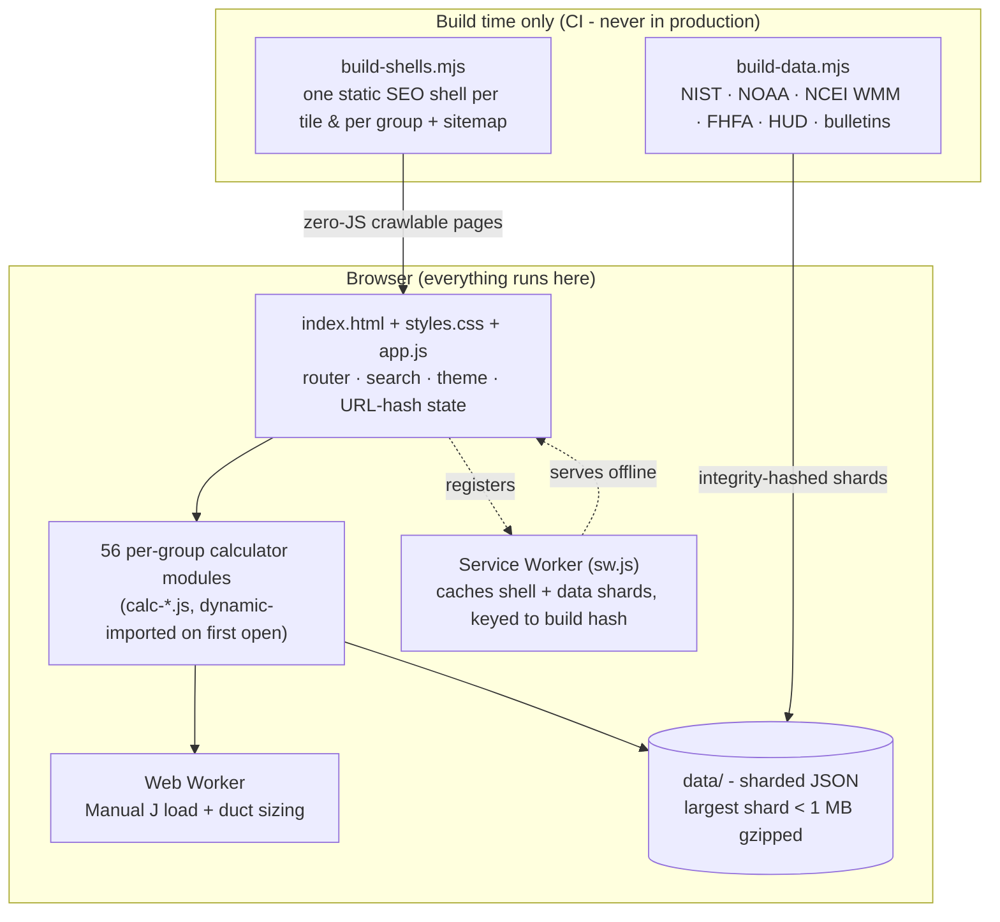

# roughlogic

**Field math for the trades. Free, fast, no ads, no accounts, works offline.**

[roughlogic.com](https://roughlogic.com) gives electricians, plumbers, HVAC techs, carpenters, restoration techs, firefighters, surveyors, and dozens of other trades more than 1,000 small, single-purpose calculators - voltage drop, friction loss, conduit fill, duct sizing, refrigerant superheat, stair geometry, pump operating point, earth pressure, and much more. Everything runs in your browser. Every answer is computed from a published formula and cites its source.

<p align="center">
  
  &nbsp;
  
  &nbsp;
  
</p>

## How to use it

1. Open [roughlogic.com](https://roughlogic.com).
2. Type what you need in the search bar - a tool name or a plain-English question ("voltage drop on a 150 ft run") - and pick a result. Or browse by trade from the home page.
3. Type in your numbers. The answer updates live; there is no submit button. Tap **Copy** to grab a value.

Every calculator ships with a **Test with example** button that fills a known reference case, a **citation** for where the formula comes from, and a **limitation note** on what the tool is *not* for. Your inputs are saved in the URL, so you can bookmark or share a calculator with its numbers preloaded. Once the page has loaded, it works with no signal at all - no account, no email, no tracking, ever.

## What's in the catalog

The catalog is organized into 21 trade benches. Search spans all of them at once; the letters are the internal group codes (the `I` code is reserved).

| | Bench | | Bench |
|---|---|---|---|
| **A** | Electrical | **N** | Stage & Live Production |
| **B** | Plumbing & Gas | **O** | Kitchen & Food Service |
| **C** | HVAC | **P** | Field, Backcountry & SAR |
| **D** | Water Damage & Mold Restoration | **Q** | Historical Reference Data |
| **E** | Carpentry & Construction | **R** | Accounting, Tax & Small-Business |
| **F** | Fire-Ground Engineering | **T** | Bench Science & Laboratory Math |
| **G** | Cross-Trade Utilities | **X** | Real Estate |
| **H** | Knowledge References | **Y** | Educators & K-12 |
| **J** | Trucking & Logistics | **Z** | Rigging & Heavy Lift |
| **K** | Mechanic - Auto, Marine, Aviation | | |
| **L** | Agriculture & Forestry | | |
| **M** | Water & Wastewater Operations | | |

### A representative slice

Each tile is one formula, one screen, with the source it comes from. A sample:

| Calculator | Computes | Grounded in |
|---|---|---|
| Ohm's Law | V, I, R, or P from any two | `V = I·R`, `P = V·I` |
| Voltage Drop | 1φ / 3φ drop over a run | NEC Ch. 9 conductor properties |
| Conduit Fill | percent fill by conduit + conductors | NEC Ch. 9 Table 1 / Annex C |
| Friction Loss | head loss in a pipe run | Hazen-Williams (water), Darcy-Weisbach (gas) |
| Refrigerant P-T | pressure ↔ temperature | manufacturer saturation tables |
| Hydraulic Jump | sequent depth & energy loss | Bélanger: `y₂ = (y₁/2)(√(1+8·Fr₁²) − 1)` |
| Stair Stringer | diagonal length & board feet | rise/run geometry |
| Sag Vertical Curve | min. curve length for sight distance | AASHTO: `L = A·S²/(400 + 3.5·S)` |
| Required Section Modulus | `Zx` to pick a steel W-shape | AISC 360 Ch. F, `Mp = Fy·Zx` |
| Michaelis-Menten (inverse) | `[S]` for a target fraction of Vmax | `[S] = Km·f/(1 − f)` |

Every formula is transcribed in [docs/derivations.md](docs/derivations.md) and every citation in [docs/data-sources.md](docs/data-sources.md).

## Architecture

roughlogic is a **100% client-side static site**. There is no server, no database, no account system, no analytics, and no runtime third-party dependency. Everything ships as same-origin static assets, and the site is fully functional offline after the first load.



The home-view payload (`index.html` + `styles.css` + `app.js` + the boot helpers) gzips to well under the 100 KB spec budget. Opening a calculator dynamic-imports only that trade's `calc-*.js` module and lazy-loads only the data shards it needs - nothing is fetched eagerly. The simplified Manual J heating/cooling load estimators and the duct-sizing calculator run in a Web Worker so the main thread stays responsive on multi-zone inputs.

**Discoverability without JavaScript.** At build time, `build-shells.mjs` emits one zero-JS static shell per tile (`dist/tools/<id>/`) and per group (`dist/groups/<slug>/`), each carrying title, meta description, canonical link, Open Graph / Twitter Card tags, JSON-LD (`WebApplication` / `CollectionPage`), a breadcrumb, and a "Run the calculator" link into the SPA. A crawler or a no-JS visitor reads a complete static reference page; one click opens the live tool. See [docs/architecture.md](docs/architecture.md) and [docs/seo.md](docs/seo.md).

## How the answers earn trust

The hard part of a calculator catalog is not the arithmetic - it is proving, at scale, that every tile stays correct as the catalog grows. roughlogic treats that as a build problem. `npm run lint` runs **more than 30 static gates** before any change can land, and CI layers browser tests on top. Highlights:

| Gate | What it guarantees |
|---|---|
| `check-dimensions` | every formula is dimensionally consistent (the unit algebra checks out) |
| `check-cross-validation` | independent tiles that compute the same quantity agree numerically |
| `check-bounds` | a fuzzer sweeps each tile's input domain; no NaN/∞, monotonicity where required |
| `check-worked-examples` | each tile's "Test with example" reproduces a publisher-verified reference number |
| `check-citation-coverage` | every tile names a real, dated source; citations are freshness-tracked |
| `check-derivation-coverage` | every formula has a written derivation in `docs/derivations.md` |
| `check-dead-inputs` | no rendered field is silently ignored by the compute function |
| `check-tile-contract` | every tile is registered, crash-free, and matches its declared I/O shape |
| `check-us-defaults` | inputs default to US customary units where the trade expects them |
| `check-module-sizes` / `check-home-payload` | per-module and home-payload gzip budgets hold |
| `check-csp` | no inline handlers or external origins that would violate the strict CSP |

CI runs four parallel jobs on every push: **lint + unit tests + data-integrity verification**, **Lighthouse** (budgets asserted on the *median of 3* runs, not an optimistic single sample), **accessibility** (axe-core at 320 px), and the **full Playwright integration suite** on Chromium *and* WebKit, followed by a `dist/` dangling-reference gate. In the browser, a startup integrity check (`integrity.js`) re-verifies the SHA-256 of every data manifest against `data/integrity.json` and surfaces a non-blocking banner if a shard was tampered with - the read-only posture means the worst case is a visible warning, never silent corruption.

## Design decisions

| Decision | Why |
|---|---|
| **100% client-side, static** | No server means no outage, no data collection, no cost to keep running, and true offline use. |
| **No accounts, no analytics, no cookies** | The only persisted state is the theme (one `localStorage` key). Calculator inputs and pinned tiles live in the URL hash - shareable and bookmarkable by construction. |
| **Cite every formula** | A field calculator you can't verify is a liability. Every tile links its published source and is gated on having one. |
| **One tile, one formula** | Small, composable tools beat a monolithic mega-calculator: each is independently testable, citable, and linkable. |
| **Correctness is a build gate, not a hope** | Dimensional analysis, cross-validation, bounds fuzzing, and worked-example checks run in CI so drift fails loudly instead of shipping. |
| **Lazy everything** | Dynamic-imported modules and on-demand data shards keep the home payload tiny and the site fast on a phone on a slow connection. |
| **Mobile-first, no horizontal scroll** | A dedicated gate (`check-shell-mobile`) plus a Playwright stress sweep assert zero page-level horizontal scroll on every view at 320 px, in landscape, and at 200% text zoom. |

## Use it from an AI agent

The whole catalog is available to AI agents (Claude Code, Claude Desktop, Cursor, and the like) through a local, zero-dependency [MCP](https://modelcontextprotocol.io) server that runs entirely on your machine over stdio - no hosting, no network. It exposes three meta-tools (`search_calculators`, `describe_calculator`, `run_calculator`) that read straight from the repo, so the agent surface can never drift from the site. See [mcp/README.md](mcp/README.md) for setup.

## Develop

```bash
npm install        # dev tooling only; the site itself has zero runtime deps
npm run dev        # serve the SPA locally
npm run build      # emit dist/ (SPA + static shells + sitemap)
npm run lint       # the full static-gate chain (30+ checks)
npm test           # unit tests (node --test)
npm run test:e2e   # Playwright integration suite (needs a browser)
```

The repo root holds the SPA entry (`index.html`, `styles.css`, `app.js`, `sw.js`), the `calc-*.js` calculator modules, and shared UI/runtime helpers. `data/` holds sharded JSON with per-folder manifests and integrity hashes. `scripts/` holds build and gate tooling (never runs in production). `specs/` is the numbered specification history; `docs/` holds the derivations, data sources, architecture, and audit trail. See [docs/maintainer-quickstart.md](docs/maintainer-quickstart.md) and [docs/contributor-checklist.md](docs/contributor-checklist.md).

## License

MIT. See [LICENSE](LICENSE).
