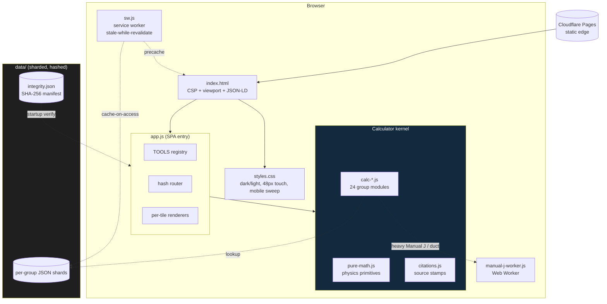
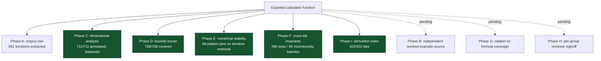
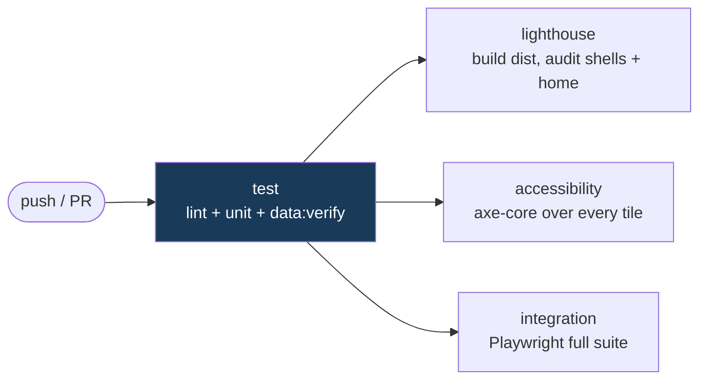

# roughlogic

Field math for the trades. A calm, fast, ad-free, account-free, ever-free reference site.

[roughlogic.com](https://roughlogic.com) is a single-page static web application that helps electricians, plumbers, HVAC technicians, water-damage and mold-restoration techs, carpenters and general contractors, fire-ground engineers, and a widening set of allied professions do the math they actually do during a workday. Everything runs in the browser. No server, no account, no analytics, no telemetry, no AI inference, no API key, no ongoing operating cost beyond domain renewal.

> **422 deterministic tools across 24 trade groups. 0 dependencies. 0 trackers. 0 LLM calls. 4,842 unit tests. Works offline.**

---

## The problem

Tradespeople do quick math constantly: voltage drop, friction loss, conduit fill, duct sizing, refrigerant superheat, psychrometric drying goals, stair geometry, fire-ground pump pressure. The reference material lives behind paywalled code books, in licensed apps that nag the user constantly, or in cluttered websites that lard the page with advertisements and trackers. The trades deserve better.

## The solution

One static page with 422 small calculators and reference tools, organized into 24 categories. Each tool does one thing. The home page is scannable in five seconds. Every formula is computed from public physics or public-domain data. Every reference value is sourced and dated. The user can save the page and use it offline forever.

The design constraints are the product:

| Constraint | What it means |
|---|---|
| No accounts | Nothing to sign up for. No email is ever requested. |
| No telemetry | No analytics SDK, no pixel, no beacon. CSP `connect-src 'self'` makes outbound calls impossible at runtime. |
| No AI | Every output is a deterministic function of input and bundled data. No model, no inference, no probabilistic step. |
| No runtime dependencies | The app ships zero third-party JavaScript. `package.json` has empty `dependencies` and `devDependencies`. |
| Offline-first | A service worker pre-caches the shell; the page works with the network off. |
| Cited | Every answer carries a source stamp with the publication and edition it derives from. |

---

## Quick start

Open [https://roughlogic.com](https://roughlogic.com) in any browser. Type a tool's name in the center search bar; it filters the catalog as you type and shows a results dropdown. Click a result, or press Enter, to open that calculator. Focus the empty search bar to browse the whole catalog. Type in your numbers. Read the answer (it renders live, there is no submit button). Copy to clipboard. Go back to work. The header toggle (top right) switches between dark and light; the choice persists across reloads.

Calculator state is encoded in the URL hash, so you can bookmark or share a calculator with its inputs preloaded (for example, `https://roughlogic.com/#voltage-drop`).

---

## How it works

The home view is a single centered hero: an elevator-pitch headline, a one-paragraph description, one search bar, and a static "browse by trade" index of the 24 group hubs. The search bar is a combobox: free text filters the catalog by tool name, description, or industry-term alias, and a results dropdown shows matches with their category; focusing the empty field lists every tool. Selecting a result routes to that calculator.


Each calculator has labeled numeric inputs (with `inputmode` set so phones surface the right keypad), a "Test with example" button that fills a known reference case, an inline citation, a live-rendered output that updates as you type, a per-output Copy button, and a limitation notice stating what the tool is not. There is no submit button anywhere on the site.

---

## System design and architecture

The runtime is a single `index.html`, a single `styles.css`, a single entry `app.js`, a set of per-group calculator modules (`calc-*.js`), a shared math kernel (`pure-math.js`), a citations module, a service worker, and a `data/` folder of sharded JSON. The architecture follows the same principles as encryptalotta.com and sophiewell.com: same-origin static assets, a strict Content Security Policy, no runtime dependencies, no telemetry.



Design decisions worth calling out:

- **Computation on the main thread, with two exceptions.** Most tools compute in well under a millisecond, so a worker would only add latency. The simplified Manual J load estimators and the duct-sizing calculator (nested bisection + Colebrook iteration) run in `manual-j-worker.js` to keep the main thread responsive.
- **Sharded data, hashed at build.** Reference datasets are split per group so a tool loads only what it needs. A startup integrity check (`integrity.js`) verifies the SHA-256 of each per-folder manifest against `data/integrity.json`; a mismatch surfaces a non-blocking banner naming the affected dataset.
- **Hash-based state.** Per-tile inputs live in the URL hash (`hash-state.js`), which makes every calculation bookmarkable and shareable with zero server state. The grammar and its back-compat policy are documented in [docs/hash-state.md](docs/hash-state.md).
- **One brand accent in an otherwise monochrome palette.** Links, the focus ring, the "Run the calculator" CTA, and the copy-success pulse share a single accent that clears WCAG AA on every surface in both themes.

For the full runtime walkthrough and the ASCII diagram, see [docs/architecture.md](docs/architecture.md).

### Repository map

```
roughlogic.com/
  index.html            SPA shell: CSP, viewport, JSON-LD, theme pre-paint
  styles.css            single stylesheet (dark + light, mobile sweep, print)
  app.js                SPA entry: TOOLS registry, router, renderers (~142 KB)
  pure-math.js          physics/math primitives shared across groups
  calc-<group>.js       24 per-group calculator modules (electrical, hvac, ...)
  citations.js          per-tile source-stamp strings
  theme.js              dark/light toggle (pre-paint, no flash)
  hash-state.js         URL-hash state grammar + router
  integrity.js          startup SHA-256 manifest verification
  sw.js                 service worker (offline + stale-while-revalidate)
  manual-j-worker.js    Web Worker for Manual J + duct sizing
  data/                 sharded, hashed reference JSON (per group)
  specs/                spec.md .. spec-v17.md (inheriting build specs)
  docs/                 architecture, correctness, data-sources, a11y, ...
  scripts/              build + 22 lint/audit gates + data pipeline
  test/                 unit (Node test runner) + integration (Playwright)
  dist/                 build output: prerendered shells + sitemap (generated)
```

---

## The catalog (cheat sheet)

422 tiles across 24 active group letters. The letters are stable identifiers; new groups append, retired tiles keep their IDs.

| Letter | Group | Tiles | Representative tools |
|---|---|--:|---|
| A | Electrical | 40 | voltage drop (with reactance), power triangle, EV charger load, ambient ampacity adjust, service load (220.82), PV interconnection busbar |
| B | Plumbing and Gas | 33 | friction loss, pipe sizing, water hammer, recirc pump head + annual cost, water-heater recovery, thermal expansion tank, sanitary DFU, trap primer, backflow assembly sizing screen |
| C | HVAC | 40 | duct sizing, Manual J (simplified), refrigerant P-T, chiller tonnage, heat-exchanger LMTD/NTU, air changes per hour, boiler pipe sizing, compressor short-cycle, humidifier capacity, filter pressure drop and fan energy |
| D | Water Damage and Mold Restoration | 16 | air movers, dehumidifier sizing, mold risk, standing water, drying log, equipment power draw vs circuit capacity (NEC 210.20) |
| E | Carpentry and Construction | 43 | joist/beam spans, header sizing (R602.7), deck beam/post (R507), roof pitch, stair stringer, wind/snow load |
| F | Fire-Ground Engineering | 22 | pump discharge pressure, standpipe PDP (NFPA 14), smoke-ejector CFM, hose friction, needed fire flow, SCBA time |
| G | Cross-Trade Utilities | 31 | unit conversion, mileage cost, NIOSH lifting, heat stress, haversine |
| H | Knowledge References | 15 | color codes, knot reference, wire gauge tables |
| J | Trucking and Logistics | 8 | bridge formula, HOS math, stopping sight distance, axle load |
| K | Mechanic (Auto, Marine, Aviation) | 8 | fuel range, gear ratio, compression |
| L | Agriculture and Forestry | 12 | sprayer calibration, GPA, drawbar power, board-foot cruise, irrigation requirement (ET acre-feet), cattle stocking rate (AUM), grain bin capacity |
| M | Water and Wastewater Operations | 13 | pounds formula, detention time, disinfection CT, SVI, pool turnover, well drawdown, cooling-water makeup, chlorine residual decay |
| N | Stage and Live Production | 7 | DMX addressing, SPL distance, rigging pulley MA |
| O | Kitchen and Food Service | 6 | recipe scaling, food cost, tip-out split |
| P | Field, Backcountry, and SAR | 8 | backcountry needs, ramp slope, rainwater capture |
| Q | Historical Reference Data | 1 | historical reference lookup |
| R | Accounting, Tax, and Small-Business | 12 | loan amortization, MACRS, breakeven, payroll withholding, mileage rollup |
| S | Legal Plain-English and Statutory Math | 9 | filing deadlines, judgment interest, wage-and-hour |
| T | Bench Science and Laboratory Math | 10 | Beer-Lambert, dilution, Henderson-Hasselbalch, molarity |
| U | Veterinary | 18 | dose, maintenance fluids, energy requirement, CRI, anesthesia vitals |
| V | EMS and Pre-hospital | 20 | GCS, Parkland, anion gap, Wells, APGAR, pediatric weight |
| W | Pilots and General Aviation | 18 | density altitude, wind triangle, fuel planning, METAR/TAF decode |
| X | Real Estate | 15 | LTV, DTI, PITI, cap rate/DSCR, 1031 timeline, closing costs |
| Y | Educators and K-12 | 17 | readability scores, bell-curve CDF, standards-based grading, statistics quick-read, confidence interval, Pearson correlation (r + significance), chi-square goodness-of-fit |

The full inventory is in the specs. Each spec inherits all prior specs by reference: `spec.md` is the v1 source of truth; v2 through v4 expanded the catalog; v5 added Accounting / Legal / Lab; v6 set citation discipline; v7 through v9 added tiles; v10 was a platform-only maintenance pass; v11 retired Recents and Big Buttons; v12 added five allied-profession groups (U/V/W/X/Y) plus a mobile-responsive sweep, a wiring-correctness lint, and a tiered data-refresh; v13 added the prerendered discoverable surface; v14 is the correctness pass (below). Specs v15 through v17 draft a 385 to 485 tile expansion; landing is incremental against the live catalog (much of v15 was already in place). **Spec-v15 is now fully closed** (all 35 tiles, catalog at 400; package version stamped 0.15.0). Group A (Electrical) added voltage drop with reactance (NEC Chapter 9 Table 9), the power-triangle solver (IEEE 1459), EV charger continuous load (NEC Article 625), conductor ambient + fill ampacity adjustment (NEC 310.15), the service-load optional method (NEC 220.82), PV interconnection 120% busbar (NEC 705.12), and off-grid battery sizing (IEEE 1013). Group E (Carpentry) added window/door header sizing (IRC R602.7 + AWC NDS, with C_D / C_F factors and a jack-stud count) and deck beam/post sizing (IRC R507 + an NDS column check, footing, and ledger schedule). Group F (Fire-Ground) added standpipe pump discharge pressure (NFPA 14) and smoke-ejector / negative-pressure ventilation CFM (NFPA 1500 / IFSTA). Group G (Cross-Trade) added pump total dynamic head (Hazen-Williams / Crane TP-410), hydraulic cylinder force and speed (NFPA T2.13.7), V-belt sheave and drive sizing (ANSI/RMA IP-20 / IP-22), and the gear ratio / RPM cascade (AGMA 2000). All landed with full v14 discipline. The §H.6 per-group reviewer signoffs remain open and gate the "audited" announcement, not the landing.

**Spec-v16 is now closed (Part II of III); package version stamped 0.16.0.** The Group B (Plumbing), Group M (Water / Wastewater), Group C (HVAC), and the Group D / C.4 loose-ends batches landed 16 genuinely-new tiles plus 2 output extensions, taking the catalog **400 -> 417**. Group B added water-heater recovery rate (DOE 10 CFR 430 / AHRI 1300), potable thermal-expansion-tank sizing (ASPE Plumbing Engineering Design Handbook + ASME B40.1 steam tables, with the IPC 604.8 PRV note), sanitary-drain DFU sizing (IPC 2021 Tables 709.1 / 710.1 for horizontal branch, stack, and building drain), and trap-primer sizing (IPC 1002.4 occupied-space compliance). Group C now ships the full first-principles mechanical set: chiller tonnage from delta-T and GPM (`Q = GPM x 500 x delta-T`, with property-derived glycol factors per ASHRAE Fundamentals 2021 Ch. 31), heat-exchanger LMTD and effectiveness-NTU (TEMA / Incropera, counter- and parallel-flow, with thermodynamic-limit rejections), air changes per hour (`CFM x 60 / volume`, net ACH and pressurization, against ASHRAE 62.1 / 170 occupancy bands), hot-water boiler distribution pipe sizing (`GPM = Q / (500 x delta-T)` then the smallest copper / steel / PEX size at or below the material velocity ceiling, with Hazen-Williams head loss; ASHRAE Systems and Equipment 2020 Ch. 13), compressor short-cycle protection (the ASHRAE/AHRI part-load cycling parabola against the minimum oil-return runtime; Copeland AE Bulletin 17-1226), and humidifier capacity from an RH target (`60 x CFM x rho x delta-W` with altitude-corrected humidity ratios; ASHRAE Fundamentals 2021 Ch. 1). Group M added the small-system-water-operator math: pool turnover rate and chlorine demand (NSPF CPO Handbook / ANSI-APSP-ICC 11), well drawdown and specific capacity (AWWA A100 / USGS), cooling water makeup from cycles of concentration (CTI / ASHRAE), and first-order chlorine residual decay (EPA 815-R-02-020 / AWWA M14). The Group D / C.4 batch added D.5 equipment power draw vs available circuit capacity (NEC 210.20(A) 80%-continuous check over the drying-equipment fleet) and the C.4 cooling-tower efficiency ratio (`range / (range + approach)`, added to the existing `cooling-tower` tile rather than duplicated). Then C.7 filter pressure-drop (clean and change-out drop by MERV / HEPA class, the brake-HP fan power at each, and the annual fan energy and loading penalty over a clean filter; ASHRAE 52.2 + first-principles fan power) landed as a first-principles tile -- the site's "compute the physics, never reproduce the licensed table" rule is exactly what lets it use representative cut-sheet defaults inline rather than bundle a paywalled curve. B.3 recirculation heat-loss landed its net-new annual-cost output as an extension of the existing `recirc-loop-sizing` tile (standing heat loss x runtime / heater efficiency / per-fuel BTU content x fuel price, gas or electric) rather than shipping a duplicate. And B.8 cross-connection backflow assembly sizing landed as `backflow-sizing`, reusing the head-loss curves already bundled for `backflow-loss` (so no new dataset) and adding the genuinely-net-new screening: a high / health hazard forces a reduced-pressure principle (RP) assembly per IPC 312 regardless of selection, the downstream residual pressure (upstream minus head loss) is checked against a minimum, and the EPA 40 CFR 141.85 / AWWA M14 annual-test reminder is surfaced. Each shipped with the full v14 discipline: dimensional annotation, bounds fuzzer, a worked example cross-checked against the cited reference, citation + tile-meta + related-tiles + search aliases, and a prerendered shell. With B.3 and B.8 landed, every genuinely-new v16 tile the first-principles / extension / representative-defaults discipline can deliver has shipped. The rest are covered by existing tiles (C.1 duct fittings by `duct-friction-static`; D.1-D.4 by `air-movers` / `dehumidifier` / `nam-sizing` / `drying-times`; B.4 storm-drain by `computeStormwaterRational` + `computeManningSlope`; N.6 WSFU by the Hunter's-curve `pipe-sizing` tile), and only the external-dataset tiles (C.2 refrigerant line-set / NIST REFPROP and B.7 LP-gas / NPGA) are deferred to their own reviewed changes (each bundles a genuinely external, in B.7's case safety-sensitive, dataset that lands later as a 0.16.x change). With those documented, **v16 closed on 2026-06-05 and the package version stamped 0.16.0**; the §Z.4 reviewer signoffs remain open and gate the "audited" announcement, not the close. v17 (Allied-Profession Deepening, Part III of III) is the next frontier and stamps 0.17.0 at its own close. See [specs/spec-v16.md](specs/spec-v16.md).

**Spec-v17 is open (Part III of III), landing incrementally; package version stays 0.16.0 until v17 closes.** The first Phase L (Agriculture) batch and the §Z.4 statistics platform work are live, taking the catalog **417 -> 422**. Phase L added the irrigation requirement (ET-based acre-feet from `ET_crop = Kc x ET0 x days`, net/gross depth after rainfall and efficiency; FAO Irrigation and Drainage Paper 56 + USDA NRCS Irrigation Guide, with reference ET0 user-supplied and FAO 56 Table 12 Kc values inline), the cattle stocking rate (available forage, animal-unit-months, and grazing days; USDA NRCS National Range and Pasture Handbook Ch. 6), and the grain bin capacity (cylinder + cone geometry to bushels via `ft^3 x 0.8036`, weight by USDA FGIS test weight). The §Z.4 deliverable added shared, lazy-loaded statistical special functions to `pure-math.js` -- `erf`, `normCdf`, `gammaln`, `gammainc`, `chi2Cdf`, `betainc`, `tcdf` -- each verified against a published table value (Abramowitz & Stegun for `erf`; the standard t / chi-square critical-value tables for the CDFs), with zero impact on the home-view payload; the two tiles to consume them so far are Y.4 `pearson-correlation` (Pearson r, R^2, and the t-test with a two-tailed p-value from `tcdf`) and Y.3 `chi-square-gof` (the chi-square goodness-of-fit statistic, k-1 df, and the p-value from `chi2Cdf`, with expected entered as counts or proportions and an expected-below-5 flag). That same batch also corrected the home page's stale, inconsistent crawler-facing tool count (`index.html` read "404", the SPA runtime read "400") to a durable "420+". Each shipped with the full v14 discipline. As in v16, the audit found that much of what v17 drafts is already in the catalog and is documented as covered rather than duplicated: Aviation `top-of-descent` / `weight-balance` / `pressure-altitude` / Mach-in-`true-airspeed`; EMS anion-gap / `nihss` / `wells-pe` / `perc-rule`; Lab `henderson-hasselbalch` / `molarity-dilution` / `beer-lambert`. The genuinely-new v17 surface concentrates in Group L (L.2 / L.5 remain), Y.2 regression (the last stats tile to consume the new helpers), and a subset of finance / tax / legal tiles needing state-keyed shards; those land in later batches. (Platform note: the home-view JS sub-budget is now at ~99% of its ceiling; the spec-v10 §H.2 TOOLS-metadata extraction into a *lazy-loaded* shard is the documented remediation and the near-term blocker before the next multi-tile batch -- it lands as a dedicated change because the savings are honest only if the shard is genuinely deferred, not merely moved off `app.js`.) See [specs/spec-v17.md](specs/spec-v17.md).

Retired platform affordances: Recents and Big Buttons mode (v11), Project Bundle (the `bundle.js` module; old `#b=` hashes still parse and route home). High-contrast theme was folded into the dark/light toggle; a stored `high-contrast` preference migrates to dark on load.

---

## Discoverable surface (prerendered shells)

The home document renders the SPA, and per-tile state lives in the URL hash. But fragments are not part of URL canonicalization, and most non-Google crawlers do not execute JavaScript, so the cited reference content of 422 tiles would otherwise be invisible to general web search. Spec-v13 fixes this with a build-time prerender step.


- **`/tools/<id>/index.html`** is one static, zero-JavaScript shell per tile (422). Each carries the tile name as `<h1>`, a verb-first description, a JSON-LD `WebApplication` + `BreadcrumbList` block, Open Graph + Twitter Card meta, the inline notice, the source-stamp citation, a worked example, a curated related-tiles list, and a "Run the calculator" anchor to the SPA hash route.
- **`/groups/<slug>/index.html`** is one shell per active group (24), listing every tile with a one-line description and an internal link, plus JSON-LD `CollectionPage` + `BreadcrumbList` + `ItemList`.
- **`sitemap.xml`** carries 448 URLs (home + changelog + 24 groups + 422 tiles), regenerated at every build.
- **SPA-side canonical emission**: when the SPA opens a tile it sets `<link rel="canonical" href="https://roughlogic.com/tools/<id>/">` so a crawler that lands on a hash URL still reads the canonical shell.

Measurement is source-side only (Cloudflare edge metrics, Google Search Console, Bing Webmaster Tools); there is no client telemetry. See [docs/seo.md](docs/seo.md) for the shell model, authoring rules, and JSON-LD allowlist.

---

## Correctness posture

The site is a calculator; the unit of value is the answer it returns. Spec-v14 adds an end-to-end correctness audit on top of the source-stamp discipline (v6) and the per-tile unit tests. The audit is a set of build-time gates that ratchet to fail-on-missing as coverage closes, so a regression surfaces at CI rather than in the field.



Status as of this writing:

| Phase | What it guarantees | State |
|---|---|---|
| A | Every exported function has a formula-corpus row in `docs/derivations.md` | Complete (708 rows; lint fails on a stale section) |
| B | Every fixture comes from a published worked example independent of the primary citation | Pending the per-group review pass |
| C | Every function carries a dimensional-analysis annotation that parses and balances | Complete (711/711) |
| D | Every function passes the bounds-and-edge-case fuzzer | Complete (708/708) |
| E | Every iterative method has a numerical-stability (bit-pattern) pin | Complete |
| F | Every shared computation passes cross-tile invariant tests | Complete (5/5 shared-computation classes; round-trip identities; 66 monotonicity batches, 390 tests) |
| G | Every tile maps to a tracked published source | Measurement mode (366/422 tiles tracked, 86.7%) |
| H | Every active non-exempt group has a current reviewer signoff | Pending external reviewers (H and Q are exempt) |
| I | One derivation-index row per tile | Complete (422/422) |

The **cross-tile invariant** suite is the most distinctive gate. Where an output is monotonic in an input (voltage drop in length, friction loss in flow, fluid plan in patient weight), a sweep asserts strict monotonicity plus a published-rule pin (for example, NEC 430.22 125%, Hazen-Williams `Q^1.852`, the IRS standard mileage rate against the bundled shard). A sign flip, an exponent swap, or a missing unit conversion fails immediately rather than producing a plausible-but-wrong number. The sweep now covers every catalog compute function whose output is monotonic in an input. See [docs/correctness.md](docs/correctness.md).

---

## Building and testing

The site has no command-line interface of its own. The repository ships these npm scripts.

| Command | What it does |
|---|---|
| `npm run dev` | Start a local development server. |
| `npm run build` | Produce the static `dist/` for deployment (copies the SPA, prerenders 422 tile + 24 group shells, regenerates `sitemap.xml`). |
| `npm test` / `npm run test:unit` | Run the unit suite under Node's built-in test runner (4,842 tests). |
| `npm run test:e2e` | Run the Playwright integration suite (per-tile smoke, layout, print, CSV, perf). |
| `npm run test:a11y` | Run the axe-core accessibility loop over every tile. |
| `npm run lint` | Run the 22-gate lint chain (below). |
| `npm run audit` | The pre-PR gate: lint, test, build, dist check, data verify. |
| `npm run data:refresh` | Run the data pipeline (fetch, parse, shard). |
| `npm run data:verify` | Verify shard SHA-256 hashes against `data/integrity.json`. |
| `npm run clean` | Remove `dist/`. |

### The lint chain

`npm run lint` runs 22 gates in sequence. They are the project's executable spec: a violation fails CI.

| Gate | Guards |
|---|---|
| `grep-checks` | Banned tokens: em-dash, emoji, forbidden phrasings (spec §8). |
| `check-ngrams` | Banned n-grams in user-facing copy. |
| `check-v6-discipline` | Every tile has a source stamp (v6). |
| `check-manifests` | Data manifests match the shard tree. |
| `check-citation-freshness` | Citation editions are current. |
| `build-citation-strings --check` | Generated citation strings are not stale. |
| `check-discoverability` | Search aliases + group/tile counts are consistent. |
| `check-worked-examples` | Every tile has a worked-example fixture. |
| `check-tile-meta` | Tile metadata is well-formed. |
| `check-related-tiles` | Every tile has a curated related-tiles entry. |
| `check-wiring` | Renderer imports/exports and dist-vs-runtime parity. |
| `check-sw-precache` | The service-worker precache list matches shipped files. |
| `check-module-sizes` | Per-module gzip caps (tile shell 6 KB, group shell 12 KB). |
| `check-home-payload` | Home-view payload under the 100 KB budget. |
| `build-corpus --check` | Formula corpus is not stale (Phase A). |
| `build-tile-index --check` | Per-tile derivation index is not stale (Phase I). |
| `check-cross-validation` | Fixture tolerances under the per-group ceiling (Phase B). |
| `check-dimensions` | Dimensional annotations parse and balance (Phase C). |
| `check-citation-coverage` | Tile-to-source coverage map (Phase G). |
| `check-audit-trail` | Per-group reviewer-signoff table is well-formed (Phase H). |
| `check-derivation-coverage` | Every tile is mentioned in `docs/derivations.md` (Phase I). |
| `check-bounds` | Every corpus row has a bounds-fuzzer row (Phase D). |

### Continuous integration

`.github/workflows/ci.yml` runs four jobs on every push and pull request to `main`/`develop`:



The Lighthouse budgets are tiered: the prerendered `/tools/` and `/groups/` shells carry the strict budget (performance >= 0.95, FCP <= 1 s, LCP <= 1.5 s) because they ship only `styles.css`; the SPA home view, which loads the ~142 KB `app.js`, is gated on the stable paint metrics (FCP, LCP, CLS) and the accessibility / best-practices / SEO scores rather than the high-variance total-blocking-time the shared 2-core runner produces under CPU throttle.

---

## Accessibility and mobile

The site targets WCAG 2.2 Level AA and is verified by an axe-core loop over every tile under both themes. The interaction contract: a single `<h1>` per view, a 48 px touch-target floor on every control, an `aria-live` output region, visible focus rings, full keyboard operation, and `prefers-reduced-motion` honored (entry animations are transform-only so text never composites at sub-full opacity).

The mobile sweep guarantees **zero page-level horizontal scroll at any viewport width >= 320 px** on every view. Long strings (citation URLs, source stamps, hyphenated names) wrap with `overflow-wrap: anywhere`; wide multi-column data tables (loan amortization, PCR master mix) scroll inside their own `.tabular-tool` container so the page itself never does. A Playwright guard asserts `documentElement.scrollWidth <= clientWidth + 1` at 320 px on the home view, the widest data table, and the longest reference list. See [docs/accessibility.md](docs/accessibility.md) and [docs/mobile-responsive.md](docs/mobile-responsive.md).

---

## Safety guarantees

- **Read-only by default.** No cookies, no sessionStorage, no IndexedDB. localStorage holds exactly one key (`rl-theme`, value `"dark"` or `"light"`). No calculator inputs are persisted. The service-worker cache holds only same-origin static assets.
- **No outbound network calls at runtime.** CSP `connect-src 'self'` is enforced.
- **All inputs are typed.** No HTML rendering of user-supplied text.
- **Startup integrity check.** `integrity.js` verifies each per-folder data manifest against `data/integrity.json`; a mismatch surfaces a non-blocking banner.
- **Honest framing.** An inline limitation notice on every calculator and a footer disclaimer state that the site is a math aid, not a code authority.

## Limitations

The site is honest about what it is and is not.

- It is **not a code authority** and does not interpret code requirements. The authority having jurisdiction governs all installations and inspections.
- It **does not reproduce any licensed code text or table.** NEC, IPC, IRC, ASHRAE Fundamentals, ACCA Manual J, NFPA standards, and AWC span tables are not bundled. Where a first-principles calculator matches a code table for the same inputs, it is because both compute the same physics, not because the table was copied.
- The **Manual J** cooling and heating estimators are simplified; a code-compliant load calculation requires full Manual J, and every Manual J view says so.
- The clinical and veterinary tiles (Groups U, V) are **math aids, never a substitute** for the licensed provider's protocol or an in-person exam. See [docs/profession-overrides.md](docs/profession-overrides.md).
- The site does not generate code-compliant designs. The user is the judgment.

## Stability commitments

- No A/B testing, ever. No user-visible feature flags. No tracking, no email capture, no notifications.
- Public changelog at [CHANGELOG.md](CHANGELOG.md), also rendered at `/changelog.html`.
- A 90-day deprecation notice for any tool removed or any formula changed.
- Semantic versioning.

## Determinism, not AI

roughlogic uses zero LLM and zero AI. Every output is the result of a deterministic function over user input and bundled data. There is no inference, no model, no probabilistic step. The same inputs produce the same outputs, every time, on any device, with or without a network connection.

---

## Documentation

- [specs/](specs/) - the inheriting build specifications (`spec.md` through `spec-v17.md`); each carries an implementation-status banner.
- [docs/architecture.md](docs/architecture.md) - runtime architecture and ASCII diagram.
- [docs/correctness.md](docs/correctness.md) - the spec-v14 correctness pass (corpus, cross-check, dimensions, bounds, stability, invariants, signoffs).
- [docs/data-sources.md](docs/data-sources.md) - every dataset with source, license, cadence, and shard layout.
- [docs/derivations.md](docs/derivations.md) - first-principles derivation per calculator, plus the per-tile index.
- [docs/legal.md](docs/legal.md) - legal posture, dataset attributions, first-principles approach.
- [docs/accessibility.md](docs/accessibility.md) - WCAG 2.2 AA conformance checklist.
- [docs/mobile-responsive.md](docs/mobile-responsive.md) - the per-tile mobile sweep and no-horizontal-scroll guard.
- [docs/threat-model.md](docs/threat-model.md) - threats and controls.
- [docs/performance.md](docs/performance.md) - performance budget and enforcement.
- [docs/seo.md](docs/seo.md) - prerendered shell model, authoring rules, JSON-LD allowlist.
- [docs/deployment.md](docs/deployment.md) - Cloudflare Pages configuration.
- [docs/launch-checklist.md](docs/launch-checklist.md) - per-release launch gates and the live status snapshot.
- [docs/citation-discipline.md](docs/citation-discipline.md) - per-tile source-stamp strings and edition table.
- [docs/hash-state.md](docs/hash-state.md) - URL-hash grammar and back-compat policy.
- [docs/edition-rollover.md](docs/edition-rollover.md) / [docs/edition-amendment.md](docs/edition-amendment.md) - code-edition runbooks.
- [docs/maintainer-quickstart.md](docs/maintainer-quickstart.md) / [docs/contributor-checklist.md](docs/contributor-checklist.md) - maintenance and per-PR checklists.
- [docs/audit-trail.md](docs/audit-trail.md) - append-only record of external reviews.
- [CHANGELOG.md](CHANGELOG.md) - public changelog.

## License

MIT. See [LICENSE](LICENSE).
