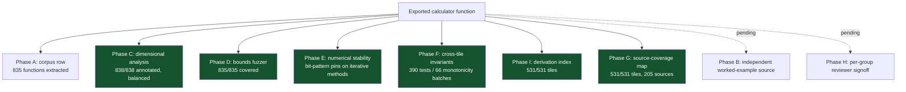
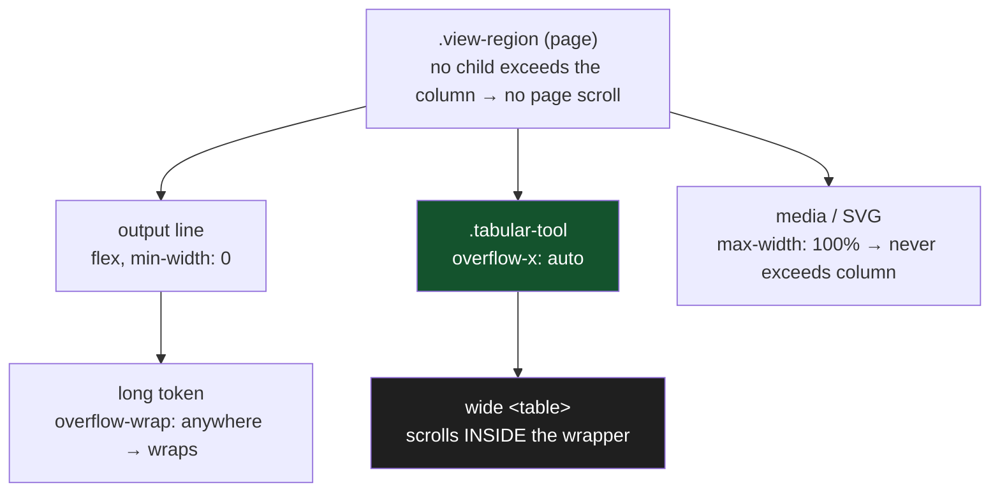

# roughlogic

Field math for the trades. A calm, fast, ad-free, account-free, ever-free reference site.

[roughlogic.com](https://roughlogic.com) is a single-page static web application that helps electricians, plumbers, HVAC technicians, water-damage and mold-restoration techs, carpenters and general contractors, fire-ground engineers, and a widening set of allied professions do the math they actually do during a workday. Everything runs in the browser. No server, no account, no analytics, no telemetry, no AI inference, no API key, no ongoing operating cost beyond domain renewal.

> **531 deterministic tools across 24 trade groups. 0 dependencies. 0 trackers. 0 LLM calls. 5,449 unit tests. Works offline.**

<p align="center">
  
  &nbsp;
  
  &nbsp;
  
</p>

<p align="center"><sub>The home view and a calculator (light and dark), on a 390&nbsp;px phone. One column, live output, cited, with a per-value copy button. No accounts, no ads, no network calls, no horizontal scroll at any width down to 320&nbsp;px.</sub></p>

---

## The problem

Tradespeople do quick math constantly: voltage drop, friction loss, conduit fill, duct sizing, refrigerant superheat, psychrometric drying goals, stair geometry, fire-ground pump pressure. The reference material lives behind paywalled code books, in licensed apps that nag the user constantly, or in cluttered websites that lard the page with advertisements and trackers. The trades deserve better.

## The solution

One static page with 531 small calculators and reference tools, organized into 24 categories. Each tool does one thing. The home page is scannable in five seconds. Every formula is computed from public physics or public-domain data. Every reference value is sourced and dated. The user can save the page and use it offline forever.

The design constraints are the product:

| Constraint | What it means |
|---|---|
| No accounts | Nothing to sign up for. No email is ever requested. |
| No telemetry | No analytics SDK, no pixel, no beacon. CSP `connect-src 'self'` makes outbound calls impossible at runtime. |
| No AI | Every output is a deterministic function of input and bundled data. No model, no inference, no probabilistic step. |
| No runtime dependencies | The app ships zero third-party JavaScript. `package.json` has empty `dependencies` and `devDependencies`. |
| Offline-first | A service worker pre-caches the shell; the page works with the network off. |
| Cited | Every answer carries a source stamp with the publication and edition it derives from. |

---

## Quick start

Open [https://roughlogic.com](https://roughlogic.com) in any browser. Type a tool's name in the center search bar; it filters the catalog as you type and shows a results dropdown. Click a result, or press Enter, to open that calculator. Focus the empty search bar to browse the whole catalog. Type in your numbers. Read the answer (it renders live, there is no submit button). Copy to clipboard. Go back to work. The header toggle (top right) switches between dark and light; the choice persists across reloads.

Calculator state is encoded in the URL hash, so you can bookmark or share a calculator with its inputs preloaded (for example, `https://roughlogic.com/#voltage-drop`).

---

## How it works

The home view is a single centered hero: an elevator-pitch headline, a one-paragraph description, one search bar, and a static "browse by trade" index of the 24 group hubs. The search bar is a combobox: free text filters the catalog by tool name, description, or industry-term alias, and a results dropdown shows matches with their category; focusing the empty field lists every tool. Selecting a result routes to that calculator.


Each calculator has labeled numeric inputs (with `inputmode` set so phones surface the right keypad), a "Test with example" button that fills a known reference case, an inline citation, a live-rendered output that updates as you type, a per-output Copy button, and a limitation notice stating what the tool is not. There is no submit button anywhere on the site.

---

## System design and architecture

The runtime is a single `index.html`, a single `styles.css`, a single entry `app.js`, a lazy-loaded catalog registry (`tools-data.js`), a set of per-group calculator modules (`calc-*.js`), a shared math kernel (`pure-math.js`), a citations module, a service worker, and a `data/` folder of sharded JSON. The architecture follows the same principles as encryptalotta.com and sophiewell.com: same-origin static assets, a strict Content Security Policy, no runtime dependencies, no telemetry.


Design decisions worth calling out:

- **Computation on the main thread, with two exceptions.** Most tools compute in well under a millisecond, so a worker would only add latency. The simplified Manual J load estimators and the duct-sizing calculator (nested bisection + Colebrook iteration) run in `manual-j-worker.js` to keep the main thread responsive.
- **Sharded data, hashed at build.** Reference datasets are split per group so a tool loads only what it needs. A startup integrity check (`integrity.js`) verifies the SHA-256 of each per-folder manifest against `data/integrity.json`; a mismatch surfaces a non-blocking banner naming the affected dataset.
- **Hash-based state.** Per-tile inputs live in the URL hash (`hash-state.js`), which makes every calculation bookmarkable and shareable with zero server state. The grammar and its back-compat policy are documented in [docs/hash-state.md](docs/hash-state.md).
- **Catalog metadata is lazy (spec-v10 §H.2).** The 531-entry `TOOLS` registry -- every tile's id, name, group, trades, and description -- lives in `tools-data.js` and is dynamic-imported only on the first search keystroke or tile-route navigation (via `ensureTools()`, mirroring the alias loader). The bare home view is static HTML that the router only unhides, so first paint loads neither the catalog nor the search aliases. This keeps the home-view JS sub-budget at ~43% of its ceiling (21.1 KB gz of the 49 KB allowance; total home payload 33.6% of the 100 KB budget) instead of ~99% with the array inlined; the bytes are deferred, not eliminated, so the gate measures honestly.
- **One brand accent in an otherwise monochrome palette.** Links, the focus ring, the "Run the calculator" CTA, and the copy-success pulse share a single accent that clears WCAG AA on every surface in both themes.

For the full runtime walkthrough and the ASCII diagram, see [docs/architecture.md](docs/architecture.md).

### Repository map

```
roughlogic.com/
  index.html            SPA shell: CSP, viewport, JSON-LD, theme pre-paint
  styles.css            single stylesheet (dark + light, mobile sweep, print)
  app.js                SPA entry: hash router, renderers, lazy loaders (~55 KB raw / ~18 KB gz)
  tools-data.js         catalog registry (TOOLS, 531 tiles); lazy-loaded (~119 KB raw / ~39 KB gz)
  pure-math.js          physics/math primitives shared across groups
  calc-<group>.js       24 per-group calculator modules (electrical, hvac, ...)
  citations.js          per-tile source-stamp strings
  theme.js              dark/light toggle (pre-paint, no flash)
  hash-state.js         URL-hash state grammar + router
  integrity.js          startup SHA-256 manifest verification
  sw.js                 service worker (offline + stale-while-revalidate)
  manual-j-worker.js    Web Worker for Manual J + duct sizing
  data/                 sharded, hashed reference JSON (per group)
  specs/                spec.md .. spec-v25.md (inheriting build specs)
  docs/                 architecture, correctness, data-sources, a11y, ...
  scripts/              build + 22 lint/audit gates + data pipeline
  test/                 unit (Node test runner) + integration (Playwright)
  dist/                 build output: prerendered shells + sitemap (generated)
```

---

## The catalog (cheat sheet)

531 tiles across 24 active group letters. The letters are stable identifiers; new groups append, retired tiles keep their IDs.

| Letter | Group | Tiles | Representative tools |
|---|---|--:|---|
| A | Electrical | 44 | voltage drop (with reactance), power triangle, EV charger load, service load (220.82), PV interconnection busbar, lux/footcandle, **parallel-conductor ampacity**, **3-phase neutral current**, **motor starting voltage dip** |
| B | Plumbing and Gas | 38 | friction loss, pipe sizing, water hammer, water-heater recovery, sanitary DFU, backflow sizing, **water thermal-expansion volume**, **DWV vent-stack DFU/length**, **Spitzglass gas pressure drop** |
| C | HVAC | 45 | duct sizing, Manual J (simplified), refrigerant P-T, chiller tonnage, LMTD/NTU, duct velocity pressure, **economizer free-cooling hours**, **radial pipe heat loss**, **fan brake horsepower** |
| D | Water Damage and Mold Restoration | 19 | air movers, dehumidifier sizing, drying log, circuit-capacity check, drying-chamber CO2, **grain-depression water removal**, **evaporation load / dehu demand** |
| E | Carpentry and Construction | 48 | joist/beam spans, header sizing (R602.7), deck beam/post (R507), wind/snow load, wall bracing, **wood-plate bearing length**, **wood column buckling (Cp)**, **simple-span beam reactions** |
| F | Fire-Ground Engineering | 26 | pump discharge pressure, standpipe PDP (NFPA 14), needed fire flow, nozzle reaction, sprinkler K-factor, **elevation pressure loss/gain**, **water-supply duration** |
| G | Cross-Trade Utilities | 31 | unit conversion, mileage cost, NIOSH lifting, heat stress, haversine |
| H | Knowledge References | 15 | color codes, knot reference, wire gauge tables |
| J | Trucking and Logistics | 13 | bridge formula, HOS math, cargo securement WLL, IFTA fuel tax, **operating cost per mile**, **deadhead percentage**, **axle-load tandem slide** |
| K | Mechanic (Auto, Marine, Aviation) | 13 | fuel range, valve Cv, screw conveyor, **HP from torque/RPM (5252)**, **volumetric efficiency**, **gear-ratio MPH from RPM** |
| L | Agriculture and Forestry | 18 | sprayer calibration, irrigation requirement, NPK blend, pesticide REI/PHI, **growing degree days**, **Pearson-square feed ration**, **livestock water requirement** |
| M | Water and Wastewater Operations | 17 | pounds formula, detention time, disinfection CT, well drawdown, backflow test, **weir/flume open-channel flow**, **Langelier index**, **chemical metering-pump setting** |
| N | Stage and Live Production | 8 | DMX addressing, SPL distance, rigging pulley MA, **power distro per-leg loading** |
| O | Kitchen and Food Service | 7 | recipe scaling, food cost, tip-out split, **brine / cure concentration** |
| P | Field, Backcountry, and SAR | 9 | backcountry needs, ramp slope, rainwater capture, **search probability of detection** |
| Q | Historical Reference Data | 1 | historical reference lookup |
| R | Accounting, Tax, and Small-Business | 16 | loan amortization, MACRS, breakeven, payroll withholding, **declining-balance depreciation**, **markup vs. margin**, **employer payroll tax** |
| S | Legal Plain-English and Statutory Math | 12 | filing deadlines, judgment interest, wage garnishment, **federal post-judgment interest**, **lease/rent proration** |
| T | Bench Science and Laboratory Math | 14 | Beer-Lambert, dilution, Henderson-Hasselbalch, OD600, gel %, **primer melting temperature (Tm)**, **CFU/mL plate count** |
| U | Veterinary | 25 | dose, maintenance fluids, CRI drip rate, transfusion volume, **body surface area (Meeh)**, **corrected reticulocyte**, **dehydration fluid deficit**, **anion gap** |
| V | EMS and Pre-hospital | 27 | GCS, Parkland, Wells, ideal body weight, **Cockcroft-Gault CrCl**, **Winters' expected pCO2**, **A-a oxygen gradient**, **FENa** |
| W | Pilots and General Aviation | 23 | density altitude, wind triangle, fuel planning, weight-shift fuel burn, **cold-temperature altitude correction**, **weight-and-balance CG shift**, **takeoff/landing DA correction** |
| X | Real Estate | 24 | LTV, DTI, PITI, cap rate/DSCR, depreciation recapture, **gross rent multiplier**, **PMI cancellation/termination**, **seller net proceeds sheet** |
| Y | Educators and K-12 | 22 | readability scores, bell-curve CDF, Pearson correlation, chi-square GOF, linear regression, **final-exam grade needed**, **weighted category grade**, **two-sample t-test** |

The full inventory is in the specs. Each spec inherits all prior specs by reference: `spec.md` is the v1 source of truth; v2 through v4 expanded the catalog; v5 added Accounting / Legal / Lab; v6 set citation discipline; v7 through v9 added tiles; v10 was a platform-only maintenance pass; v11 retired Recents and Big Buttons; v12 added five allied-profession groups (U/V/W/X/Y) plus a mobile-responsive sweep, a wiring-correctness lint, and a tiered data-refresh; v13 added the prerendered discoverable surface; v14 is the correctness pass (below). Specs v15 through v17 draft a 385 to 485 tile expansion; landing is incremental against the live catalog (much of v15 was already in place). **Spec-v15 is now fully closed** (all 35 tiles, catalog at 400; package version stamped 0.15.0). Group A (Electrical) added voltage drop with reactance (NEC Chapter 9 Table 9), the power-triangle solver (IEEE 1459), EV charger continuous load (NEC Article 625), conductor ambient + fill ampacity adjustment (NEC 310.15), the service-load optional method (NEC 220.82), PV interconnection 120% busbar (NEC 705.12), and off-grid battery sizing (IEEE 1013). Group E (Carpentry) added window/door header sizing (IRC R602.7 + AWC NDS, with C_D / C_F factors and a jack-stud count) and deck beam/post sizing (IRC R507 + an NDS column check, footing, and ledger schedule). Group F (Fire-Ground) added standpipe pump discharge pressure (NFPA 14) and smoke-ejector / negative-pressure ventilation CFM (NFPA 1500 / IFSTA). Group G (Cross-Trade) added pump total dynamic head (Hazen-Williams / Crane TP-410), hydraulic cylinder force and speed (NFPA T2.13.7), V-belt sheave and drive sizing (ANSI/RMA IP-20 / IP-22), and the gear ratio / RPM cascade (AGMA 2000). All landed with full v14 discipline. The §H.6 per-group reviewer signoffs remain open and gate the "audited" announcement, not the landing.

**Spec-v24 (Trade-Floor Deepening) and spec-v25 (Surveying and Civil Layout) are closed; package version stamps 0.26.0.** These two landed together on 2026-06-09: **16 new tiles** plus **3 additive enhancements**, taking the catalog **515 -> 531** with no new group letters (every tile deepens an existing group). The headline is **conduit bending**, the single most-performed piece of field math an electrician does in a day and a gap the catalog had exactly where its first user reaches first. Group A gained the three-tile bending suite (`conduit-offset`, `conduit-saddle`, `conduit-90-stub`): the cosecant offset multiplier, the three- and four-point saddle marks, and the 90-degree stub deduct plus segmented bends, all first-principles trigonometry with the bender deduct/shoe figures user-supplied and flagged confirm-against-your-tool. Group E gained welding heat input (`weld-heat-input`, the AWS D1.1 / ASME BPVC Section IX `HI = (60 x V x I) / TS` definition with the arc-efficiency factor by process), metal weight by shape and alloy (`metal-weight`), and 3-4-5 layout squaring (`layout-squaring`), then the v25 civil set: horizontal (circular) and vertical (parabolic) curve layout (`horizontal-curve`, `vertical-curve`, AASHTO Green Book + FM 5-233), average-end-area and prismoidal earthwork volume (`earthwork-end-area`, FHWA / FM 5-233), and slope-stake cut/fill with the catch-point offset (`slope-stake-cut-fill`, FM 5-233). Group G gained the rolling offset (`rolling-offset`, the Pythagorean true offset and cosecant travel of NCCER pipefitting). Group N gained the day-of-show speaker electronics (`speaker-impedance`, `decibel-converter`, `amp-power-spl`, Ohm's-law networks + the ANSI S1.1 decibel basis). Group P gained the surveyor's tailgate math: area by coordinates (`area-by-coordinates`, the shoelace method) and traverse closure with the Compass/Bowditch adjustment (`traverse-closure`). The three enhancements are additive with backward-compatible defaults: `tire-gearing` now reports the speedometer/odometer error from a tire swap (EN.1), `spl-distance` adds incoherent N-source summation at +3 dB per doubling with N=1 reproducing the prior output exactly (EN.2), and `bend-allowance` exposes the bend deduction `BD = 2 x OSSB - BA` beside the existing flat-pattern length (EN.3). Every new tile carries the full v14 discipline and is born into the v18/v21 output contract (the tile-contract sweep reports 0 Tier-1 and 0 Tier-2 across 536 swept tiles; the angle-to-zero cosecant, zero travel speed, zero radius/length, and zero perimeter/misclosure divisor seams are all guarded per RC-1/RC-2) and the v19/v22 citation discipline. A count reconciliation is recorded honestly: the spec-v24 draft summary stated a 12-tile delta with a "K +2" line, but the spec body specifies only the 10 tiles above and no Group K new-tile section exists; rather than fabricate two uncited tiles to hit a number, the build landed exactly what the body specifies. See [specs/spec-v24.md](specs/spec-v24.md), [specs/spec-v25.md](specs/spec-v25.md), and the 2026-06-09 stanza in [docs/audit-trail.md](docs/audit-trail.md).

The v24/v25 field formulas, as a one-screen cheat sheet (all first-principles, all ASCII):

| Tile | Formula | Worked check |
| --- | --- | --- |
| `conduit-offset` | mark spacing = offset / sin(theta); shrink = offset x tan(theta/2) | 6 in @ 30 deg -> 12 in spacing, multiplier 2.0 |
| `conduit-saddle` | 3-point: center bend = 2 x outer; field multiplier 2.5x (45/22.5) or 2.0x (60/30) | 3 in @ 45/22.5 -> 7.5 in marks, 9/16 in shrink |
| `conduit-90-stub` | stub mark = height - deduct; segment shots = ceil(90 / per-shot) | 8 in stub, 6 in deduct -> 2 in mark; 5 deg shots -> 18 |
| `rolling-offset` | true offset = sqrt(rise^2 + roll^2); travel = true offset / sin(theta) | rise 12, roll 9 -> 15 true offset; 21.21 in travel @ 45 deg |
| `weld-heat-input` | HI = (60 x V x I) / TS x efficiency | 25 V, 200 A, 8 in/min, eta 0.8 -> 30 kJ/in |
| `metal-weight` | weight = area x length x density x qty | 1x12x120 in A36 plate -> 408.4 lb |
| `layout-squaring` | diagonal = sqrt(a^2 + b^2); out-of-square = abs(d1 - d2) | sides 3, 4 -> diagonal 5 exactly |
| `horizontal-curve` | T = R tan(d/2); L = R d_rad; LC = 2R sin(d/2); D = 5729.58/R | R 1000 ft, d 30 deg -> T 267.95, L 523.60, LC 517.64 |
| `vertical-curve` | y = y_BVC + g1 x + ((g2-g1)/2L) x^2; turning x = -g1 L/(g2-g1) | g1 +3, g2 -2, L 400 -> crest 97.60 at sta 5040 |
| `earthwork-end-area` | V = (L/2)(A1 + A2); prismoidal (L/6)(A1 + 4Am + A2); yd3 = ft3/27 | two 100 ft^2 @ 100 ft -> 10000 ft3 (370.4 yd3) |
| `slope-stake-cut-fill` | cut/fill = existing - design; catch = offset + ratio x abs(cut/fill) | existing 104.5, design 100, 2:1 -> 4.5 ft cut, 9 ft catch |
| `area-by-coordinates` | A = 1/2 abs(sum(E_i N_{i+1} - E_{i+1} N_i)); acres = ft2/43560 | 100x100 square -> 10000 ft2 (0.2296 ac) |
| `traverse-closure` | lat = d cos(az), dep = d sin(az); misclosure = sqrt(sumLat^2 + sumDep^2); Bowditch correction = -(d/perimeter) x sum | rectangle -> perfect closure (0 misclosure) |
| `speaker-impedance` | series Z = sum Z_i; parallel Z = Z/N (equal drivers) | four 8-ohm parallel -> 2 ohm |
| `decibel-converter` | power 10 log10(P2/P1); field 20 log10(V2/V1); combine 10 log10(sum 10^(Li/10)) | P2/P1 = 2 -> 3.01 dB; two 90 dB -> 93.01 dB |
| `amp-power-spl` | SPL = sensitivity + 10 log10(P) - 20 log10(d) | 90 dB, 100 W, 1 m -> 110 dB; doubling power -> +3 dB |

**Spec-v16 is now closed (Part II of III); package version stamped 0.16.0.** The Group B (Plumbing), Group M (Water / Wastewater), Group C (HVAC), and the Group D / C.4 loose-ends batches landed 16 genuinely-new tiles plus 2 output extensions, taking the catalog **400 -> 417**. Group B added water-heater recovery rate (DOE 10 CFR 430 / AHRI 1300), potable thermal-expansion-tank sizing (ASPE Plumbing Engineering Design Handbook + ASME B40.1 steam tables, with the IPC 604.8 PRV note), sanitary-drain DFU sizing (IPC 2021 Tables 709.1 / 710.1 for horizontal branch, stack, and building drain), and trap-primer sizing (IPC 1002.4 occupied-space compliance). Group C now ships the full first-principles mechanical set: chiller tonnage from delta-T and GPM (`Q = GPM x 500 x delta-T`, with property-derived glycol factors per ASHRAE Fundamentals 2021 Ch. 31), heat-exchanger LMTD and effectiveness-NTU (TEMA / Incropera, counter- and parallel-flow, with thermodynamic-limit rejections), air changes per hour (`CFM x 60 / volume`, net ACH and pressurization, against ASHRAE 62.1 / 170 occupancy bands), hot-water boiler distribution pipe sizing (`GPM = Q / (500 x delta-T)` then the smallest copper / steel / PEX size at or below the material velocity ceiling, with Hazen-Williams head loss; ASHRAE Systems and Equipment 2020 Ch. 13), compressor short-cycle protection (the ASHRAE/AHRI part-load cycling parabola against the minimum oil-return runtime; Copeland AE Bulletin 17-1226), and humidifier capacity from an RH target (`60 x CFM x rho x delta-W` with altitude-corrected humidity ratios; ASHRAE Fundamentals 2021 Ch. 1). Group M added the small-system-water-operator math: pool turnover rate and chlorine demand (NSPF CPO Handbook / ANSI-APSP-ICC 11), well drawdown and specific capacity (AWWA A100 / USGS), cooling water makeup from cycles of concentration (CTI / ASHRAE), and first-order chlorine residual decay (EPA 815-R-02-020 / AWWA M14). The Group D / C.4 batch added D.5 equipment power draw vs available circuit capacity (NEC 210.20(A) 80%-continuous check over the drying-equipment fleet) and the C.4 cooling-tower efficiency ratio (`range / (range + approach)`, added to the existing `cooling-tower` tile rather than duplicated). Then C.7 filter pressure-drop (clean and change-out drop by MERV / HEPA class, the brake-HP fan power at each, and the annual fan energy and loading penalty over a clean filter; ASHRAE 52.2 + first-principles fan power) landed as a first-principles tile -- the site's "compute the physics, never reproduce the licensed table" rule is exactly what lets it use representative cut-sheet defaults inline rather than bundle a paywalled curve. B.3 recirculation heat-loss landed its net-new annual-cost output as an extension of the existing `recirc-loop-sizing` tile (standing heat loss x runtime / heater efficiency / per-fuel BTU content x fuel price, gas or electric) rather than shipping a duplicate. And B.8 cross-connection backflow assembly sizing landed as `backflow-sizing`, reusing the head-loss curves already bundled for `backflow-loss` (so no new dataset) and adding the genuinely-net-new screening: a high / health hazard forces a reduced-pressure principle (RP) assembly per IPC 312 regardless of selection, the downstream residual pressure (upstream minus head loss) is checked against a minimum, and the EPA 40 CFR 141.85 / AWWA M14 annual-test reminder is surfaced. Each shipped with the full v14 discipline: dimensional annotation, bounds fuzzer, a worked example cross-checked against the cited reference, citation + tile-meta + related-tiles + search aliases, and a prerendered shell. With B.3 and B.8 landed, every genuinely-new v16 tile the first-principles / extension / representative-defaults discipline can deliver has shipped. The rest are covered by existing tiles (C.1 duct fittings by `duct-friction-static`; D.1-D.4 by `air-movers` / `dehumidifier` / `nam-sizing` / `drying-times`; B.4 storm-drain by `computeStormwaterRational` + `computeManningSlope`; N.6 WSFU by the Hunter's-curve `pipe-sizing` tile), and only the external-dataset tiles (C.2 refrigerant line-set / NIST REFPROP and B.7 LP-gas / NPGA) are deferred to their own reviewed changes (each bundles a genuinely external, in B.7's case safety-sensitive, dataset that lands later as a 0.16.x change). With those documented, **v16 closed on 2026-06-05 and the package version stamped 0.16.0**; the §Z.4 reviewer signoffs remain open and gate the "audited" announcement, not the close. v17 (Allied-Profession Deepening, Part III of III) is the next frontier; because v18-v23 landed out of spec order and stamped the package through 0.24.2 before v17's bookkeeping close, the v17 close rides 0.24.2 rather than the drafted 0.17.0. See [specs/spec-v16.md](specs/spec-v16.md).

**Spec-v17 (Allied-Profession Deepening, Part III of III) is closed; the close rides the 0.24.2 patch stamp.** Multiple batches landed incrementally, taking the catalog **417 -> 437**. Phase L added the irrigation requirement (ET-based acre-feet from `ET_crop = Kc x ET0 x days`, net/gross depth after rainfall and efficiency; FAO Irrigation and Drainage Paper 56 + USDA NRCS Irrigation Guide, with reference ET0 user-supplied and FAO 56 Table 12 Kc values inline), the cattle stocking rate (available forage, animal-unit-months, and grazing days; USDA NRCS National Range and Pasture Handbook Ch. 6), and the grain bin capacity (cylinder + cone geometry to bushels via `ft^3 x 0.8036`, weight by USDA FGIS test weight). The §Z.4 deliverable added shared, lazy-loaded statistical special functions to `pure-math.js` -- `erf`, `normCdf`, `gammaln`, `gammainc`, `chi2Cdf`, `betainc`, `tcdf` -- each verified against a published table value (Abramowitz & Stegun for `erf`; the standard t / chi-square critical-value tables for the CDFs), with zero impact on the home-view payload; the three tiles that consume them complete the Educators statistics set: Y.4 `pearson-correlation` (Pearson r, R^2, and the t-test from `tcdf`), Y.3 `chi-square-gof` (the chi-square goodness-of-fit statistic and p-value from `chi2Cdf`, expected as counts or proportions with an expected-below-5 flag), and Y.2 `linear-regression` (the least-squares slope / intercept, R^2, residual standard error, the slope t-test, and an optional prediction). That batch also corrected the home page's stale, inconsistent crawler-facing tool count (`index.html` read "404", the SPA runtime read "400") to a durable "420+". Each shipped with the full v14 discipline. As in v16, the audit found that much of what v17 drafts is already in the catalog and is documented as covered rather than duplicated: Aviation `top-of-descent` / `weight-balance` / `pressure-altitude` / Mach-in-`true-airspeed`; EMS anion-gap / `nihss` / `wells-pe` / `perc-rule`; Lab `henderson-hasselbalch` / `molarity-dilution` / `beer-lambert`. The Group L deepening then completed its genuinely-new surface: L.2 `npk-blend` (a soil-test fertilizer recommendation -- max(0, crop demand - soil credit) for N/P2O5/K2O, solved into a three-straight blend of urea, DAP, and potash with over-application flags) and L.5 `tank-mix` (acres per tank, product per tank with unit conversions, and tanks / total product / carrier water for a field; the nozzle-output GPA calibration stays the existing `gpa-rate` tile). The finance / tax / legal deepening then added two more genuinely-new tiles after auditing out the already-covered ones (R.1 estimated tax, R.2 mileage, R.4 Schedule SE, S.2 FRCP deadline, and S.3 prejudgment interest all already exist): R.3 `home-office` (the simplified $5/ft^2-to-$1,500 method vs the actual office-percent-of-expenses method, reporting the higher; IRS Pub 587 / Form 8829) and S.1 `wage-garnishment` (the federal CCPA Title III cap -- consumer 25% / student-loan 15% bounded by the 30x-minimum-wage floor, child support 50-65% exempt from the floor -- with an optional stricter state cap; 15 USC 1673). Group V (EMS) deepening then **completed**, taking the catalog **427 -> 429**: V.1 `ideal-body-weight` (the Devine ideal, Hume lean, and ICU adjusted body weights used as drug-dosing and tidal-volume weights, with a short-stature flag) and V.3 `corrected-qt` (QTc by Bazett, Fridericia, and Framingham from the measured QT and heart rate, flagging which correction to trust by rate and banding prolongation at 450 / 460 / 500 ms); the rest of Phase V was already covered (V.2 `anion-gap`, V.4 `nihss`, V.5 `wells-dvt` / `wells-pe`, V.6 `perc-rule`). Group X (Real Estate) then added three no-shard financing tiles, taking the catalog **429 -> 432**: X.1 `mortgage-point-breakeven` (payment with/without points, monthly savings, point cost, and the break-even month vs the holding period), X.3 `per-diem-interest` (the CFPB Closing Disclosure prepaid-interest line from the closing date through end of month, Actual/365 / Actual/360 / 30-360), and X.4 `mortgage-reserves` (required PITI-months vs eligible liquid plus allowable retirement assets). X.5's income-method valuation then landed as a net-new OUTPUT extension on the existing `rental-worksheet` tile rather than a duplicate (the v16 B.3 / C.4 extension pattern): the gross rent multiplier (GRM = property value / annual gross rent) and the value it implies at a user-entered market GRM, completing the income approach the worksheet's NOI / cap-rate already covered. Group U (Veterinary) then added three first-principles tiles, taking the catalog **432 -> 435**: U.1 `vet-cri` (the AVECCT constant-rate-infusion bag method), U.3 `vet-transfusion` (transfusion volume from species blood volume and the PCV gap, ACVIM 2021), and U.4 `equine-weight` (Carroll-Huntington heart-girth body weight); U.2 anesthesia induction and U.5 caloric-with-illness-factor were audited out as covered by `vet-weight-based-dose` / `vet-anesthesia-vitals` and `vet-energy-requirement`. Two genuinely-new no-shard tiles then landed, taking the catalog **435 -> 437**: W.5 `holding-fuel` (the in-hold endurance question the pre-flight `fuel-planning` tile does not answer -- fuel burned over the hold, fuel remaining at release, endurance left in hr:min, and the maximum hold before busting the 45-min IFR / 30-min VFR reserve floor; 14 CFR 91.151 / 91.167) and X.2 `rent-vs-buy` (the New York Times rent-vs-buy methodology as a first-principles DCF -- each path a present value of out-of-pocket cost discounted at the investment-return rate, `PV_buy = down + PV(P&I + tax + insurance + HOA + maintenance) - PV(net sale)` against `PV_rent = PV(inflating rent)`, with the break-even holding year and a buy-vs-rent verdict; tax treatment is out of scope and noted). With those, every genuinely-new v17 tile and tile-output the first-principles / extension discipline can deliver has shipped, and v17 **closed on 2026-06-08**. The one drafted surface that does not close inside v17 is the §Z.5 state-keyed shards: the R.4 SE wage base and the sales/use-rate reference already ship as `data/accounting/se-tax-parameters.json` and `data/crosswalks/state-tax-rates.json`, and the L.1 ET reference is the tile's user-supplied reference ET0; the two genuinely-new 50-state **legal** datasets (S.1 garnishment maxima, S.3 prejudgment-interest rates) land as their own reviewed change per the v16 deferred-external-dataset precedent, and neither tile is blocked on them (`wage-garnishment` already computes the federal CCPA Title III cap with an optional stricter state-cap percent, and `judgment-interest` accepts the statutory rate as an input). The §Z.6 per-group reviewer signoffs remain sought and gate the "audited" label on the release announcement, not the close. Because v18-v23 had already stamped the package through 0.24.2 (out of spec order), re-stamping the drafted 0.17.0 would be a semver regression, so the close rides 0.24.2 and changes no code. **Platform note:** the spec-v10 §H.2 TOOLS-metadata extraction has **landed**. The ~30 KB `TOOLS` array moved out of `app.js` into a *lazy-loaded* `tools-data.js`, dynamic-imported via an `ensureTools()` that mirrors the existing `ensureAliases` pattern (the home view is static HTML and routing consults the id list only for a tile hash, so the bare home view excludes the shard), with the ~15 build / lint scripts and tests that parse the `{ id: ... }` shape repointed to the new file. A static import was rejected because it would only shrink `app.js` on disk without reducing the bytes the browser loads on first paint. The result: the home-view JS sub-budget dropped from **99.3%** to **39.9%** (and the total home payload to **31.9%** of its 100 KB ceiling), restoring headroom for the rest of v17. The full design and rationale are in [specs/spec-v17.md](specs/spec-v17.md).

**Spec-v18 (Public-Surface Hardening) is closed; the close rides the 0.24.2 patch stamp.** v18 ships **no new tiles and changes no correct output** -- it is a defect-removal pass that writes the per-tile output contract down (spec-v18 §2) and makes the test suite enforce it. Every registered compute function must return either an all-finite-numeric result or an `{ error }` object; it must never throw, hang, exhaust memory, mutate its input, or return a different result on an identical second call. The first hardening pass added the **`check-tile-contract` gate** (a structured input sweep seeded from each tile's worked-example fixture, run inside a worker with a heap cap and wall-clock timeout so a regression that reintroduces an unbounded loop surfaces as a gate failure rather than an infinite CI hang) and removed the seven genuinely-dangerous defects it found -- inputs that previously **crashed, hung, or exhausted memory** rather than returning a clean error: `upgrade-roi` and `loan-amortization` (a non-finite term looped / allocated without bound), `serial-dilution` and `hip-valley-rafter` (a non-finite count built an unbounded array), `macrs` and `court-deadline` (a `NaN`/`Infinity` index threw), and `solar-times` (a non-finite time-zone offset spun the minute-wrap loop forever). Each landed with a red-then-green regression test. The remaining lower-severity backlog -- a perturbed numeric slot driven to `Infinity`/`NaN` that leaks a non-finite *output* field instead of erroring -- is recorded as a ratcheted baseline (`test/fixtures/contract-baseline.json`) so no new tile can add one, and is hardened module-by-module per spec-v18 §7. v18 also promoted the temporary 320 px shell auditor to the standing **`check-shell-mobile` gate** (wired into CI) and fixed a genuine page-level horizontal-scroll defect it surfaced: the client-rendered changelog overflowed 320 px on long file-path / URL tokens, now wrapped. **The §7 per-module Tier-2 campaign is now CLOSED (package 0.24.1, 2026-06-06): the backlog went from 837 to 0** -- every registered compute function honors the output contract under the full sweep (each numeric slot driven to 0 / -1 / NaN / Infinity), the baseline is rewritten to 0 so any new leak hard-fails, and no correct output changed (all 5,425 unit tests pass). The fix is the v21 seam applied module-wide: a generic non-finite **input guard** (a pasted `1e999` or garbage returns `{ error }` instead of leaking; a non-exported `_finiteGuard` per module, no corpus row) plus a per-function **degenerate-denominator** fix on the 16 residual zero/negative cases (a zeroed required input returns `{ error }`; a genuinely-infinite field is `null` with the other fields preserved). Pinned by [test/unit/v18-section7-hardening.test.js](test/unit/v18-section7-hardening.test.js). **The §5.4 render-assertion layer then closed v18 entirely (package 0.24.2, 2026-06-08):** [test/integration/render-no-nan.test.js](test/integration/render-no-nan.test.js) asserts at the real-Chromium DOM that no renderer paints a raw `NaN`, `Infinity`, `$NaN`, or `undefined` into the user-visible output (the half of the C-7 contract §7's solver sweep does not cover -- a finite value can still leak through a missing field or a bad format string). Every one of the 531 tiles is checked across four input states: a finite result via its "Test with example" button, the empty first render, the degenerate-after-interaction states (each input blanked in turn, each select cycled through every option), and the checkbox / radio toggle states (each box on and off, each radio selected) that switch a renderer onto a mode branch the other states never reach. Result: **531 / 531 pass, 0 leaks**, running inside the existing `test:e2e` job. See [specs/spec-v18.md](specs/spec-v18.md).

**Spec-v19 (Citation Integrity Sweep) is closed; the close rides the 0.24.2 patch stamp.** v19's guarantee is that every public tile cites **inline** (in view and in the clipboard export), **current** (edition checked against the source's publication cycle), and **well-formatted** (every URL linkifies, nothing overflows a 320px phone). The *substance* of the sweep landed as spec-v22 (the concrete findings register that "closes the loop opened by v19"): the freshness ledger ([docs/citation-freshness-ledger.md](docs/citation-freshness-ledger.md)) lists every tracked source with a `current | disclosed-lag | acknowledged-stale` status, the link/constant-hygiene checks live in `check-citation-coverage.mjs`, 320px wrapping rides on `check-shell-mobile.mjs`, and prose conventions are guarded by the CF-09 regex. The one piece that remained genuinely open -- the **§2.1/§2.2 coverage-gate graduation** -- closed 2026-06-08: `check-citation-coverage.mjs` now **fails** on any tile missing a citation entry, any orphan entry, any entry missing one of the four required fields (`formula` / `edition` / `freeAccess` / `governance`), and any field carrying a raw `http(s)://` scheme. Coverage stands at **531 / 531** with all four required fields present, so the gate graduated at its floor (the v14 §16 ratchet). Pinned by [test/unit/v19-citation-coverage.test.js](test/unit/v19-citation-coverage.test.js). See [specs/spec-v19.md](specs/spec-v19.md).

**Spec-v21 (Public-Surface Hardening II) is closed; package version stamps 0.21.0.** Where v18 wrote the contract and built the harness, v21 is the *defect register*: the result of an adversarial stress-read of all 23 solver modules, enumerating every concrete leak and patching each with a red-then-green regression test ([test/unit/v21-defect-register.test.js](test/unit/v21-defect-register.test.js)). It ships **no new tiles and changes no correct output** (all 442 worked-example fixtures still pass). The reassuring headline (spec-v21 §4): the catalog is mostly sound -- six modules came back fully clean, the allied-health dosing unit-toggles are arithmetically correct, and the hardest calendar logic (`computeDeadline`) is correct. The 28 defects that existed cluster on two named seams: **RC-1**, a renderer-coerced `0`/negative pushed into a solver with no domain guard (the fix is an explicit positivity/finiteness guard returning `{ error }`, e.g. a zero load that drove a lumber span to `Infinity ft`, or a negative area that put `NaN` into a needed-fire-flow); and **RC-2**, a solver that emitted infinite/`NaN` values and leaned on a renderer guard to hide them (the fix represents the degenerate case as `null` plus a flag, e.g. solids-retention-time on zero outflow, or the t-statistic of a perfect regression fit). Two non-contract items were resolved by confirming the basis against the cited source: the judgment-interest day-count is now declared **Actual/365-Fixed** explicitly in the output and notice, and the stage atmospheric-absorption humidity term was re-derived against **ANSI S1.26**, dropping an extra `(p_r/p_a)` factor that over-weighted humidity above sea level (unity at sea level, so no fixture changed). The fixes closed enough leaks to ratchet the Tier-2 contract backlog from **889 to 840**; the baseline was rewritten to lock the gain. See [specs/spec-v21.md](specs/spec-v21.md).

**Spec-v22 (Citation Integrity II) is closed; package version stamps 0.22.0.** The citation counterpart to v21: a read of all 437 reference blocks and the cycle table behind them, fixing every concrete way the provenance promise quietly breaks. It ships **no new tiles**. The headline defect (**CF-01**): eight non-electrical tiles -- a wastewater operator's sludge index, a pesticide applicator's sprayer calibration, a livestock heat-stress index -- were displaying the **NEC ampacity disclosure** as their edition note, so a user was told to "verify the NEC edition adopted by your AHJ" on a tile that has nothing to do with the NEC. Each got a domain-appropriate note (OSHA, WEF, EPA-label, USDA, NOAA, NFPA-1142), and a new edition-note-relevance gate in `check-citation-coverage.mjs` -- a disclosure constant may not attach to a tile that does not cite its standard -- caught **four more** electrical-group tiles wearing the ampacity note for a quantity they do not compute (battery sizing, power-factor algebra, arc-flash, short-circuit), twelve total. The cycle table had **fallen behind its own dates** (**CF-02/CF-03**): NEC, three ASHRAE standards, and the AASHTO Green Book had passed their `next_expected` release estimates unflagged. NEC advanced to the published 2026 edition (disclosed-lag: bundled values still follow 2023 and the disclosure now says so); the rest re-stamped "verified, monitoring." The freshness gate now **fails** on a passed date with no re-stamp and on any tracked source missing a row in the new [docs/citation-freshness-ledger.md](docs/citation-freshness-ledger.md). Two links were repaired (**CF-05/CF-06**: a `.co.uk` the linkifier could not render, a defunct AMS-55 host), the worst 320px-overflowing URLs shortened to bare host (**CF-08**, the `.citation-link` `overflow-wrap` guard already catching the rest), and the spelled-out `<number> percent` / `in dollars` prose reworded to `%` / `(USD)` (**CF-09**). The raw-URL-scheme (CF-07) and non-ASCII (CF-10) classes were re-confirmed clean. See [specs/spec-v22.md](specs/spec-v22.md).

**Spec-v23 (Catalog Enhancement & Expansion VII) is closed; package version stamps 0.23.0.** v23 is the value pass after the v21/v22 hardening: twenty enhancements that add the inverse/solve-for mode an existing tile stops one input short of, and twenty-three new tiles a working professional reaches for. Because it lands after the contract and citation gates went green, every new path is born into them -- the fuzzer's `Infinity` probe immediately drove a finite-guard fix on the new lumen-method denominator, exactly the RC-1 seam v21 named. **All 23 of the new tiles have now landed** (catalog **437 -> 460** across two batches), each as one formula, one cross-check, one tolerance, one named US authority. The **first batch** (8 tiles): A.1 `lux-to-footcandle` (IES lumen method + the exact 10.764 lux/fc identity), C.1 `duct-velocity-pressure` (ACCA Manual D / ASHRAE `V = 4005√VP`), C.2 `refrigerant-velocity` (ASHRAE Refrigeration Handbook line velocity with an oil-return verdict), F.1 `fire-stream-reaction` (IFSTA smooth/fog nozzle reaction with a staffing note), F.2 `sprinkler-k-factor` (NFPA 13 `Q = K√P` solved three ways), K.1 `valve-flow-coefficient` (ISA-75.01 / Crane TP-410 `Q = Cv√(ΔP/SG)`), T.2 `od600-cell-count` (spectrophotometry with a user-supplied strain factor and linear-range flag), and Y.1 `curve-grade-scaler` (flat / square-root / linear-rescale, clamped to [0, 100]). The **second batch** (the remaining 15): B.1 `trap-seal-loss` (IPC/UPC §1002 trap-to-vent), B.2 `water-meter-sizing` (AWWA M22), D.1 `drying-chamber-co2` (ASHRAE 62.1 mass balance), E.1 `wall-bracing-length` (IRC R602.10), E.2 `deck-ledger-fasteners` (IRC R507.9), J.1 `cargo-securement-wll` (FMCSA 49 CFR 393), J.2 `fuel-tax-ifta` (IFTA Articles of Agreement), K.2 `screw-conveyor` (CEMA Book No. 350), L.1 `pesticide-rei-phi` (EPA WPS 40 CFR 170 + label), M.1 `backflow-test-psi` (USC FCCCHR / AWWA C511), T.1 `gel-percent-agarose` (Sambrook & Russell), V.1 `pediatric-tube-depth` (AHA PALS, with the licensed-provider banner), W.1 `weight-shift-fuel-burn` (FAA-H-8083-1, extending `weight-shift-cg` into the time domain), X.1 `depreciation-recapture` (IRS Pub 544 / IRC §1245 / §1250), and X.2 `rent-roll-vacancy` (Appraisal Institute EGI). Each shipped with the full v14 discipline -- dimensional annotation, bounds-fuzzer row, a worked example cross-checked against the cited source, a `citations.js` entry with a single-edition note, a `tile-meta.js` row with related-tiles and aliases, and a 320px-audited prerendered shell. **The 20 Part I enhancements also landed** -- each additive (an inverse/solve-for mode, an exposed assumption, a cross-check output, or a labeled second method), changing no existing correct output without an opt-in and guarding every new zeroable denominator per the v21 RC-1 seam: SEER2/annual-cost on `seer-eer`, target-superheat charge verdict on `superheat-subcool`, strip-kW on `balance-point`, solve-for inverses on `tankless-gpm` and `fuel-range`, peak-demand sizing on `water-heater-recovery`, burst/freeze on `glycol-mix`, sloped-roof + drift on `snow-load`, the Kz/Kzt/Kd/G design factors on `wind-pressure`, cracked/edge on `anchor-embedment`, eccentric bearing on `footing-area`, the Iowa second method on `required-fire-flow`, nozzle reaction on `master-stream`/`hydrant-flow`, per-axle wear on `brake-pad-life`, the required-t10 inverse on `disinfection-ct`, overflow-rate loadings on `detention-time`, Cooper-Jacob transmissivity on `well-drawdown`, bag-count/kg-ha on `npk-blend`, tank-batches on `sprayer-calibration`, and loan-derived debt service + break-even occupancy on `cap-rate-dscr`. The contract sweep improved as a result (the new guards cleared 3 prior Tier-2 leaks; baseline 840 -> 837). See [specs/spec-v23.md](specs/spec-v23.md).

**Spec-v20 (Catalog Expansion VI) is closed; package version stamps 0.24.0.** v20 is the catalog-growth member of the v18/v19/v20 set, and it landed *after* the v21-v23 hardening, citation, and enhancement passes (out of spec order), so every one of its **55 new tiles** is born into the hardened v21 contract and the v22 citation discipline rather than retrofitted -- the bounds-fuzzer's `Infinity` probe drove finite-guard fixes on the new declining-balance, markup, neutral-current, and ISA-correction denominators as they landed, exactly the v21 RC-1 seam. The catalog advances **460 -> 515** across nineteen groups: A +3 (`parallel-conductor-derate`, `neutral-current-3ph`, `motor-vd-starting`), B +3 (`thermal-expansion-volume`, `vent-sizing-stack`, `gas-pipe-pressure-drop` via the Spitzglass low-pressure form), C +3 (`economizer-savings-hours`, `pipe-heat-loss-radial`, `fan-motor-bhp`), D +2 (`grains-removed`, `evaporation-load`), E +3 (`point-load-bearing`, `column-buckling-wood`, `beam-reactions`), F +2 (`elevation-pressure-loss`, `water-supply-duration`), J +3 (`cost-per-mile`, `deadhead-percent`, `axle-load-distribution`), K +3 (`hp-from-torque`, `volumetric-efficiency`, `gear-mph-rpm`), L +3 (`growing-degree-days`, `pearson-square-ration`, `livestock-water-requirement`), M +3 (`weir-flow`, `langelier-index`, `chemical-feed-pump`), N +1 (`power-distro`), O +1 (`brine-cure`), P +1 (`search-probability`), R +3 (`declining-balance-depreciation`, `markup-vs-margin`, `employer-payroll-tax`), S +2 (`federal-post-judgment-interest`, `lease-rent-proration`), T +2 (`primer-tm`, `cfu-plate-count`), U +4 (`vet-body-surface-area`, `vet-corrected-reticulocyte`, `vet-fluid-deficit`, `vet-anion-gap`), V +4 (`cockcroft-gault-crcl`, `winters-expected-pco2`, `aa-gradient`, `fena`), W +3 (`isa-temp-correction`, `weight-shift-cg`, `landing-takeoff-da-correction`), X +3 (`gross-rent-multiplier`, `pmi-cancellation-date`, `seller-net-sheet`), Y +3 (`final-grade-needed`, `category-weighted-grade`, `two-sample-t-test`, the last reusing the bundled `tcdf` helper). Each shipped with the full v14 discipline; the four Group U and four Group V tiles additionally carry the spec-v12 §13 licensed-provider banner. A self-audit caught the spec's example PMI months for `pmi-cancellation-date` ("~70/~82"): standard amortization of a $250k loan at 6.5% over 360 months reaches 80% LTV at month 146 and 78% at month 156, and the implementation uses the correct months. Because 0.21.0-0.23.0 were already stamped, the close stamps **0.24.0** rather than the 0.20.0 the spec named (a downgrade would be a semver regression). See [specs/spec-v20.md](specs/spec-v20.md).

Retired platform affordances: Recents and Big Buttons mode (v11), Project Bundle (the `bundle.js` module; old `#b=` hashes still parse and route home). High-contrast theme was folded into the dark/light toggle; a stored `high-contrast` preference migrates to dark on load.

---

## Discoverable surface (prerendered shells)

The home document renders the SPA, and per-tile state lives in the URL hash. But fragments are not part of URL canonicalization, and most non-Google crawlers do not execute JavaScript, so the cited reference content of 531 tiles would otherwise be invisible to general web search. Spec-v13 fixes this with a build-time prerender step.


- **`/tools/<id>/index.html`** is one static, zero-JavaScript shell per tile (531). Each carries the tile name as `<h1>`, a verb-first description, a JSON-LD `WebApplication` + `BreadcrumbList` block, Open Graph + Twitter Card meta, the inline notice, the source-stamp citation, a worked example, a curated related-tiles list, and a "Run the calculator" anchor to the SPA hash route.
- **`/groups/<slug>/index.html`** is one shell per active group (24), listing every tile with a one-line description and an internal link, plus JSON-LD `CollectionPage` + `BreadcrumbList` + `ItemList`.
- **`sitemap.xml`** carries 557 URLs (home + changelog + 24 groups + 531 tiles), regenerated at every build.
- **SPA-side canonical emission**: when the SPA opens a tile it sets `<link rel="canonical" href="https://roughlogic.com/tools/<id>/">` so a crawler that lands on a hash URL still reads the canonical shell.

Measurement is source-side only (Cloudflare edge metrics, Google Search Console, Bing Webmaster Tools); there is no client telemetry. See [docs/seo.md](docs/seo.md) for the shell model, authoring rules, and JSON-LD allowlist.

---

## Correctness posture

The site is a calculator; the unit of value is the answer it returns. Spec-v14 adds an end-to-end correctness audit on top of the source-stamp discipline (v6) and the per-tile unit tests. The audit is a set of build-time gates that ratchet to fail-on-missing as coverage closes, so a regression surfaces at CI rather than in the field.



Status as of this writing:

| Phase | What it guarantees | State |
|---|---|---|
| A | Every exported function has a formula-corpus row in `docs/derivations.md` | Complete (835 rows; lint fails on a stale section) |
| B | Every fixture comes from a published worked example independent of the primary citation | Pending the per-group review pass |
| C | Every function carries a dimensional-analysis annotation that parses and balances | Complete (838/838) |
| D | Every function passes the bounds-and-edge-case fuzzer | Complete (835/835) |
| E | Every iterative method has a numerical-stability (bit-pattern) pin | Complete |
| F | Every shared computation passes cross-tile invariant tests | Complete (5/5 shared-computation classes; round-trip identities; 66 monotonicity batches, 390 tests) |
| G | Every tile maps to a classified source: a tracked published authority, or an explicit first-principles / public-domain / author-original class with no edition cycle | Complete (531/531 tiles classified, 100%; 205 tracked sources) |
| H | Every active non-exempt group has a current reviewer signoff | Pending external reviewers (H and Q are exempt) |
| I | One derivation-index row per tile | Complete (531/531) |

The **cross-tile invariant** suite is the most distinctive gate. Where an output is monotonic in an input (voltage drop in length, friction loss in flow, fluid plan in patient weight), a sweep asserts strict monotonicity plus a published-rule pin (for example, NEC 430.22 125%, Hazen-Williams `Q^1.852`, the IRS standard mileage rate against the bundled shard). A sign flip, an exponent swap, or a missing unit conversion fails immediately rather than producing a plausible-but-wrong number. The sweep now covers every catalog compute function whose output is monotonic in an input. See [docs/correctness.md](docs/correctness.md).

---

## Building and testing

The site has no command-line interface of its own. The repository ships these npm scripts.

| Command | What it does |
|---|---|
| `npm run dev` | Start a local development server. |
| `npm run build` | Produce the static `dist/` for deployment (copies the SPA, prerenders 531 tile + 24 group shells, regenerates `sitemap.xml`). |
| `npm test` / `npm run test:unit` | Run the unit suite under Node's built-in test runner (5,449 tests). |
| `npm run test:e2e` | Run the Playwright integration suite (per-tile smoke, layout, print, CSV, render-leak, perf, responsive-stress). |
| `npm run test:a11y` | Run the axe-core accessibility loop over every tile. |
| `npm run lint` | Run the 23-gate lint chain (below). |
| `npm run audit` | The pre-PR gate: lint, test, build, dist check, data verify. |
| `npm run data:refresh` | Run the data pipeline (fetch, parse, shard). |
| `npm run data:verify` | Verify shard SHA-256 hashes against `data/integrity.json`. |
| `npm run check:shell-mobile` | Audit every prerendered shell (531 tools + 24 groups + changelog + home) for zero horizontal scroll: all at the 320px floor, plus a representative sample at 568x320 landscape and 200% text zoom (needs a built `dist/` + Playwright; skips cleanly otherwise). |
| `npm run clean` | Remove `dist/`. |

### The lint chain

`npm run lint` runs 23 gates in sequence. They are the project's executable spec: a violation fails CI.

| Gate | Guards |
|---|---|
| `grep-checks` | Banned tokens: em-dash, emoji, forbidden phrasings (spec §8). |
| `check-ngrams` | Banned n-grams in user-facing copy. |
| `check-v6-discipline` | Every tile has a source stamp (v6). |
| `check-manifests` | Data manifests match the shard tree. |
| `check-citation-freshness` | Citation editions are current. |
| `build-citation-strings --check` | Generated citation strings are not stale. |
| `check-discoverability` | Search aliases + group/tile counts are consistent. |
| `check-worked-examples` | Every tile has a worked-example fixture. |
| `check-tile-meta` | Tile metadata is well-formed. |
| `check-related-tiles` | Every tile has a curated related-tiles entry. |
| `check-wiring` | Renderer imports/exports and dist-vs-runtime parity. |
| `check-sw-precache` | The service-worker precache list matches shipped files. |
| `check-module-sizes` | Per-module gzip caps (tile shell 6 KB, group shell 12 KB). |
| `check-home-payload` | Home-view payload under the 100 KB budget. |
| `build-corpus --check` | Formula corpus is not stale (Phase A). |
| `build-tile-index --check` | Per-tile derivation index is not stale (Phase I). |
| `check-cross-validation` | Fixture tolerances under the per-group ceiling (Phase B). |
| `check-dimensions` | Dimensional annotations parse and balance (Phase C). |
| `check-citation-coverage` | Tile-to-source coverage map (Phase G). |
| `check-audit-trail` | Per-group reviewer-signoff table is well-formed (Phase H). |
| `check-derivation-coverage` | Every tile is mentioned in `docs/derivations.md` (Phase I). |
| `check-bounds` | Every corpus row has a bounds-fuzzer row (Phase D). |
| `check-tile-contract` | Every registered compute function honors the spec-v18 §2 output contract: no throw, hang, OOM, impurity, input mutation, or `NaN`/`Infinity` on its canonical input, and (as of the v18 §7 close) no non-finite leak in any **numeric** output field on any perturbed input either -- the Tier-2 backlog is ratcheted to **0**, so any new leak hard-fails. (A non-finite value formatted into a **string** field -- e.g. a `run/0` ratio rendered as `"Infinity:1"` -- is invisible to this numeric-field sweep; the §5.4 render-leak gate below is what catches those at the DOM.) |

### Continuous integration

`.github/workflows/ci.yml` runs four jobs on every push and pull request to `main`/`develop`:


The `integration` job also builds `dist/` and runs `check-shell-mobile` (spec-v18 §6): every prerendered `/tools/`, `/groups/`, and `changelog` shell is loaded at a 320 px viewport and fails the build if `scrollWidth` exceeds `clientWidth` (a page-level horizontal scroll on a phone), with a representative sample re-checked at landscape and 200% text zoom. The Playwright suite additionally runs the spec-v18 §5.4 **render-leak gate** (`render-no-nan.test.js`): every tile is loaded at the real-Chromium DOM across its finite-result, empty-first-render, degenerate-after-interaction (each input blanked, each select cycled), and checkbox/radio toggle states, and fails if the user-visible output ever contains a raw `NaN`, `Infinity`, `$NaN`, or `undefined`; and the **`responsive-stress.test.js`** SPA gate re-checks the interactive views at 200% text zoom and across landscape / tablet widths.

The Lighthouse budgets are tiered: the prerendered `/tools/` and `/groups/` shells carry the strict budget (performance >= 0.95, FCP <= 1 s, LCP <= 1.5 s) because they ship only `styles.css`; the SPA home view, which loads the ~55 KB `app.js` (the catalog registry is deferred to `tools-data.js`, lazy-loaded on first interaction), is gated on the stable paint metrics (FCP, LCP, CLS) and the accessibility / best-practices / SEO scores rather than the high-variance total-blocking-time the shared 2-core runner produces under CPU throttle.

---

## Accessibility and mobile

The site targets WCAG 2.2 Level AA and is verified by an axe-core loop over every tile under both themes. The interaction contract: a single `<h1>` per view, a 48 px touch-target floor on every control, an `aria-live` output region, visible focus rings, full keyboard operation, and `prefers-reduced-motion` honored (entry animations are transform-only so text never composites at sub-full opacity).

### Keyboard cheat sheet

Press a leader key `G`, then a single letter within 1.5 s. `?` opens an in-app overlay listing the same bindings (theme-aware, legible in both themes); `Esc` closes it.

| Keys | Action | | Keys | Action |
|---|---|---|---|---|
| `G` `H` | Home | | `G` `D` | Duct Sizing |
| `G` `S` | Focus search | | `G` `R` | Refrigerant P-T |
| `G` `U` | Unit Converter | | `G` `L` | Lumber Spans |
| `G` `O` | Ohm's Law | | `G` `C` | Concrete Volume |
| `G` `W` | Wire Ampacity | | `G` `T` | Static Pressure |
| `G` `V` | Voltage Drop | | `?` | Toggle shortcut overlay |
| `G` `F` | Friction Loss | | `Esc` | Close overlay |

In the search box, `Up` / `Down` move the result highlight, `Enter` opens it, `Esc` dismisses the dropdown. Shortcuts are suppressed while typing in any input, textarea, or select.

The mobile sweep guarantees **zero page-level horizontal scroll at any viewport width >= 320 px** on every view. The layout is single-column and fluid: every input and output is a full-width block that stacks vertically, so narrowing the viewport never forces a sideways scroll -- only a longer vertical one.

### The responsive design model

Three overflow sources can push a page wider than the viewport. Each has a structural defense, so the guarantee holds by construction rather than by per-tile tuning:

| Overflow source | Example | Defense |
|---|---|---|
| A long unbreakable string | a `codes.iccsafe.org/...` citation URL, a 64-bit binary conversion result | `overflow-wrap: anywhere` on citation, source-stamp, and `.out-value` elements |
| A wide multi-column table | the 5-column loan-amortization / MACRS schedule (~440 px intrinsic) | the table lives in a `<div class="tabular-tool">` that owns the horizontal scroll, so only the table scrolls and the page never does |
| A rigid intrinsic-width element | an SVG phasor diagram, a wide form row | `max-width: 100%` on media; inputs are `width: 100%` flex blocks that shrink to fit |

The table case is the subtle one. The CSS protects the *wrapper class*, not the table -- a `<table>` dropped into a bare `<div>` re-introduces the bug one tile at a time. A 2026-06-08 full-catalog audit (route to all live tile ids at 320 px, populate via the example button, assert no page-level scroll) caught exactly one such escapee, `macrs-depreciation`, whose schedule `<div>` had been built without the `.tabular-tool` class; adding the class fixed it. That one-off audit is now a **standing CI gate** -- the `responsive-stress.test.js` "every live tile view" case drives all **531** live tile views (input grid + populated example output) at the 320 px floor on every push, so a new tile that ships a bare-`<div>` table fails the build rather than escaping to production. Current run: **531 / 531 tiles clean**.



**Verified viewports.** The sweep targets four widths -- 320 px (iPhone SE 1st gen, the floor), 375 px (modern SE / 12 mini), 414 px (Plus), and 760 px (the layout breakpoint) -- plus the 48 px touch-target floor, `inputmode` on every numeric field so the soft keyboard surfaces the right pad, and `input`-event compute (not `change`) so voice dictation updates the result without a trailing keystroke. A Playwright guard asserts `documentElement.scrollWidth <= clientWidth + 1` at 320 px. Two layers run the assertion: the `a11y.test.js` block spot-checks the highest-risk routes (home, both wide-table tiles `loan-amortization` / `macrs-depreciation`, the longest reference list `color-codes`, and the longest-output v17 tiles `rent-vs-buy` / `holding-fuel`), and the `responsive-stress.test.js` "every live tile view" case sweeps the **full catalog** -- all 531 live tile views, each with its example output populated -- so the guarantee holds for every tile, not just the representative sample. The interactive SPA is one surface; the prerendered static shells (`/tools/<id>/`, `/groups/<slug>/`, `changelog.html`) plus the SPA home are another, and `npm run check:shell-mobile` audits all **557** routes (531 tools + 24 groups + changelog + home) at 320 px (last run: 557/557 clean).

Because a single-viewport sweep covers only one of the three responsive axes, two standing gates extend the no-horizontal-scroll guarantee to the other two -- **WCAG 1.4.4 resize text** (200% text-only zoom, emulated by doubling the root font-size so every rem-based size grows the way Firefox text-zoom does) and **landscape phones + tablet portraits** (568x320, 667x375, 768, 834, and both sides of the 760 px breakpoint) -- each over the surface it can actually reach. The **`responsive-stress.test.js`** integration test drives the interactive **SPA** (the integration server serves the repo root, so it asserts a 2xx before measuring and never touches the prerendered shells, which live only in `dist/`). It carries three checks: the full-catalog 320 px portrait sweep (all 531 live tile views), the 200% text-zoom sweep over a diverse route sample, and the landscape/tablet-width sweep. The **`check:shell-mobile`** auditor serves `dist/` and covers the **prerendered shells** on the same three axes (every shell at the 320 px floor; a representative tool sample plus every group hub, the changelog, and the home shell at landscape + text-zoom). (WCAG 1.4.10 reflow at 400% page zoom is already covered: it resolves to the 320 px viewport both gates test.) The responsive guarantee additionally verifies clean under WebKit, the iOS Safari engine. See [docs/accessibility.md](docs/accessibility.md) and [docs/mobile-responsive.md](docs/mobile-responsive.md).

---

## Safety guarantees

- **Read-only by default.** No cookies, no sessionStorage, no IndexedDB. localStorage holds exactly one key (`rl-theme`, value `"dark"` or `"light"`). No calculator inputs are persisted. The service-worker cache holds only same-origin static assets.
- **No outbound network calls at runtime.** CSP `connect-src 'self'` is enforced.
- **All inputs are typed.** No HTML rendering of user-supplied text.
- **Startup integrity check.** `integrity.js` verifies each per-folder data manifest against `data/integrity.json`; a mismatch surfaces a non-blocking banner.
- **Honest framing.** An inline limitation notice on every calculator and a footer disclaimer state that the site is a math aid, not a code authority.

## Limitations

The site is honest about what it is and is not.

- It is **not a code authority** and does not interpret code requirements. The authority having jurisdiction governs all installations and inspections.
- It **does not reproduce any licensed code text or table.** NEC, IPC, IRC, ASHRAE Fundamentals, ACCA Manual J, NFPA standards, and AWC span tables are not bundled. Where a first-principles calculator matches a code table for the same inputs, it is because both compute the same physics, not because the table was copied.
- The **Manual J** cooling and heating estimators are simplified; a code-compliant load calculation requires full Manual J, and every Manual J view says so.
- The clinical and veterinary tiles (Groups U, V) are **math aids, never a substitute** for the licensed provider's protocol or an in-person exam. See [docs/profession-overrides.md](docs/profession-overrides.md).
- The site does not generate code-compliant designs. The user is the judgment.

## Stability commitments

- No A/B testing, ever. No user-visible feature flags. No tracking, no email capture, no notifications.
- Public changelog at [CHANGELOG.md](CHANGELOG.md), also rendered at `/changelog.html`.
- A 90-day deprecation notice for any tool removed or any formula changed.
- Semantic versioning.

## Determinism, not AI

roughlogic uses zero LLM and zero AI. Every output is the result of a deterministic function over user input and bundled data. There is no inference, no model, no probabilistic step. The same inputs produce the same outputs, every time, on any device, with or without a network connection.

---

## Documentation

- [specs/](specs/) - the inheriting build specifications (`spec.md` through `spec-v25.md`); each carries an implementation-status banner.
- [docs/architecture.md](docs/architecture.md) - runtime architecture and ASCII diagram.
- [docs/correctness.md](docs/correctness.md) - the spec-v14 correctness pass (corpus, cross-check, dimensions, bounds, stability, invariants, signoffs).
- [docs/data-sources.md](docs/data-sources.md) - every dataset with source, license, cadence, and shard layout.
- [docs/derivations.md](docs/derivations.md) - first-principles derivation per calculator, plus the per-tile index.
- [docs/legal.md](docs/legal.md) - legal posture, dataset attributions, first-principles approach.
- [docs/accessibility.md](docs/accessibility.md) - WCAG 2.2 AA conformance checklist.
- [docs/mobile-responsive.md](docs/mobile-responsive.md) - the per-tile mobile sweep and no-horizontal-scroll guard.
- [docs/threat-model.md](docs/threat-model.md) - threats and controls.
- [docs/performance.md](docs/performance.md) - performance budget and enforcement.
- [docs/seo.md](docs/seo.md) - prerendered shell model, authoring rules, JSON-LD allowlist.
- [docs/deployment.md](docs/deployment.md) - Cloudflare Pages configuration.
- [docs/launch-checklist.md](docs/launch-checklist.md) - per-release launch gates and the live status snapshot.
- [docs/citation-discipline.md](docs/citation-discipline.md) - per-tile source-stamp strings and edition table.
- [docs/citation-freshness-ledger.md](docs/citation-freshness-ledger.md) - per-source edition / asOf ledger with a current / disclosed-lag / acknowledged-stale status (spec-v19 §3.3, spec-v22).
- [docs/hash-state.md](docs/hash-state.md) - URL-hash grammar and back-compat policy.
- [docs/edition-rollover.md](docs/edition-rollover.md) / [docs/edition-amendment.md](docs/edition-amendment.md) - code-edition runbooks.
- [docs/maintainer-quickstart.md](docs/maintainer-quickstart.md) / [docs/contributor-checklist.md](docs/contributor-checklist.md) - maintenance and per-PR checklists.
- [docs/audit-trail.md](docs/audit-trail.md) - append-only record of external reviews.
- [CHANGELOG.md](CHANGELOG.md) - public changelog.

## License

MIT. See [LICENSE](LICENSE).
