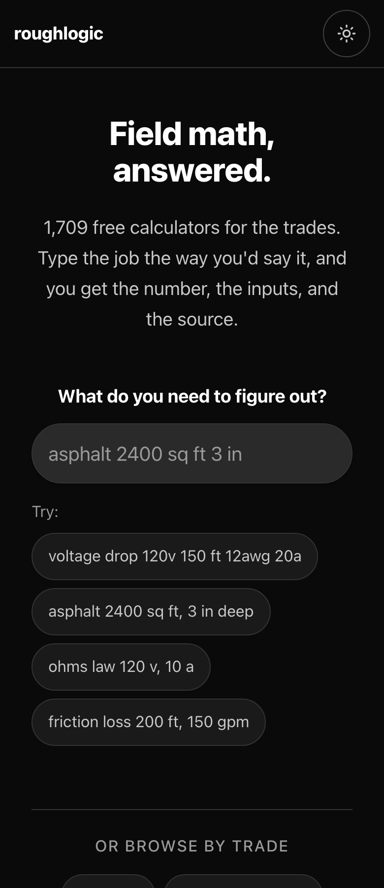
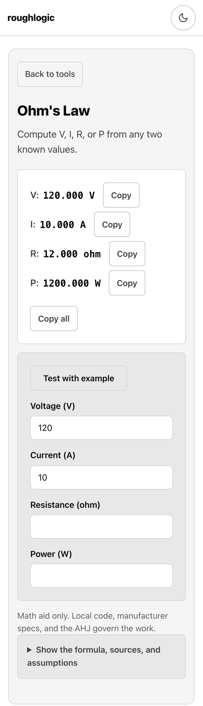
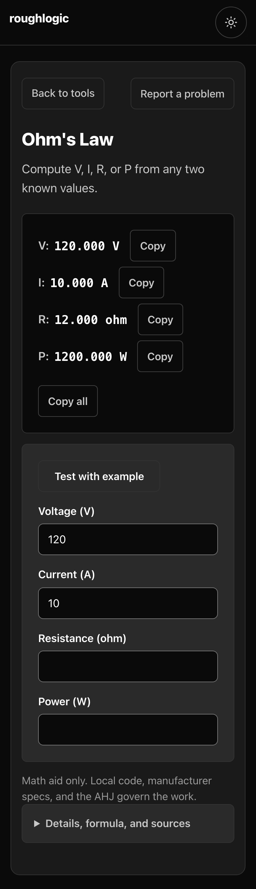

# roughlogic

**Field math for the trades. Free, fast, no ads, no accounts, works offline.**

[roughlogic.com](https://roughlogic.com) is 1,760 small, single-purpose calculators for electricians, plumbers, HVAC techs, carpenters, restoration techs, firefighters, surveyors, and dozens of other trades. Everything runs in your browser. Every answer comes from a published formula and cites its source.

<p align="center">
  
  &nbsp;
  
  &nbsp;
  
</p>

## Use it

1. Type the job the way you'd say it, numbers and all: `voltage drop 120v 150 ft 12 awg 20a`. Search by name if you'd rather, or open **All calculators** for the full list by trade.
2. The calculator opens with your numbers already in it, each box captioned with the words they came from. If one value is missing, the page asks for it in words.
3. The answer sits at the top of the page, above the inputs that produced it, and updates as you type. There is no submit button. Tap **Copy** to take a value with you.

Open a calculator directly, without a question to fill it, and it starts empty -- each box captioned with the value the page's worked example uses (`e.g. 150`), so you can see the expected unit and magnitude before typing your own over it. A box whose value is a trade convention rather than a job number (30 °C ambient, a 0.61 orifice coefficient) opens holding that convention instead.

**Every calculator's page is the same short thing**, in this order. Nothing below the example is open until you ask for it:

| | |
|---|---|
| **Title + one line** | what it does |
| **Run the calculator** | opens it with the example already loaded |
| **Example** | the exact inputs and the exact answer |
| **Collapsed detail** | One *Details, formula, and sources* drop-down at the bottom of every page -- scope, formula, sources, and assumptions, all in the one place |

Here is that Example block, from [Voltage Drop](https://roughlogic.com/tools/voltage-drop/):

| You enter | | You get | |
|---|---|---|---|
| Phase | single | Voltage drop | 7.45 V |
| Material | copper | Percent drop | 3.11 % |
| AWG | 10 | | |
| Length one-way (ft) | 150 | | |
| Current (A) | 20 | | |
| Source voltage (V) | 240 | | |

Grounded in `VD = 2 · I · R · L`, with R from NEC Ch. 9 Table 8 -- the same line the page prints under *Details, formula, and sources*. Everything is named the way the calculator names it. The machine field names an AI agent passes (`length_ft`, `drop_V`) are listed inside the collapsed formula block, so the page stays readable and the contract stays published.

Your inputs live in the URL, so a calculator is bookmarkable and shareable with its numbers preloaded. After the first load it works with no signal. No account, no email, and no tracking. A user-initiated problem report is the one explicit exception to local-only data: it sends the displayed URL, inputs, results, and an optional 160-character note to a bounded Cloudflare D1 queue.

## Use it from an AI agent

The whole catalog is available to AI agents (Claude Code, Claude Desktop, Cursor) through a local, zero-dependency [MCP](https://modelcontextprotocol.io) server that runs on your machine over stdio. No hosting, no network. Five tools (`search_calculators`, `describe_calculator`, `run_calculator`, `answer_query`, `run_calculators`) read straight from this repo, so the agent surface can never drift from the site. See [mcp/README.md](mcp/README.md).

## What's in the catalog

21 trade benches. Search spans all of them at once; the letters are internal group codes (`I` is reserved).

| | Bench | | Bench |
|---|---|---|---|
| **A** | Electrical | **N** | Stage & Live Production |
| **B** | Plumbing & Gas | **O** | Kitchen & Food Service |
| **C** | HVAC | **P** | Field, Backcountry & SAR |
| **D** | Water Damage & Mold Restoration | **Q** | Historical Reference Data |
| **E** | Carpentry & Construction | **R** | Accounting, Tax & Small-Business |
| **F** | Fire-Ground Engineering | **T** | Bench Science & Laboratory Math |
| **G** | Cross-Trade Utilities | **X** | Real Estate |
| **H** | Knowledge References | **Y** | Educators & K-12 |
| **J** | Trucking & Logistics | **Z** | Rigging & Heavy Lift |
| **K** | Mechanic - Auto, Marine, Aviation | | |
| **L** | Agriculture & Forestry | | |
| **M** | Water & Wastewater Operations | | |

One calculator is one formula on one screen. (In the source and the gate names below, a calculator is called a *tile*.) Every formula is transcribed in [docs/derivations.md](docs/derivations.md) and every citation in [docs/data-sources.md](docs/data-sources.md).

## Why you can trust the answers

The hard part of a calculator catalog is not the arithmetic. It is proving, at scale, that every tile stays correct as the catalog grows. That is a build problem here: `npm run lint` runs 47 static gates before a change can land.

| Gate | What it guarantees |
|---|---|
| `check-dimensions` | every formula is dimensionally consistent |
| `check-cross-validation` | independent tiles computing the same quantity agree numerically |
| `check-bounds` | a fuzzer sweeps each tile's input domain; no NaN/∞, monotonicity where required |
| `check-worked-examples` | each tile's example reproduces a publisher-verified reference number |
| `check-example-parity` | the example a page prints is the example its calculator opens |
| `check-citation-coverage` | every tile names a real, dated source, freshness-tracked |
| `check-derivation-coverage` | every formula has a written derivation |
| `check-dead-inputs` | no rendered field is silently ignored by the compute function |
| `check-tile-contract` | every tile is registered, crash-free, and matches its declared I/O shape |
| `check-shell-mobile` | zero horizontal scroll on every page at 320 px and 200% text zoom |
| `check-feedback-loop` | every current and future calculator retains the shared defensive D1 reporting path |

CI adds four parallel jobs per push: lint + unit tests + data-integrity verification, Lighthouse (median of 3), axe-core accessibility at 320 px, and the full Playwright suite on Chromium and WebKit. At runtime, `integrity.js` re-verifies the SHA-256 of every data manifest against `data/integrity.json`; the read-only posture means the worst case is a visible warning, never silent corruption.

## How it's built

Calculator execution is a client-side, offline-first static site with no accounts or analytics. One isolated Cloudflare Worker accepts user-initiated problem reports into D1; Turnstile loads only after the report dialog opens, and static requests remain asset-first.

The browser loads `index.html` + `styles.css` + `app.js` (router, search, theme, URL-hash state), which dynamic-imports one of 57 per-group calculator modules (`calc-*.js`) on first open, which reads the sharded JSON in `data/`. A service worker (`sw.js`) caches the shell and data shards keyed to the build hash, so the site works offline after the first load.

At build time only (never in production), `build-data.mjs` refreshes the integrity-hashed data shards from NIST, NOAA, NCEI WMM, FHFA, HUD, and published bulletins, and `build-shells.mjs` emits one zero-JS crawlable static shell per tile (1760) and per group, plus a sitemap that carries 1783 URLs.

The home payload gzips to well under the 100 KB budget. Opening a calculator dynamic-imports only that trade's module and only the data shards it needs. See [docs/architecture.md](docs/architecture.md) and [docs/seo.md](docs/seo.md).

## Develop

```bash
npm ci             # exact locked dev tooling; the site has zero runtime deps
npm run dev        # build, then serve only dist/ on loopback
npm run build      # emit dist/ (SPA + static shells + sitemap)
npm run lint       # the full static-gate chain (47 checks)
npm test           # unit tests (node --test)
npm run test:e2e   # Playwright integration suite (needs a browser)
```

The repo root holds the SPA entry (`index.html`, `styles.css`, `app.js`, `sw.js`), the `calc-*.js` modules, and shared UI helpers. `data/` holds sharded JSON with per-folder manifests and integrity hashes. `scripts/` holds build and gate tooling (never runs in production). `specs/` is the numbered specification history; `docs/` holds derivations, data sources, architecture, and the audit trail. See [docs/maintainer-quickstart.md](docs/maintainer-quickstart.md) and [docs/contributor-checklist.md](docs/contributor-checklist.md).

## License

MIT. See [LICENSE](LICENSE).
